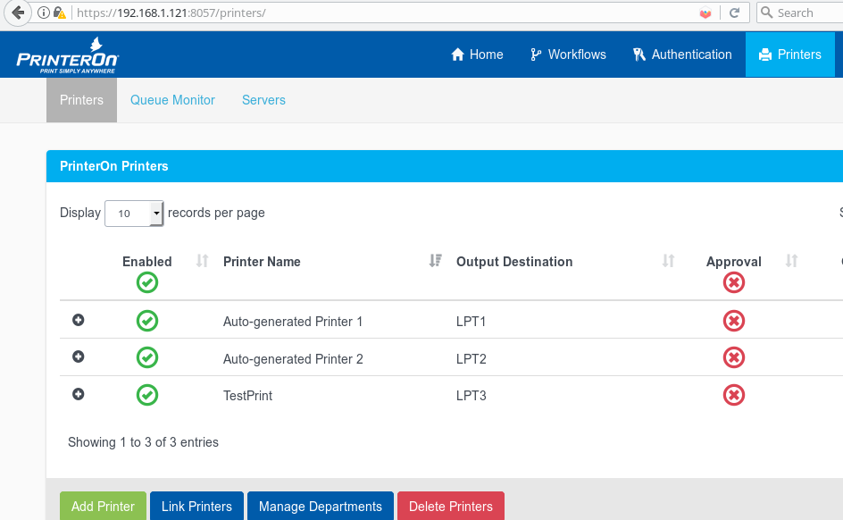
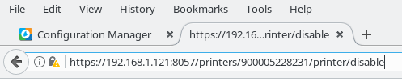
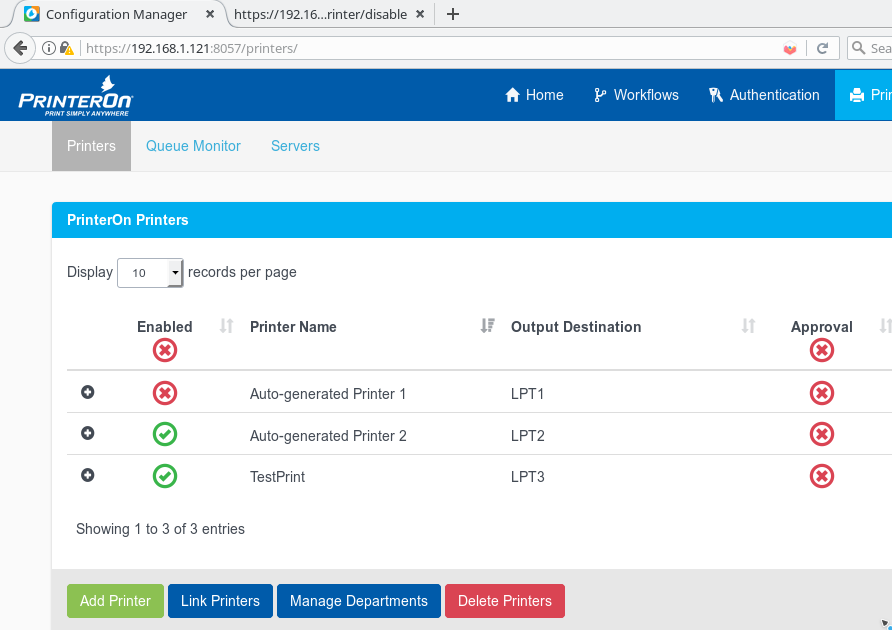

# CVE-2018-17168-CSRF-PrinterON
PrinterOn Enterprise 4.1.4 contains multiple Cross Site Request Forgery(CSRF) vulnerabilities in the Administration page. For example, an administrator, by following a link, can be tricked into making unwanted changes to a printer (Disable, Approve, etc).

##### Printers are enabled:

##### authenticated admin user is tricked in accesing the following link:

##### The Printer gets disabled:

