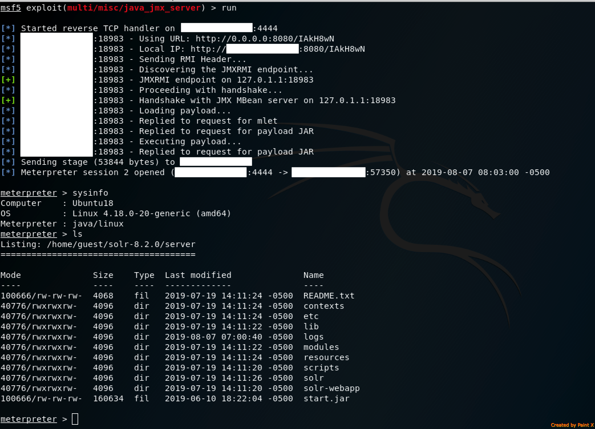

# CVE-2019-12409: Apache Solr RCE Vulnerability Due to Bad Defalut Config

The 8.1.1 and 8.2.0 releases of Apache Solr contains insecure setting in the default solr.in.sh configuration file shipping with Solr.
 
The setting that result in this vulnerability are:
- In "solr.in.sh":
	- ENABLE_REMOTE_JMX_OPTS="true" (Enables the JMX Service)
- In "solr.cmd":
	- -Dcom.sun.management.jmxremote.local.only=false (Allows Remote Access to JMX)
	- -Dcom.sun.management.jmxremote.authenticate=false (Does not Require Valid Credentials)

<table>
	<tr>
		<th>Affected Product</th>
		<th>Affected Versions</th>
		<th>Affected OS</th>
	<tr>
		<td>Apache Solr</td>
		<td>8.1.1, 8.2.0</td>
		<td>Unix / Linux</td>
	</tr>
</table>

<strong>Note:</strong> Windows users are not affected.

### Vendor Disclosure:

The vendor's disclosure and fix for this vulnerability can be found [here](https://issues.apache.org/jira/browse/SOLR-13647).

### Proof Of Concept:

Although there exist multiple ways to exploit the JMX, the simplest and most reliable way to exploit it is via the "exploit/multi/misc/java_jmx_server" metasploit module:

### Additional Resources:

[Exploiting CVE-2019-12409 using mjet](https://github.com/jas502n/CVE-2019-12409)
