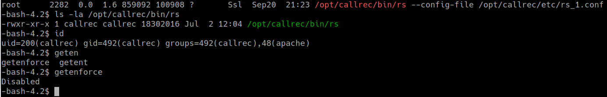
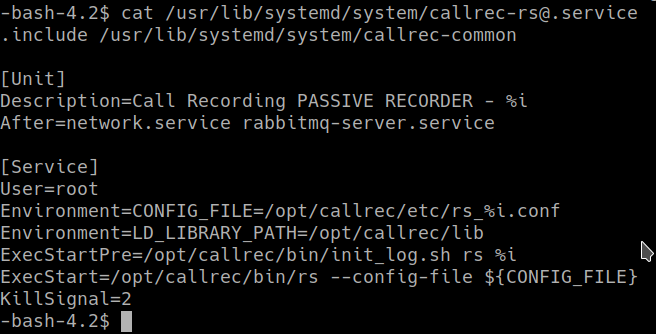
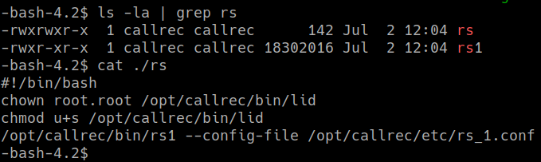
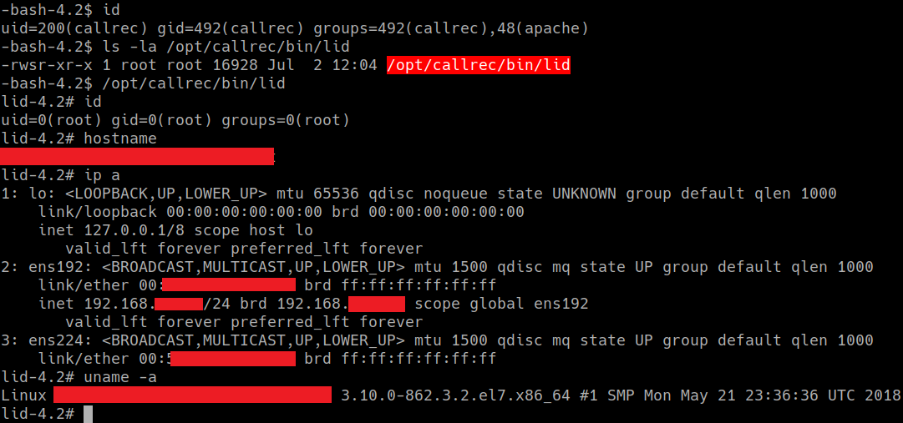

# CVE-2019-18822-PrivEscal-ZoomCallRecording
A privilege escalation vulnerability in ZOOM Call Recording 6.3.1 from ZOOM International (https://www.zoomint.com/solutions/call-recording) allows its user account (i.e., the account under which the program runs - by default, the callrec account) to elevate privileges to root by abusing the callrec-rs@.service. The callrec-rs@.service starts the /opt/callrec/bin/rs binary with root privileges, and this binary is owned by callrec. It can be replaced by a Trojan horse.

## Evidence
“/opt/callrec/bin/rs was started as a service running with root privileges, but owned by unprivileged user callrec:

 
*Figure 1 - Process running as root with binary under our control*

 
*Figure 2 - systemd callrec-rs@ service*

We replaced rs binary with a script that sets root ownership and suid flag to our malicious executable.

 
*Figure 3 - Bash script that set suid flag to our malicious executable*

After server restart, systemd started callrec-rs@.service that run our script with root privileges adding root suid flag to our file. Running our elf binary gave us /bin/bash with root privileges.

 
*Figure 4 - Local privilege escalation from callrec user to root*
