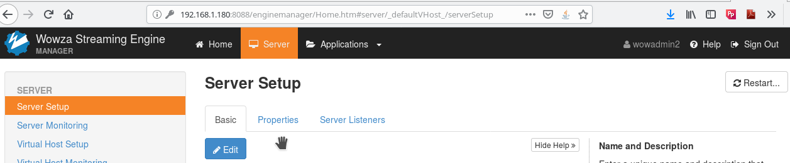

# CVE-2019-7656-PrivEscal-Wowza
A privilege escalation vulnerability in Wowza Streaming Engine 4.7.7 build 20181108145350 and 4.7.8 build 20191105123929, allows any unprivileged Linux user to escalate privileges to root. The installer sets too relaxed permissions on core program files. By injecting the payload in one of those files, it will run with same privileges as the Wowza server, root.

### Evidence

Install Wowza Streaming Engine from official site using the official instructions:

Observe that files are set with write permissions for others. Just inject code in one of those files. In this PoC we injected code in tune.sh file:

Read the password from the admin.password file:

Connect to the web interface and issue a restart of server:

Get root:

