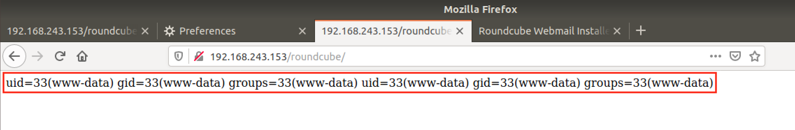

# CVE-2020-12640: Local PHP File Inclusion via "Plugin Value" in Roundcube Webmail

A Path Traversal vulnerability exists in Roundcube versions before 1.4.4, 1.3.11 and 1.2.10.
<br/>
Because the "\_plugins\_\<PLUGIN\_NAME\>" parameters do not perform sanitization/input filtering, an attacker with access to the Roundcube Installer can leverage a path traversal vulnerability to include arbitrary PHP files on the local system.

### Vendor Disclosure:

The vendor's disclosure and patch of this vulnerability can be found [here](https://roundcube.net/news/2020/04/29/security-updates-1.4.4-1.3.11-and-1.2.10).

### Proof Of Concept:

In order to reproduce this vulnerability, the following steps are required:

#### Create a PHP file and directory to a known location

In this case, in order to simplify the PoC, we consider the attacker to have SSH access as a low privileged user and write the files to "/dev/shm".


<strong>Note:</strong> In this case the PHP files will execute and display the "id" system command.

#### Craft Path Traversal Request

We craft and send a POST request to the Installer containing the malicious path traversal within a "\_plugins\_..." parameter:
```
POST /roundcube/installer/index.php HTTP/1.1
Host: 192.168.243.153
Content-Type: application/x-www-form-urlencoded
Content-Length: 936

_step=2&_product_name=Roundcube+Webmail&***TRUNCATED***&_plugins_qwerty=../../../../../../dev/shm/zipdownload&submit=UPDATE+CONFIG
```

<strong>Note:</strong> By viewing the error logs, we can see that Roundcube now tries to load the "/var/www/html/roundcube/plugins/../../../../../../dev/shm/zipdownload/../../../../../../dev/shm/zipdownload.php" file, which resolves to "/dev/shm/zipdownload.php".

#### Result

If the attack was performed correctly, when accessing any page of the Roundcube application the attacker should be greeted with the following page:



