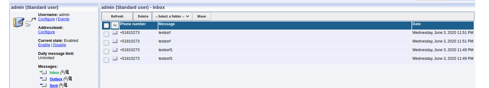

# CVE-2020-14023: Ozeki SMS Server Side Request Forgery

The Ozeki SMS Gateway software, versions 4.17.6 and below, has multiple modules that can be used to perform SSRF attacks on arbitrary targets.
<br/>
These modules are:
- SMS WCF
- RSS to SMS

Successful exploitation could allow an attacker to pivot through a victim's network in order to send malicious HTTP payloads to other vulnerable systems/applications that would otherwise be unreachable.

### Requirements:

This vulnerability requires:
- Access to an Ozeki Web Application administration interface with rights to create/modify "SMS WCF" or "RSS to SMS" links

### Proof Of Concept:

For this scenario we will consider that we were able to start a "HTTP server". This server starts locally on port 9400, but due to firewall rules we are unable to access it directly.


In order to send the payload to this service we will use the SSRF with the following link:

```
http://127.0.0.1:9400/sendMessage?recipient=%2B441234567&originator=%2B51810273&senttime=6%2F3%2F2020+12%3A56%3A54+PM&dcs=00&pid=00&msg=testssrf
```

We can now leverage the one of the following modules to trigger the SSRF:
- SMS WCF
- RSS to SMS

#### SMS WCF


#### RSS to SMS


#### Result
By calling the "HTTPServer" API, with our payload contained in the GET parameters, we notice the following result:


