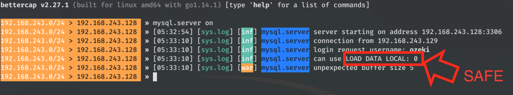
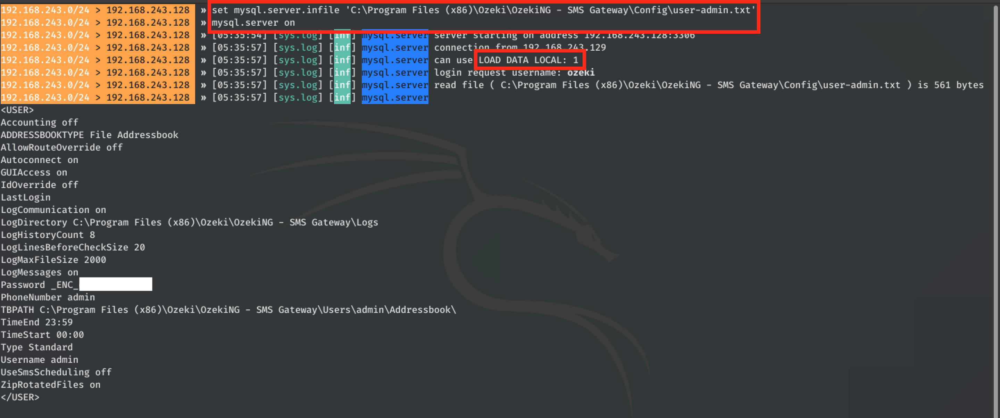

# CVE-2020-14027: Ozeki SMS Gateway "LOAD DATA LOCAL INFILE" Attack

The Ozeki SMS Gateway software, versions 4.17.6 and below, allows database connection strings that may contain custom unsafe arguments such as "ENABLE_LOCAL_INFILE".
 
This can be leveraged by attackers to trigger MySQL "LOAD DATA LOCAL INFILE" (Rogue MySQL Server) attacks.
 
Successful attacks of this vulnerability can result in unauthorized read access data accessible by the Ozeki Web Application (usually with privileges 'NT Authority\System').
 

### Requirements:

This vulnerability requires:
- Access to an Ozeki Web Application user that can create/modify DB Connections
- "MYSQL ODBC" Driver to be installed on the target system

### Proof Of Concept:

By default, the Windows "MYSQL ODBC" Driver does not allow the "Local_Infile" feature.

But, because we have full control over the connection string, we can enable this feature at the application level by adding the option "ENABLE_LOCAL_INFILE=1".

This will allow an attacker to use the MySQL Client Driver to read arbitrary files off the victim’s system. In this case we read the "user-admin.txt" config file.

