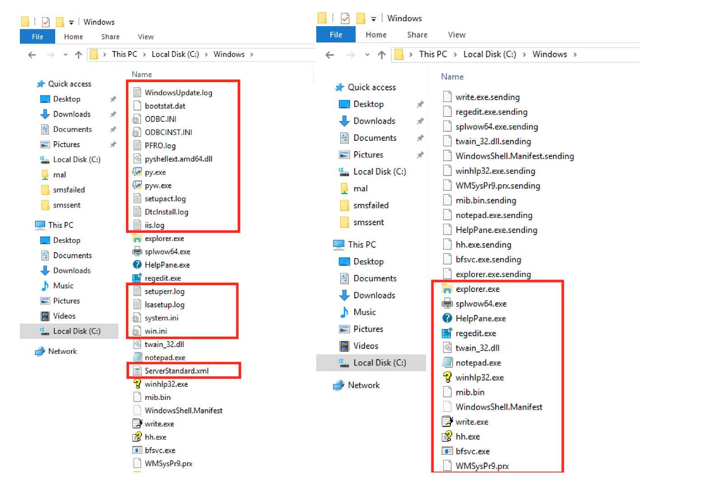

# CVE-2020-14031: Ozeki SMS Gateway Arbitrary File Delete in the "TXT" Module

In Ozeki SMS Gateway software, versions 4.17.6 and below, the “outbox” functionality of the TXT module can be used to delete all/most files in a folder.
 
Because Ozeki runs as "NT Authority\System" the only files that will not be deleted will be files that are currently being run by the system and/or files that have specific "security attributes" (Ex. Windows Defender files).
 

This delete functionality can be used to remove important files from different, the most notable of which are:

<table>
	<tr>
		<th>Folder</th>
		<th>Impact</th>
	</tr>
	<tr>
		<td>"C:\Windows\"</td>
		<td>And subfolders Can be used to delete important system resources, EXEs, DLLs, config files, etc. that may result in an OS level Denial of Service.</td>
	</tr>
		<td>The "Ozeki" folder</td>
		<td>Can be used to delete:
			 
			- user config files which will result in users not being able to login when Ozeki restarts
			 
			- deletion of DLL necessary for Ozeki to start or run services/modules
		</td>
	</tr>
	<tr>
		<td>User files</td> 
		<td>Can be used to delete user important files such as "Desktop", "Documents", etc. which may result a decrease in productivity, the loss of sensitive personal and/or business materials.</td>
	</tr>
</table>

### Requirements:

This vulnerability requires:
- Access to an Ozeki Web Application administration interface with rights to create/modify the "outbox" location of a "TXT" Module

### Proof Of Concept:

First, we point the TXT "outbox" to a folder from which we want to delete files (Ex. "C:\Windows\"):

We can notice 2 things almost immediately as this happens:
- Unusual ".sending" files appear as files are getting deleted:

- A spike in resource consumption and memory happens on the victim:

By comparing the "Before" and "After" files, we can see the damage that has been done.
In this case:
- Executables and DLLs that were not active at runtime ("py.exe", "pyshellext.amd64.dll", etc.) have been deleted.
- Logfiles ("WindowsUpdate.log", "iis.log", etc.) have been deleted.
- Configuration files ("win.ini", "system.ini", "ServerStandard.xml", etc.) have been deleted.

