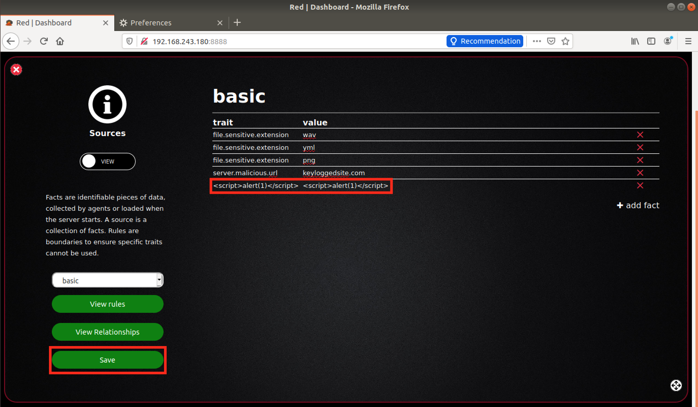
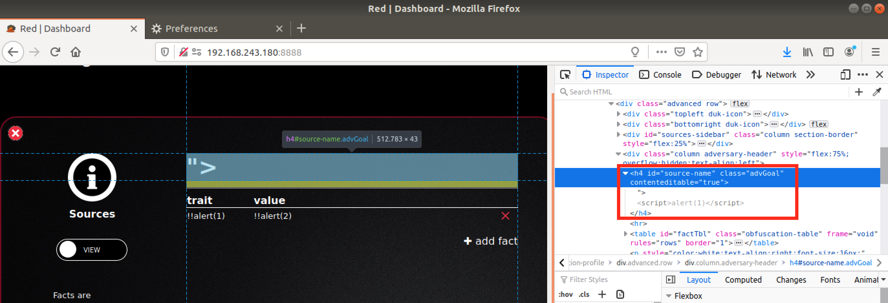

# CVE-2021-42558: Multiple Cross-Site Scripting in MITRE Caldera

Caldera (versions <=2.8.1) contains multiple reflected, stored and self XSS vulnerabilities that may be exploited by authenticated and unauthenticated attackers.
<br/>

### Software:

The MITRE Caldera software can be found [here](https://github.com/mitre/caldera).

### Proof Of Concept:

The following XXS vulnerabilities have been ordered by risk:
<br/>
1. Unauthenticated Stored XSS in Agent:

    <strong>Note:</strong> This XSS vector was also found in paralel and fixed by [Daniel "uruwhy" Matthews](https://github.com/uruwhy) in this [Caldera commit](https://github.com/mitre/caldera/commit/7d3dedb8a03cb2fcddbcb292b7ca8b8c31af62e5).
    <br/><br/>
    By sending a malicious crafted HTTP request to the Caldera server, an attacker may trick the server into displaying a face agent containing XSS payloads in its return values.
    <br/>
    On first submission, any authenticated user that has the "Agents" tab open will trigger the following 2 XSS:

    
    

    If the tab is reopened/refreshed, although the XSS does not trigger automatically, it remains stored and reflects 3 times when the user tries to access the agent's details:

    
    
    
    

    Example bash script:
```
#!/bin/bash

payload='{"server": "http://0.0.0.0:8888", "host": "<script>alert(\"NiceTry2\")</script>", "platform": "<script>alert(\"NiceTry3\")</script>", "executors": ["<script>alert(\"NiceTry4\")</script>"], "pid": 1, "group": "red", "paw": "<script>alert(\"NiceTry6\")</script>", "results": ["<script>alert(\"NiceTry7\")</script>"]}'

curl "http://127.0.0.1:8888/beacon" -d $(echo $payload | base64 -w0)
```

2. Authenticated Stored XSS in Debrief:

    By inserting an XSS payload in "Operations", the malicious JS payload can be executed evert time the respective payload is opened in the "Debrief" tab:

    
    

3. Authenticated Stored XSS in the Human Plugin:
 
    When creating a "human" with an XSS payload in the name, the auto-generated code for importing and running the human, displays the name (multiple times) in an unsanitized mode.

    

4. Authenticated Stored XSS in Objectives:
 
    The values of the "Rows" in "Objectives" are displayed as "value" attributes in an "input" html tag. By escaping the value filed using a “ "> ” we can continue inserting arbitrary html elements which will trigger the XSS when the Objective is entered again.

    
    
    

5. Authenticated Stored XSS in Sources Fact:
 
    Malicious XSS elements can be directly inserted into the "Sources" rows. The XSS triggers when the objective containing the XSS is revisited.

    
    

6. Authenticated Stored XSS in Sources Title:

    By inserting an XSS payload in the "Source Title", this triggers twice:
- It reflects once when the Source is saved:
         

- And it remains stored and triggers every time someone navigates to this objective:
         
         

7. Authenticated Stored XSS in Operation Name:

    The Debrief plugin has a stored XSS when opening operations with malicious names.
    <br/>

    We create a malicious operation with the name "test<script>alert(1)</script>test":
    

    This operation will trigger an XSS when opened/clicked on in the Debrief windows:
    
    

8. Reflected XSS in Compass:
    
    Malicious JavaScript payloads can get executed when trying to import, in the "Compass" tab, a malicious JSON that contains XSS elements in the "name" and/or the "description".
    <br/><br/>
    
    Malicious JSON:
```
{
  "version": "3.0",
  "name": "</input><script>alert(1)</script>",
  "description": "<script>alert(2)</script>",
  "domain": "mitre-enterprise",
  "techniques": [],
  "legendItems": [],
  "showTacticRowBackground": true,
  "tacticRowBackground": "#205b8f",
  "selectTechniquesAcrossTactics": true,
  "selectSubtechniquesWithParent": true,
  "gradient": {
    "colors": [
      "#ffffff",
      "#66ff66"
    ],
    "minValue": 0,
    "maxValue": 1
  }
}
```

 
 
 

9. Self-XSS Agents:
    
    By inserting an XSS payload in any of the dynamic fields of the "Agent", the generated agent code will reflect it in an unsafe manner:

    

10. Self-XSS Objectives:
 
    When saving an "Objective" containing an XSS element in the Title, the payload will get executed only once upon saving the element.

    
    

11. Self-XSS Operations:
    
    When creating an Operation containing an XSS in the name, the XSS will trigger when the Operation is started.

    
    
    