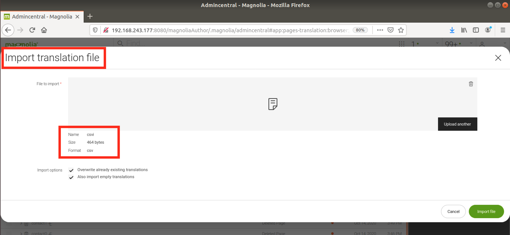
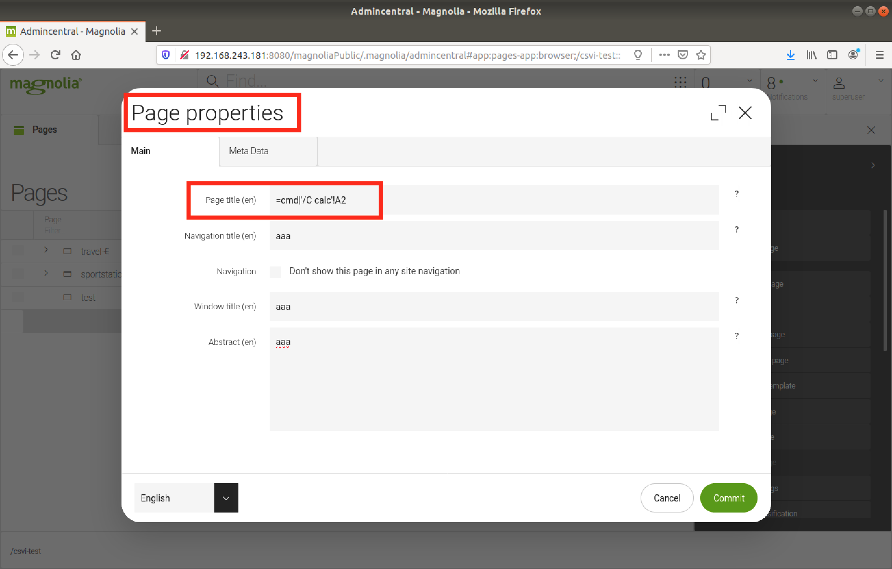
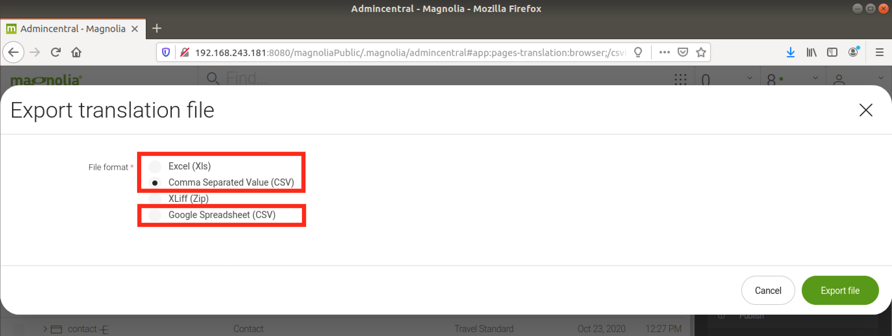
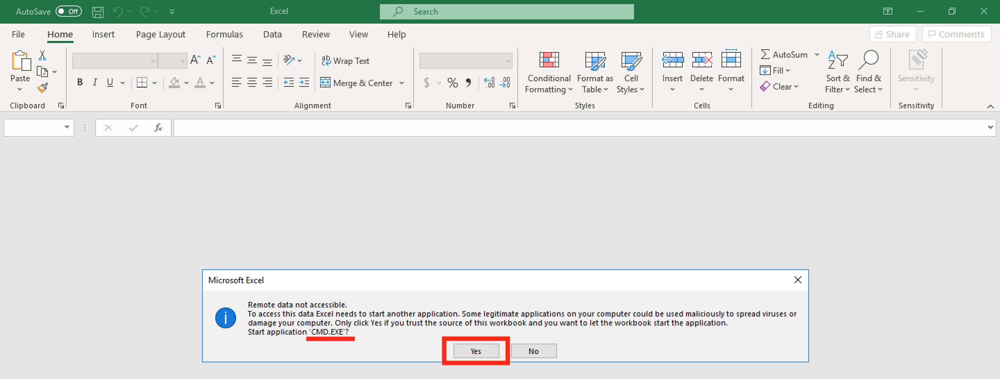
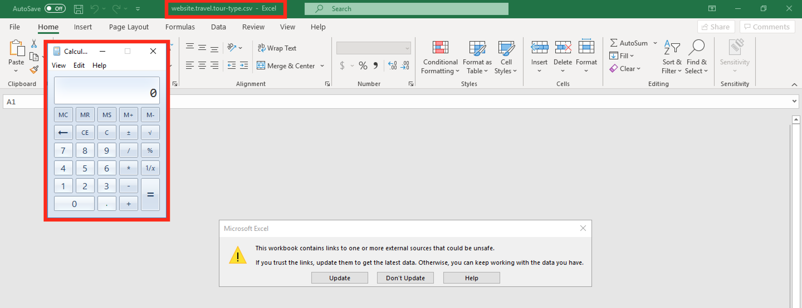
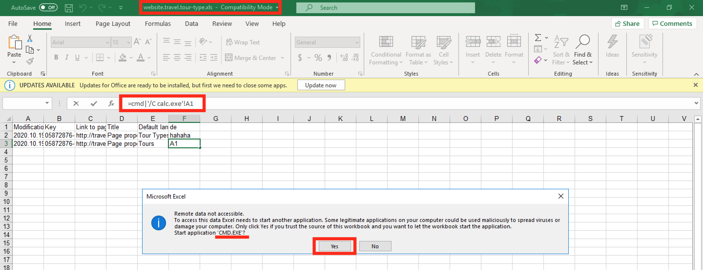

# CVE-2021-46363: Formula Injection in Content Translation in Magnolia CMS

In Magnolia (versions <=6.2.3) the export function in "Content Translation" does not sanitize potentially malicious Formulas. In a worst-case scenario, these formulas may result in arbitrary code execution on a victim's computer when opening the exported files with Microsoft Excel.

### Vendor Disclosure:

The vendor's disclosure and fix for this vulnerability can be found [here](https://docs.magnolia-cms.com/product-docs/6.2/Releases/Release-notes-for-Magnolia-CMS-6.2.4.html#_security_advisory).

### Requirements:

This vulnerability requires:
<br/>
- Valid user credentials

### Proof Of Concept:

In order to leverage this vulnerability an attacker will need to find a way to insert malicious formula elements in the content of translation files. This can be achieved by:

#### Directly importing a malicious translation file:

Content of malicious CSV:
```
"Modification date of page","Key","Link to page","Title","Default language (en)","de"
"2020.10.19 22:01:36 672","05872876-073e-40a3-a3c5-0d0a18c1d43d:title","http://travel-demo.magnolia-cms.com/tour-type.html","Page properties: Page title","Tour Types","mal"
"2020.10.19 22:01:36 672","05872876-073e-40a3-a3c5-0d0a18c1d43d:navigationTitle","http://travel-demo.magnolia-cms.com/tour-type.html","Page properties: Navigation title","Tours","=cmd|'/C calc.exe'!A1"
```

Import the above CSV:


#### Modifying Page properties

In this example we will modify the page title:


#### Result

Both these scenarios will result in files containing Malicious Formulas injected into the exported translations. The following export formats are potentially vulnerable:


When the exported files are opened in Microsoft Excel the following behaviour occurs:
- CSV and Google CSV:

    When opening the malicious exported CSV file in Excel, the vulnerability will trigger automatically:



- XLS:

    In this scenario the formula will not trigger automatically when the file is open, but the user is at risk if he/she interacts in special ways with the formula (E.g. interacting with it in the "Formula Bar"):
